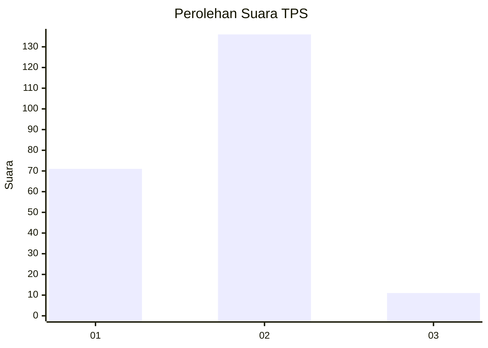
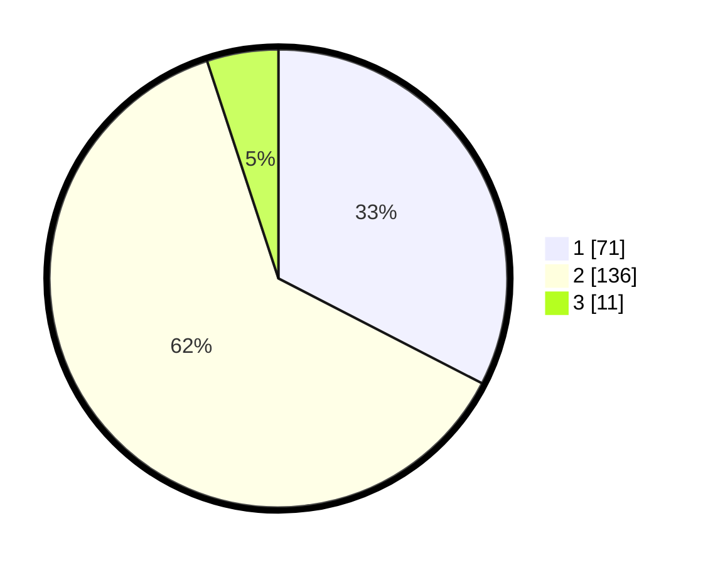

# Hasil

## Grafik

## Tabel

| No. | Nama Paslon    | Suara | Suara (raw) | Persentase |
|:--- |:-------------- | -----:| -----------:| ----------:|
| 1   | ANIES MUHAIMIN | 71    | [71][p-1]   | 32,57      |
| 2   | PRABOWO GIBRAN | 136   | [136][p-2]  | 62,39      |
| 3   | GANJAR MAHFUD  | 11    | [11][p-3]   | 5,05       |

[p-1]: https://github.com/gigit-pemilu/pemilu-2024-75-gorontalo/blob/main/pilpres/hitung-suara/sub/75-gorontalo/sub/01-gorontalo/sub/01-limboto/sub/1001-kayubulan/sub/001-tps/sub/paslon-1.txt
[p-2]: https://github.com/gigit-pemilu/pemilu-2024-75-gorontalo/blob/main/pilpres/hitung-suara/sub/75-gorontalo/sub/01-gorontalo/sub/01-limboto/sub/1001-kayubulan/sub/001-tps/sub/paslon-2.txt
[p-3]: https://github.com/gigit-pemilu/pemilu-2024-75-gorontalo/blob/main/pilpres/hitung-suara/sub/75-gorontalo/sub/01-gorontalo/sub/01-limboto/sub/1001-kayubulan/sub/001-tps/sub/paslon-3.txt

## Foto C Plano

https://sirekap-obj-formc.kpu.go.id/97dc/pemilu/ppwp/75/01/01/10/01/7501011001001-20240225-162619--ebd70d40-a6d2-4209-9612-f8ccc536a8ae.jpg

https://sirekap-obj-formc.kpu.go.id/97dc/pemilu/ppwp/75/01/01/10/01/7501011001001-20240225-162621--2e29a996-1b95-4700-886b-7ed8becb317c.jpg

https://sirekap-obj-formc.kpu.go.id/97dc/pemilu/ppwp/75/01/01/10/01/7501011001001-20240225-162620--f2807220-0e03-47e9-b6d1-4cf6aca6f58d.jpg

## Metadata

| Key        | Value               |
| ---------- | ------------------- |
| Time Stamp | 2024-02-25 17:00:00 |

## DATA PEMILIH TETAP

Jumlah pemilih dalam DPT: **256**.
 * L: **125**.
 * P: **131**.

## DATA PENGGUNA HAK PILIH

Jumlah pengguna hak pilih dalam DPT: **218**.
 * L: **103**.
 * P: **115**.

Jumlah pengguna hak pilih dalam DPTb: **1**.
 * L: **1**.
 * P: **0**.

Jumlah pengguna hak pilih dalam DPK: **0**.
 * L: **0**.
 * P: **0**.

Jumlah pengguna hak pilih: **219**.
 * L: **104**.
 * P: **115**.

## JUMLAH SUARA SAH DAN TIDAK SAH

JUMLAH SELURUH SUARA SAH: **218**.

JUMLAH SUARA TIDAK SAH: **1**.

JUMLAH SELURUH SUARA SAH DAN SUARA TIDAK SAH: **219**.

