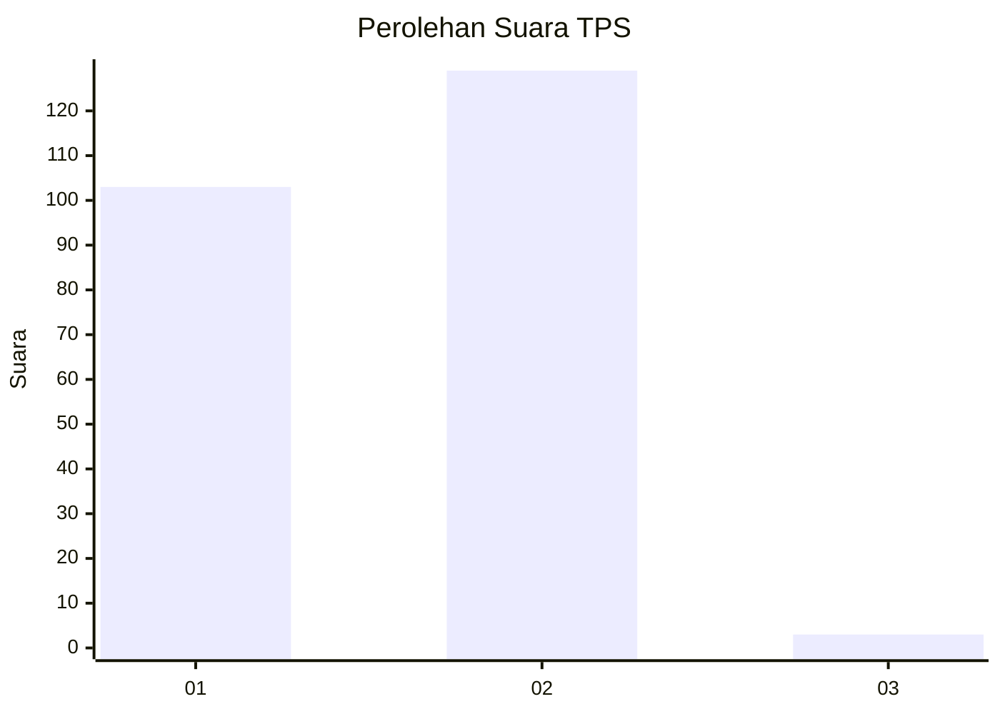
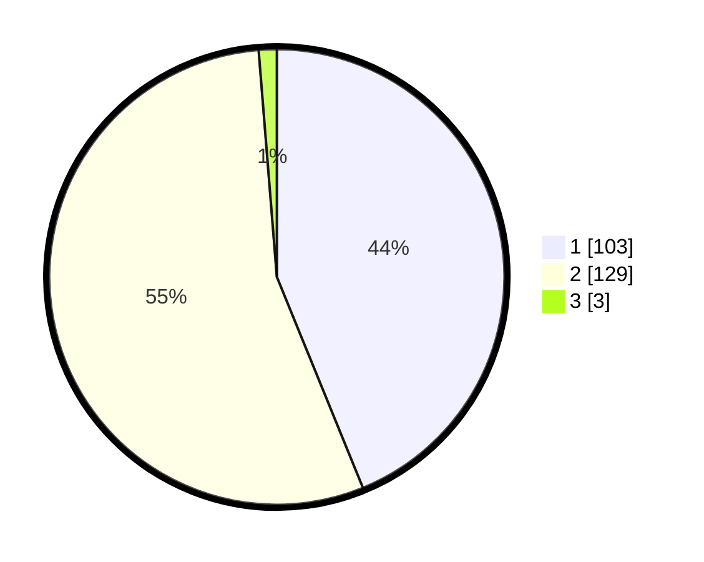

# Hasil

## Grafik

## Tabel

| No. | Nama Paslon    | Suara | Suara (raw) | Persentase |
|:--- |:-------------- | -----:| -----------:| ----------:|
| 1   | ANIES MUHAIMIN | 103   | [103][p-1]  | 43,83      |
| 2   | PRABOWO GIBRAN | 129   | [129][p-2]  | 54,89      |
| 3   | GANJAR MAHFUD  | 3     | [3][p-3]    | 1,28       |

[p-1]: https://github.com/gigit-pemilu/pemilu-2024-75-gorontalo/blob/main/pilpres/hitung-suara/sub/75-gorontalo/sub/01-gorontalo/sub/01-limboto/sub/1001-kayubulan/sub/002-tps/sub/paslon-1.txt
[p-2]: https://github.com/gigit-pemilu/pemilu-2024-75-gorontalo/blob/main/pilpres/hitung-suara/sub/75-gorontalo/sub/01-gorontalo/sub/01-limboto/sub/1001-kayubulan/sub/002-tps/sub/paslon-2.txt
[p-3]: https://github.com/gigit-pemilu/pemilu-2024-75-gorontalo/blob/main/pilpres/hitung-suara/sub/75-gorontalo/sub/01-gorontalo/sub/01-limboto/sub/1001-kayubulan/sub/002-tps/sub/paslon-3.txt

## Foto C Plano

https://sirekap-obj-formc.kpu.go.id/964c/pemilu/ppwp/75/01/01/10/01/7501011001002-20240225-162819--98f02191-8218-4892-a3a4-53751033a07a.jpg

https://sirekap-obj-formc.kpu.go.id/964c/pemilu/ppwp/75/01/01/10/01/7501011001002-20240225-162821--c33083db-3d37-41d9-845c-5ed4d2e0b7aa.jpg

https://sirekap-obj-formc.kpu.go.id/964c/pemilu/ppwp/75/01/01/10/01/7501011001002-20240225-162820--905b3676-f403-4def-b55e-de131d626b27.jpg

## Metadata

| Key        | Value               |
| ---------- | ------------------- |
| Time Stamp | 2024-02-25 17:00:00 |

## DATA PEMILIH TETAP

Jumlah pemilih dalam DPT: **0**.
 * L: **0**.
 * P: **0**.

## DATA PENGGUNA HAK PILIH

Jumlah pengguna hak pilih dalam DPT: **0**.
 * L: **0**.
 * P: **0**.

Jumlah pengguna hak pilih dalam DPTb: **0**.
 * L: **0**.
 * P: **0**.

Jumlah pengguna hak pilih dalam DPK: **0**.
 * L: **0**.
 * P: **0**.

Jumlah pengguna hak pilih: **0**.
 * L: **0**.
 * P: **0**.

## JUMLAH SUARA SAH DAN TIDAK SAH

JUMLAH SELURUH SUARA SAH: **235**.

JUMLAH SUARA TIDAK SAH: **1**.

JUMLAH SELURUH SUARA SAH DAN SUARA TIDAK SAH: **236**.

