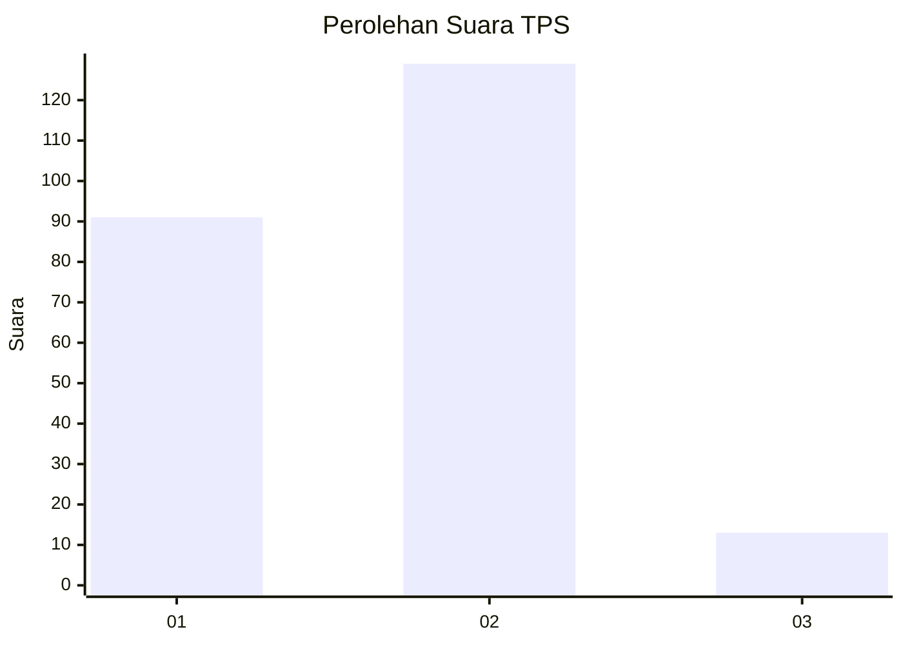
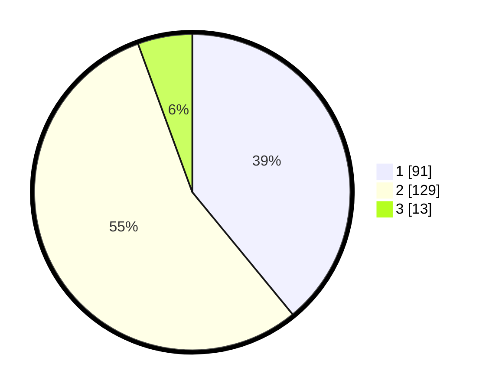

# Hasil

## Grafik

## Tabel

| No. | Nama Paslon    | Suara | Suara (raw) | Persentase |
|:--- |:-------------- | -----:| -----------:| ----------:|
| 1   | ANIES MUHAIMIN | 91    | [91][p-1]   | 39,06      |
| 2   | PRABOWO GIBRAN | 129   | [129][p-2]  | 55,36      |
| 3   | GANJAR MAHFUD  | 13    | [13][p-3]   | 5,58       |

[p-1]: https://github.com/gigit-pemilu/pemilu-2024-75-gorontalo/blob/main/pilpres/hitung-suara/sub/75-gorontalo/sub/01-gorontalo/sub/01-limboto/sub/1001-kayubulan/sub/004-tps/sub/paslon-1.txt
[p-2]: https://github.com/gigit-pemilu/pemilu-2024-75-gorontalo/blob/main/pilpres/hitung-suara/sub/75-gorontalo/sub/01-gorontalo/sub/01-limboto/sub/1001-kayubulan/sub/004-tps/sub/paslon-2.txt
[p-3]: https://github.com/gigit-pemilu/pemilu-2024-75-gorontalo/blob/main/pilpres/hitung-suara/sub/75-gorontalo/sub/01-gorontalo/sub/01-limboto/sub/1001-kayubulan/sub/004-tps/sub/paslon-3.txt

## Foto C Plano

https://sirekap-obj-formc.kpu.go.id/5cf0/pemilu/ppwp/75/01/01/10/01/7501011001004-20240217-010410--323bf958-ec93-4b73-9009-f818ddd8fbc7.jpg

https://sirekap-obj-formc.kpu.go.id/5cf0/pemilu/ppwp/75/01/01/10/01/7501011001004-20240217-010411--6f6787b2-9825-4acf-ad87-1327ce814b3b.jpg

https://sirekap-obj-formc.kpu.go.id/5cf0/pemilu/ppwp/75/01/01/10/01/7501011001004-20240217-010411--a9079006-36a5-4079-bbe8-db3978b9ffc4.jpg

## Metadata

| Key        | Value               |
| ---------- | ------------------- |
| Time Stamp | 2024-02-17 14:56:33 |

## DATA PEMILIH TETAP

Jumlah pemilih dalam DPT: **281**.
 * L: **124**.
 * P: **157**.

## DATA PENGGUNA HAK PILIH

Jumlah pengguna hak pilih dalam DPT: **234**.
 * L: **101**.
 * P: **133**.

Jumlah pengguna hak pilih dalam DPTb: **1**.
 * L: **1**.
 * P: **0**.

Jumlah pengguna hak pilih dalam DPK: **3**.
 * L: **3**.
 * P: **0**.

Jumlah pengguna hak pilih: **238**.
 * L: **105**.
 * P: **133**.

## JUMLAH SUARA SAH DAN TIDAK SAH

JUMLAH SELURUH SUARA SAH: **233**.

JUMLAH SUARA TIDAK SAH: **5**.

JUMLAH SELURUH SUARA SAH DAN SUARA TIDAK SAH: **238**.

