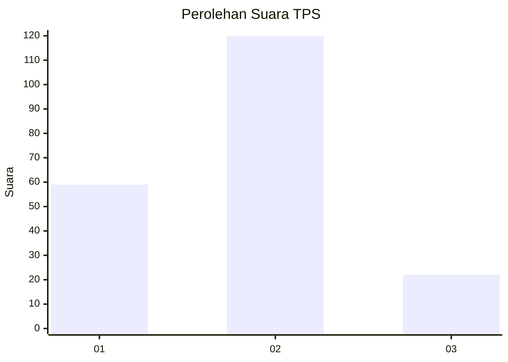
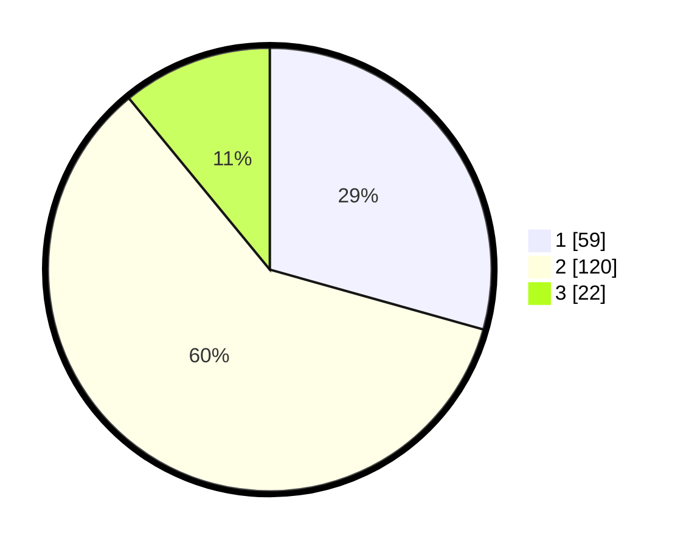

# Hasil

## Grafik

## Tabel

| No. | Nama Paslon    | Suara | Suara (raw) | Persentase |
|:--- |:-------------- | -----:| -----------:| ----------:|
| 1   | ANIES MUHAIMIN | 59    | [59][p-1]   | 29,35      |
| 2   | PRABOWO GIBRAN | 120   | [120][p-2]  | 59,70      |
| 3   | GANJAR MAHFUD  | 22    | [22][p-3]   | 10,95      |

[p-1]: https://github.com/gigit-pemilu/pemilu-2024-75-gorontalo/blob/main/pilpres/hitung-suara/sub/75-gorontalo/sub/01-gorontalo/sub/01-limboto/sub/1001-kayubulan/sub/005-tps/sub/paslon-1.txt
[p-2]: https://github.com/gigit-pemilu/pemilu-2024-75-gorontalo/blob/main/pilpres/hitung-suara/sub/75-gorontalo/sub/01-gorontalo/sub/01-limboto/sub/1001-kayubulan/sub/005-tps/sub/paslon-2.txt
[p-3]: https://github.com/gigit-pemilu/pemilu-2024-75-gorontalo/blob/main/pilpres/hitung-suara/sub/75-gorontalo/sub/01-gorontalo/sub/01-limboto/sub/1001-kayubulan/sub/005-tps/sub/paslon-3.txt

## Foto C Plano

https://sirekap-obj-formc.kpu.go.id/b045/pemilu/ppwp/75/01/01/10/01/7501011001005-20240225-162949--c79dae84-0aaf-4f27-b389-3bdd60d9ba6a.jpg

https://sirekap-obj-formc.kpu.go.id/b045/pemilu/ppwp/75/01/01/10/01/7501011001005-20240225-162951--0c9199d2-8c58-4b1d-905f-43f303ac7c85.jpg

https://sirekap-obj-formc.kpu.go.id/b045/pemilu/ppwp/75/01/01/10/01/7501011001005-20240225-162950--66e51693-e605-4ed3-b973-c28f17b1fdc0.jpg

## Metadata

| Key        | Value               |
| ---------- | ------------------- |
| Time Stamp | 2024-02-25 17:00:00 |

## DATA PEMILIH TETAP

Jumlah pemilih dalam DPT: **0**.
 * L: **0**.
 * P: **0**.

## DATA PENGGUNA HAK PILIH

Jumlah pengguna hak pilih dalam DPT: **0**.
 * L: **0**.
 * P: **0**.

Jumlah pengguna hak pilih dalam DPTb: **0**.
 * L: **0**.
 * P: **0**.

Jumlah pengguna hak pilih dalam DPK: **0**.
 * L: **0**.
 * P: **0**.

Jumlah pengguna hak pilih: **0**.
 * L: **0**.
 * P: **0**.

## JUMLAH SUARA SAH DAN TIDAK SAH

JUMLAH SELURUH SUARA SAH: **201**.

JUMLAH SUARA TIDAK SAH: **1**.

JUMLAH SELURUH SUARA SAH DAN SUARA TIDAK SAH: **202**.

