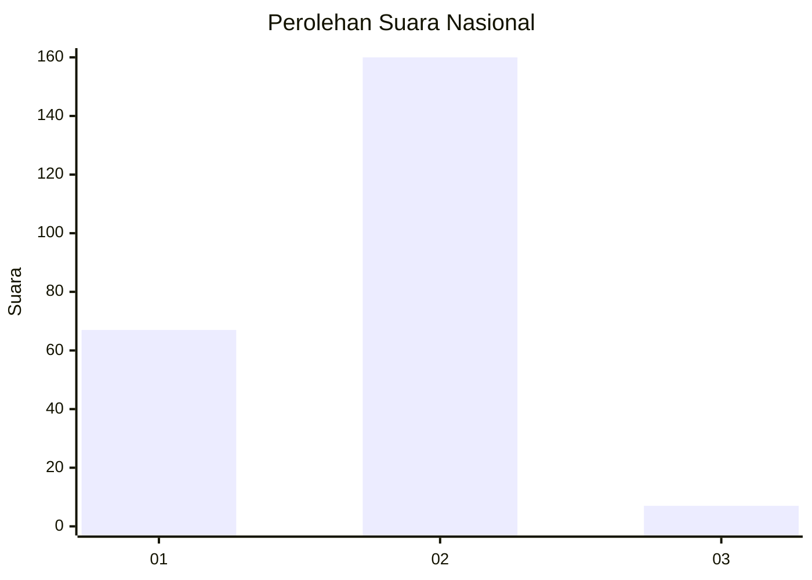
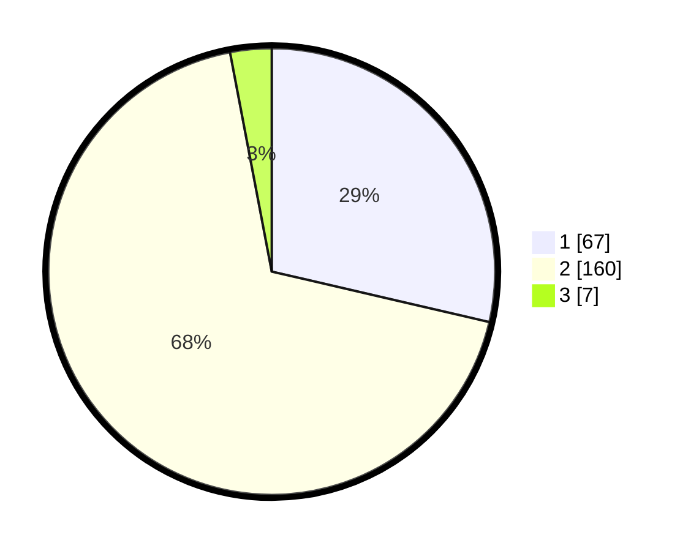

# Hasil

## Grafik

## Tabel

| No. | Nama Paslon    | Suara | Suara (raw) | Persentase |
|:--- |:-------------- | -----:| -----------:| ----------:|
| 1   | ANIES MUHAIMIN | 67    | [67][p-1]   | 28,63      |
| 2   | PRABOWO GIBRAN | 160   | [160][p-2]  | 68,38      |
| 3   | GANJAR MAHFUD  | 7     | [7][p-3]    | 2,99       |

[p-1]: https://github.com/gigit-pemilu/pemilu-2024/blob/main/pilpres/hitung-suara/sub/75-gorontalo/sub/01-gorontalo/sub/02-telaga/sub/2011-bulila/sub/002-tps/sub/paslon-1.txt
[p-2]: https://github.com/gigit-pemilu/pemilu-2024/blob/main/pilpres/hitung-suara/sub/75-gorontalo/sub/01-gorontalo/sub/02-telaga/sub/2011-bulila/sub/002-tps/sub/paslon-2.txt
[p-3]: https://github.com/gigit-pemilu/pemilu-2024/blob/main/pilpres/hitung-suara/sub/75-gorontalo/sub/01-gorontalo/sub/02-telaga/sub/2011-bulila/sub/002-tps/sub/paslon-3.txt

## Foto C Plano

https://sirekap-obj-formc.kpu.go.id/4388/pemilu/ppwp/75/01/02/20/11/7501022011002-20240214-202052--ba889275-ebc9-479c-90c6-4937a783cb3c.jpg

https://sirekap-obj-formc.kpu.go.id/4388/pemilu/ppwp/75/01/02/20/11/7501022011002-20240214-202238--e4e62630-4949-4be5-9feb-4863836f4c2c.jpg

https://sirekap-obj-formc.kpu.go.id/4388/pemilu/ppwp/75/01/02/20/11/7501022011002-20240215-104920--e4c5c2e0-88b9-4ba3-9c78-04817247c234.jpg

## Metadata

| Key        | Value               |
| ---------- | ------------------- |
| Time Stamp | 2024-02-15 15:00:29 |

