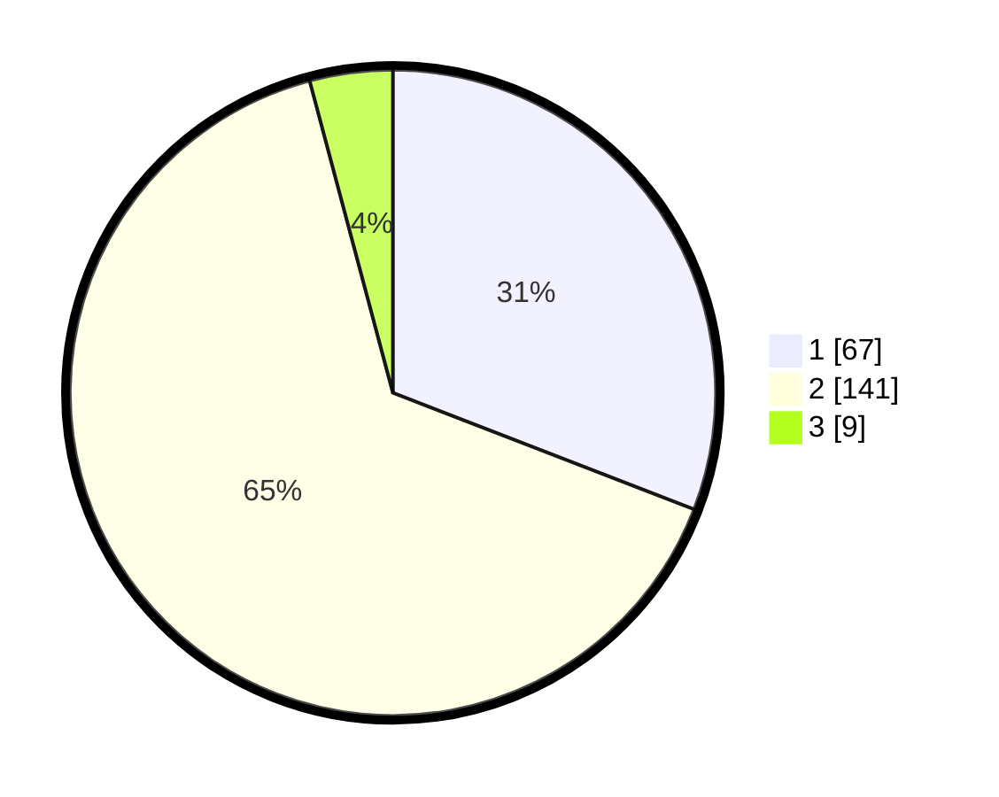

# Hasil

## Grafik

## Tabel

| No. | Nama Paslon    | Suara | Suara (raw) | Persentase |
|:--- |:-------------- | -----:| -----------:| ----------:|
| 1   | ANIES MUHAIMIN | 67    | [67][p-1]   | 30,88      |
| 2   | PRABOWO GIBRAN | 141   | [141][p-2]  | 64,98      |
| 3   | GANJAR MAHFUD  | 9     | [9][p-3]    | 4,15       |

[p-1]: https://github.com/gigit-pemilu/pemilu-2024-75-gorontalo/blob/main/pilpres/hitung-suara/sub/75-gorontalo/sub/01-gorontalo/sub/02-telaga/sub/2011-bulila/sub/005-tps/sub/paslon-1.txt
[p-2]: https://github.com/gigit-pemilu/pemilu-2024-75-gorontalo/blob/main/pilpres/hitung-suara/sub/75-gorontalo/sub/01-gorontalo/sub/02-telaga/sub/2011-bulila/sub/005-tps/sub/paslon-2.txt
[p-3]: https://github.com/gigit-pemilu/pemilu-2024-75-gorontalo/blob/main/pilpres/hitung-suara/sub/75-gorontalo/sub/01-gorontalo/sub/02-telaga/sub/2011-bulila/sub/005-tps/sub/paslon-3.txt

## Foto C Plano

https://sirekap-obj-formc.kpu.go.id/7489/pemilu/ppwp/75/01/02/20/11/7501022011005-20240215-005454--5b7ba8d2-cdce-4c41-a2c4-827034fcf6ba.jpg

https://sirekap-obj-formc.kpu.go.id/7489/pemilu/ppwp/75/01/02/20/11/7501022011005-20240215-005604--f6fa9ec9-1c17-4c84-b9eb-f0f5294f1b1a.jpg

https://sirekap-obj-formc.kpu.go.id/7489/pemilu/ppwp/75/01/02/20/11/7501022011005-20240215-005701--0ce4a5dd-54f2-4a35-9dd5-3e5b63653291.jpg

## Metadata

| Key        | Value               |
| ---------- | ------------------- |
| Time Stamp | 2024-02-15 18:00:26 |

