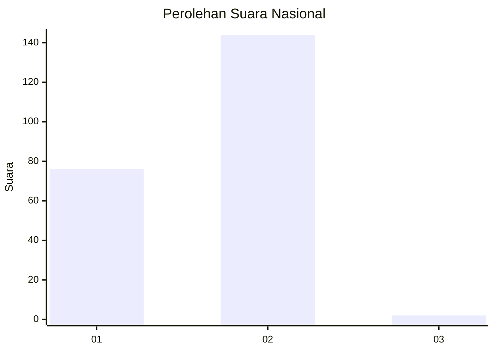
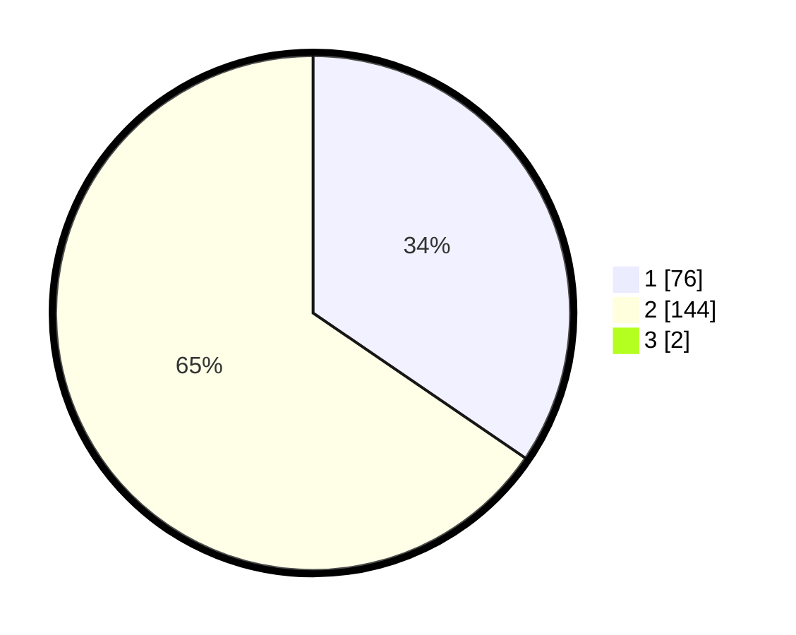

# Hasil

## Grafik

## Tabel

| No. | Nama Paslon    | Suara | Suara (raw) | Persentase |
|:--- |:-------------- | -----:| -----------:| ----------:|
| 1   | ANIES MUHAIMIN | 76    | [76][p-1]   | 34,23      |
| 2   | PRABOWO GIBRAN | 144   | [144][p-2]  | 64,86      |
| 3   | GANJAR MAHFUD  | 2     | [2][p-3]    | 0,90       |

[p-1]: https://github.com/gigit-pemilu/pemilu-2024/blob/main/pilpres/hitung-suara/sub/75-gorontalo/sub/01-gorontalo/sub/02-telaga/sub/2011-bulila/sub/007-tps/sub/paslon-1.txt
[p-2]: https://github.com/gigit-pemilu/pemilu-2024/blob/main/pilpres/hitung-suara/sub/75-gorontalo/sub/01-gorontalo/sub/02-telaga/sub/2011-bulila/sub/007-tps/sub/paslon-2.txt
[p-3]: https://github.com/gigit-pemilu/pemilu-2024/blob/main/pilpres/hitung-suara/sub/75-gorontalo/sub/01-gorontalo/sub/02-telaga/sub/2011-bulila/sub/007-tps/sub/paslon-3.txt

## Foto C Plano

https://sirekap-obj-formc.kpu.go.id/9679/pemilu/ppwp/75/01/02/20/11/7501022011007-20240215-072259--1bd5ce17-9511-4d85-9146-5763603c5840.jpg

https://sirekap-obj-formc.kpu.go.id/9679/pemilu/ppwp/75/01/02/20/11/7501022011007-20240215-072621--a4d24586-02b9-4ec5-8abe-518f4774ae72.jpg

https://sirekap-obj-formc.kpu.go.id/9679/pemilu/ppwp/75/01/02/20/11/7501022011007-20240215-073031--44a7f29a-123d-4f32-aef3-79d658410de1.jpg

## Metadata

| Key        | Value               |
| ---------- | ------------------- |
| Time Stamp | 2024-02-24 22:31:28 |

