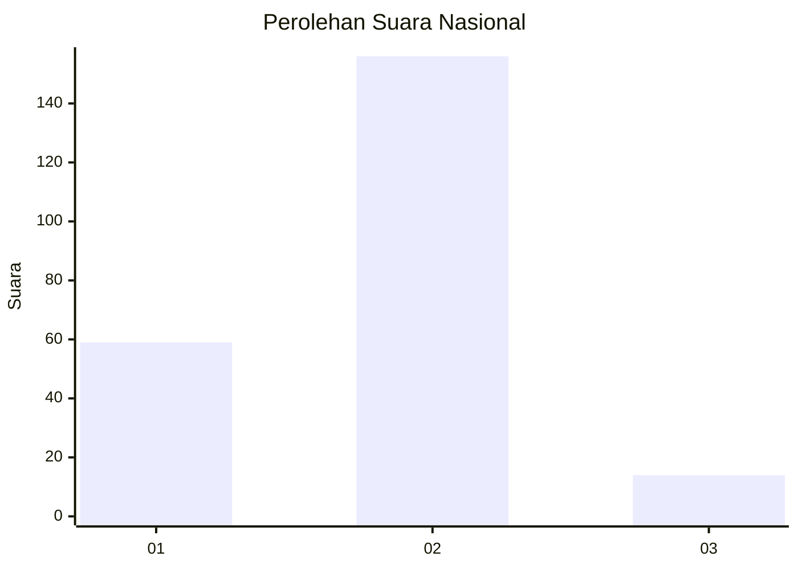
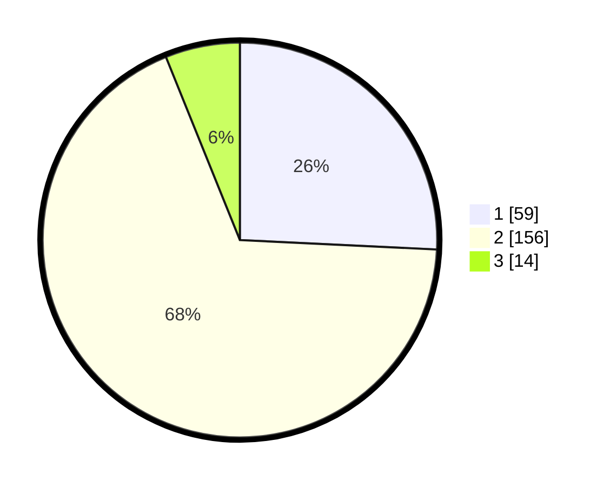

# Hasil

## Grafik

## Tabel

| No. | Nama Paslon    | Suara | Suara (raw) | Persentase |
|:--- |:-------------- | -----:| -----------:| ----------:|
| 1   | ANIES MUHAIMIN | 59    | [59][p-1]   | 25,76      |
| 2   | PRABOWO GIBRAN | 156   | [156][p-2]  | 68,12      |
| 3   | GANJAR MAHFUD  | 14    | [14][p-3]   | 6,11       |

[p-1]: https://github.com/gigit-pemilu/pemilu-2024/blob/main/pilpres/hitung-suara/sub/75-gorontalo/sub/01-gorontalo/sub/02-telaga/sub/2018-dulamayo-selatan/sub/001-tps/sub/paslon-1.txt
[p-2]: https://github.com/gigit-pemilu/pemilu-2024/blob/main/pilpres/hitung-suara/sub/75-gorontalo/sub/01-gorontalo/sub/02-telaga/sub/2018-dulamayo-selatan/sub/001-tps/sub/paslon-2.txt
[p-3]: https://github.com/gigit-pemilu/pemilu-2024/blob/main/pilpres/hitung-suara/sub/75-gorontalo/sub/01-gorontalo/sub/02-telaga/sub/2018-dulamayo-selatan/sub/001-tps/sub/paslon-3.txt

## Foto C Plano

https://sirekap-obj-formc.kpu.go.id/6af0/pemilu/ppwp/75/01/02/20/18/7501022018001-20240215-123334--1fdfbdb8-e02a-4a5f-b181-8c0ab1fc72a3.jpg

https://sirekap-obj-formc.kpu.go.id/6af0/pemilu/ppwp/75/01/02/20/18/7501022018001-20240215-123509--a3c735a2-3e94-42ff-803f-aa8f760d0524.jpg

https://sirekap-obj-formc.kpu.go.id/6af0/pemilu/ppwp/75/01/02/20/18/7501022018001-20240215-123658--c58f8e9e-13fd-4ecf-afa5-415e35c9e0ca.jpg

## Metadata

| Key        | Value               |
| ---------- | ------------------- |
| Time Stamp | 2024-02-24 22:31:28 |

