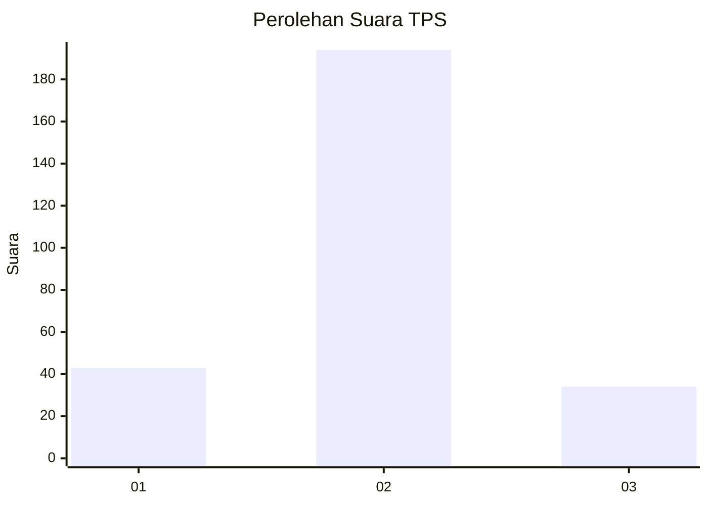
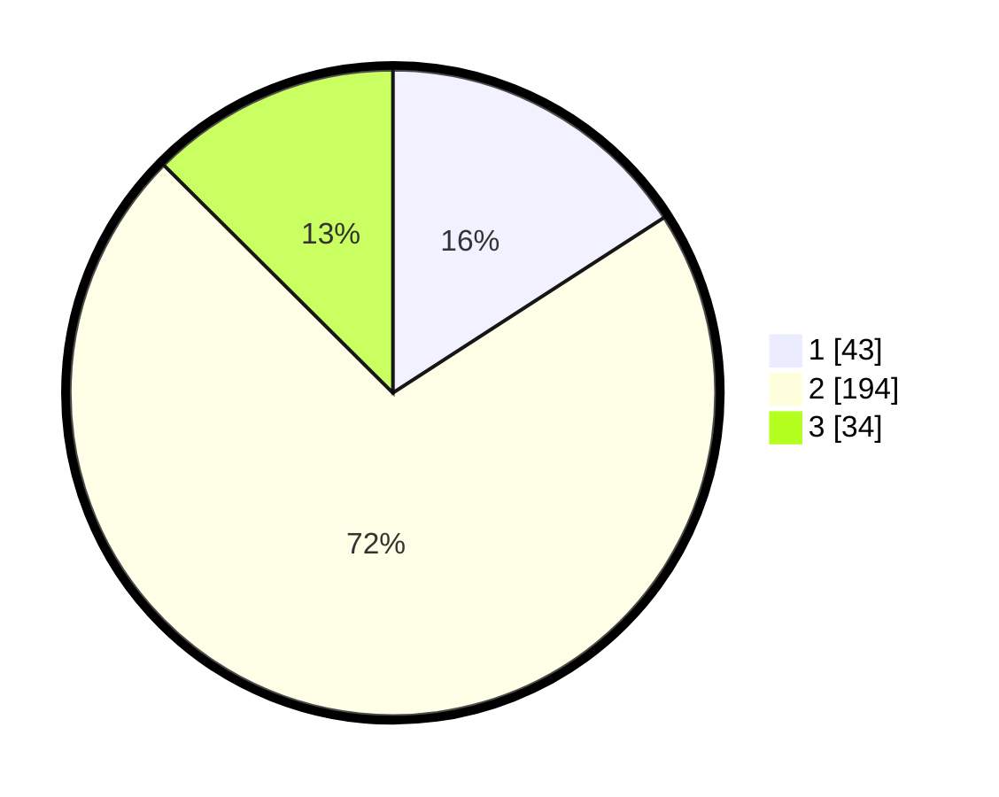

# Hasil

## Grafik

## Tabel

| No. | Nama Paslon    | Suara | Suara (raw) | Persentase |
|:--- |:-------------- | -----:| -----------:| ----------:|
| 1   | ANIES MUHAIMIN | 43    | [43][p-1]   | 15,87      |
| 2   | PRABOWO GIBRAN | 194   | [194][p-2]  | 71,59      |
| 3   | GANJAR MAHFUD  | 34    | [34][p-3]   | 12,55      |

[p-1]: https://github.com/gigit-pemilu/pemilu-2024-75-gorontalo/blob/main/pilpres/hitung-suara/sub/75-gorontalo/sub/01-gorontalo/sub/02-telaga/sub/2020-dulohupa/sub/003-tps/sub/paslon-1.txt
[p-2]: https://github.com/gigit-pemilu/pemilu-2024-75-gorontalo/blob/main/pilpres/hitung-suara/sub/75-gorontalo/sub/01-gorontalo/sub/02-telaga/sub/2020-dulohupa/sub/003-tps/sub/paslon-2.txt
[p-3]: https://github.com/gigit-pemilu/pemilu-2024-75-gorontalo/blob/main/pilpres/hitung-suara/sub/75-gorontalo/sub/01-gorontalo/sub/02-telaga/sub/2020-dulohupa/sub/003-tps/sub/paslon-3.txt

## Foto C Plano

https://sirekap-obj-formc.kpu.go.id/b054/pemilu/ppwp/75/01/02/20/20/7501022020003-20240218-134552--9eee4743-08c3-420a-ae6b-75fa49d10424.jpg

https://sirekap-obj-formc.kpu.go.id/b054/pemilu/ppwp/75/01/02/20/20/7501022020003-20240218-134749--2807d70a-4c9b-4e52-b257-ca7ace9d7195.jpg

https://sirekap-obj-formc.kpu.go.id/b054/pemilu/ppwp/75/01/02/20/20/7501022020003-20240218-134846--7f78b34e-584f-4ad3-bbbe-0cd6dfa4eecb.jpg

## Metadata

| Key        | Value               |
| ---------- | ------------------- |
| Time Stamp | 2024-02-24 22:31:28 |

