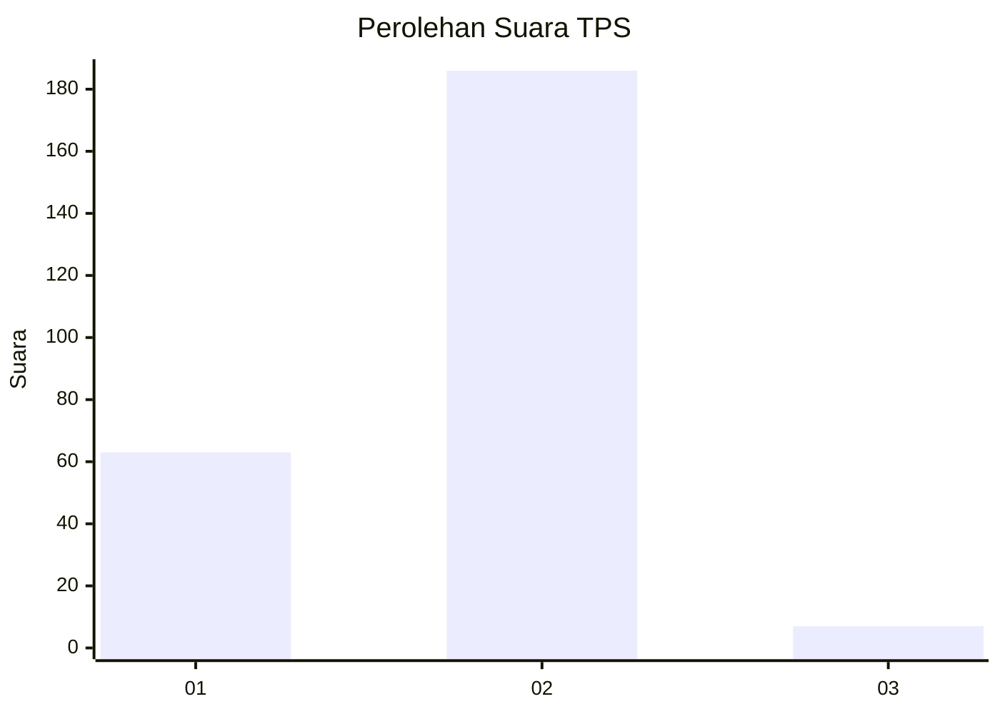
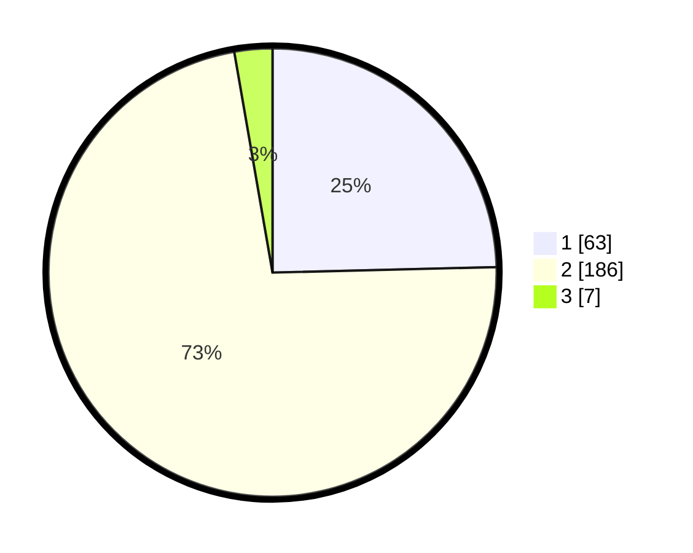

# Hasil

## Grafik

## Tabel

| No. | Nama Paslon    | Suara | Suara (raw) | Persentase |
|:--- |:-------------- | -----:| -----------:| ----------:|
| 1   | ANIES MUHAIMIN | 63    | [63][p-1]   | 24,61      |
| 2   | PRABOWO GIBRAN | 186   | [186][p-2]  | 72,66      |
| 3   | GANJAR MAHFUD  | 7     | [7][p-3]    | 2,73       |

[p-1]: https://github.com/gigit-pemilu/pemilu-2024-75-gorontalo/blob/main/pilpres/hitung-suara/sub/75-gorontalo/sub/01-gorontalo/sub/19-tabongo/sub/2001-tabongo-timur/sub/005-tps/sub/paslon-1.txt
[p-2]: https://github.com/gigit-pemilu/pemilu-2024-75-gorontalo/blob/main/pilpres/hitung-suara/sub/75-gorontalo/sub/01-gorontalo/sub/19-tabongo/sub/2001-tabongo-timur/sub/005-tps/sub/paslon-2.txt
[p-3]: https://github.com/gigit-pemilu/pemilu-2024-75-gorontalo/blob/main/pilpres/hitung-suara/sub/75-gorontalo/sub/01-gorontalo/sub/19-tabongo/sub/2001-tabongo-timur/sub/005-tps/sub/paslon-3.txt

## Foto C Plano

https://sirekap-obj-formc.kpu.go.id/786d/pemilu/ppwp/75/01/19/20/01/7501192001005-20240221-184625--126aa63b-c02b-4135-92a1-b53df5196833.jpg

https://sirekap-obj-formc.kpu.go.id/786d/pemilu/ppwp/75/01/19/20/01/7501192001005-20240221-184729--03b9f0fc-bce8-457e-99ca-843bad32ac45.jpg

https://sirekap-obj-formc.kpu.go.id/786d/pemilu/ppwp/75/01/19/20/01/7501192001005-20240221-184829--6af2fc08-c7dc-4cdd-88bc-6b780a7336c4.jpg

## Metadata

| Key        | Value               |
| ---------- | ------------------- |
| Time Stamp | 2024-02-24 22:31:28 |

