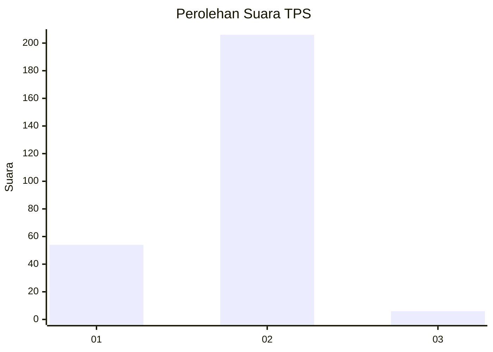
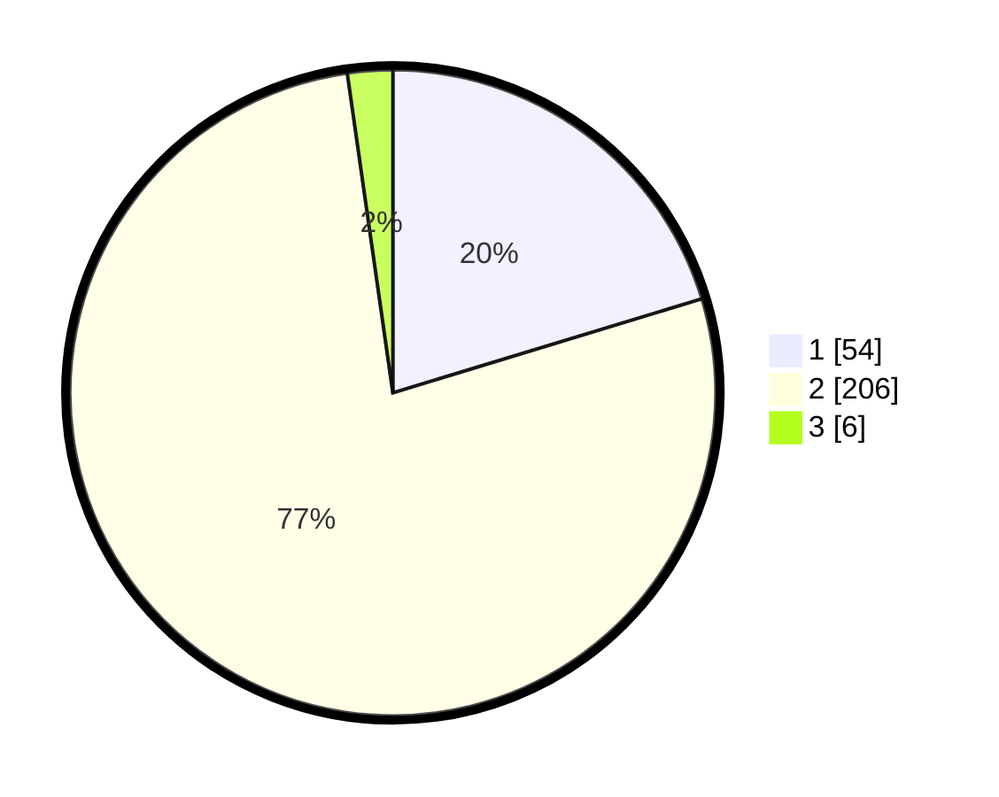

# Hasil

## Grafik

## Tabel

| No. | Nama Paslon    | Suara | Suara (raw) | Persentase |
|:--- |:-------------- | -----:| -----------:| ----------:|
| 1   | ANIES MUHAIMIN | 54    | [54][p-1]   | 20,30      |
| 2   | PRABOWO GIBRAN | 206   | [206][p-2]  | 77,44      |
| 3   | GANJAR MAHFUD  | 6     | [6][p-3]    | 2,26       |

[p-1]: https://github.com/gigit-pemilu/pemilu-2024-75-gorontalo/blob/main/pilpres/hitung-suara/sub/75-gorontalo/sub/02-boalemo/sub/01-paguyaman/sub/2009-wonggahu/sub/006-tps/sub/paslon-1.txt
[p-2]: https://github.com/gigit-pemilu/pemilu-2024-75-gorontalo/blob/main/pilpres/hitung-suara/sub/75-gorontalo/sub/02-boalemo/sub/01-paguyaman/sub/2009-wonggahu/sub/006-tps/sub/paslon-2.txt
[p-3]: https://github.com/gigit-pemilu/pemilu-2024-75-gorontalo/blob/main/pilpres/hitung-suara/sub/75-gorontalo/sub/02-boalemo/sub/01-paguyaman/sub/2009-wonggahu/sub/006-tps/sub/paslon-3.txt

## Foto C Plano

https://sirekap-obj-formc.kpu.go.id/198b/pemilu/ppwp/75/02/01/20/09/7502012009006-20240218-000348--3c69509f-c4a1-4ee0-9709-43767d1315bc.jpg

https://sirekap-obj-formc.kpu.go.id/198b/pemilu/ppwp/75/02/01/20/09/7502012009006-20240215-151247--544aa4ca-864d-4b47-b7d3-e997c7549bca.jpg

https://sirekap-obj-formc.kpu.go.id/198b/pemilu/ppwp/75/02/01/20/09/7502012009006-20240215-151550--dcfd528f-774c-4aa6-b850-217fd6a8e753.jpg

## Metadata

| Key        | Value               |
| ---------- | ------------------- |
| Time Stamp | 2024-02-24 22:31:28 |

