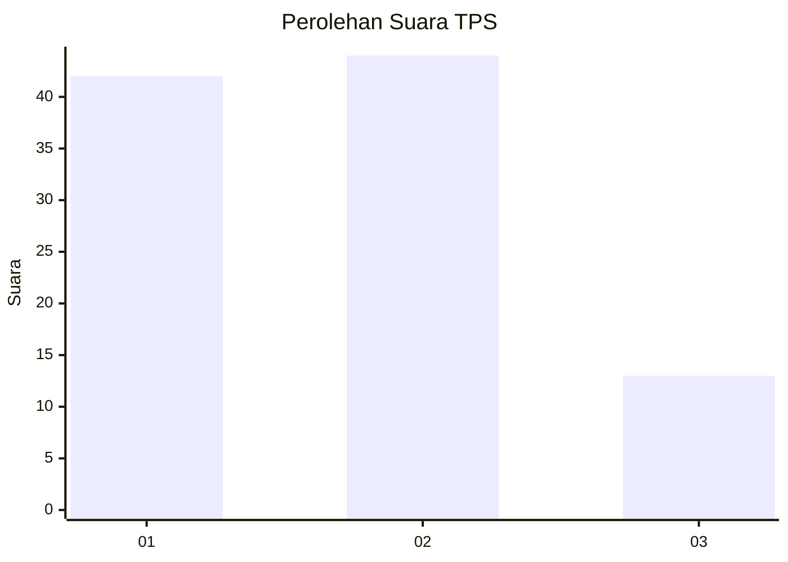
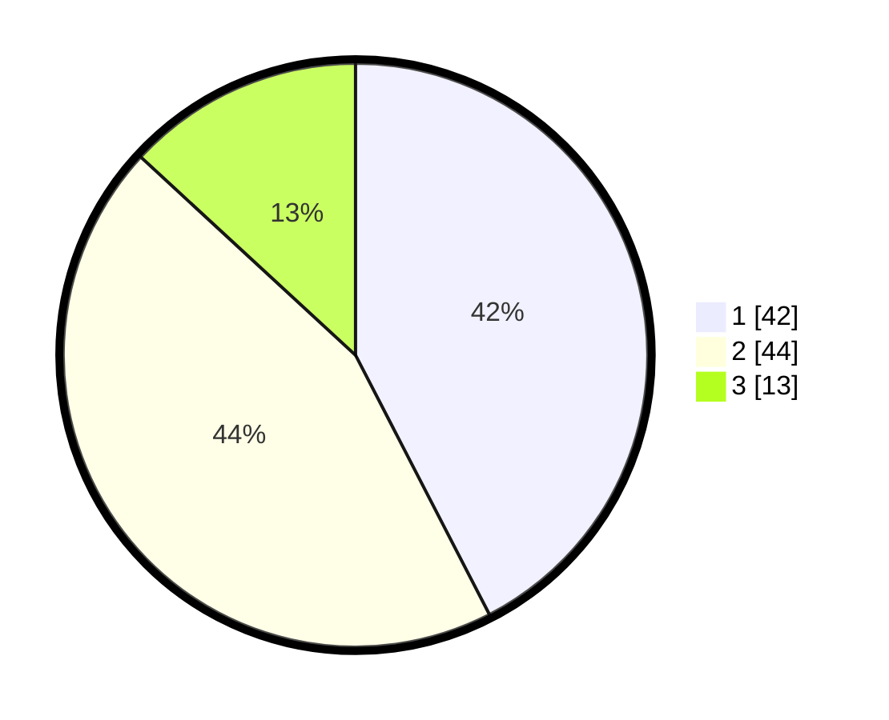

# Hasil

## Grafik

## Tabel

| No. | Nama Paslon    | Suara | Suara (raw) | Persentase |
|:--- |:-------------- | -----:| -----------:| ----------:|
| 1   | ANIES MUHAIMIN | 42    | [42][p-1]   | 42,42      |
| 2   | PRABOWO GIBRAN | 44    | [44][p-2]   | 44,44      |
| 3   | GANJAR MAHFUD  | 13    | [13][p-3]   | 13,13      |

[p-1]: https://github.com/gigit-pemilu/pemilu-2024-75-gorontalo/blob/main/pilpres/hitung-suara/sub/75-gorontalo/sub/02-boalemo/sub/01-paguyaman/sub/2021-bualo/sub/004-tps/sub/paslon-1.txt
[p-2]: https://github.com/gigit-pemilu/pemilu-2024-75-gorontalo/blob/main/pilpres/hitung-suara/sub/75-gorontalo/sub/02-boalemo/sub/01-paguyaman/sub/2021-bualo/sub/004-tps/sub/paslon-2.txt
[p-3]: https://github.com/gigit-pemilu/pemilu-2024-75-gorontalo/blob/main/pilpres/hitung-suara/sub/75-gorontalo/sub/02-boalemo/sub/01-paguyaman/sub/2021-bualo/sub/004-tps/sub/paslon-3.txt

## Foto C Plano

https://sirekap-obj-formc.kpu.go.id/53f1/pemilu/ppwp/75/02/01/20/21/7502012021004-20240219-113415--729e5e46-86fc-4eb5-b350-c5234d459993.jpg

https://sirekap-obj-formc.kpu.go.id/53f1/pemilu/ppwp/75/02/01/20/21/7502012021004-20240219-113531--d74e5f95-7916-49d7-94a9-bdad3c6d1511.jpg

https://sirekap-obj-formc.kpu.go.id/53f1/pemilu/ppwp/75/02/01/20/21/7502012021004-20240219-113654--75605ccc-3717-4734-91cb-1635088ee61e.jpg

## Metadata

| Key        | Value               |
| ---------- | ------------------- |
| Time Stamp | 2024-02-19 12:00:00 |

## DATA PEMILIH TETAP

Jumlah pemilih dalam DPT: **435**.
 * L: **68**.
 * P: **67**.

## DATA PENGGUNA HAK PILIH

Jumlah pengguna hak pilih dalam DPT: **600**.
 * L: **44**.
 * P: **57**.

Jumlah pengguna hak pilih dalam DPTb: **800**.
 * L: **0**.
 * P: **80**.

Jumlah pengguna hak pilih dalam DPK: **2**.
 * L: **41**.
 * P: **40**.

Jumlah pengguna hak pilih: **104**.
 * L: **50**.
 * P: **51**.

## JUMLAH SUARA SAH DAN TIDAK SAH

JUMLAH SELURUH SUARA SAH: **95**.

JUMLAH SUARA TIDAK SAH: **2**.

JUMLAH SELURUH SUARA SAH DAN SUARA TIDAK SAH: **606**.

