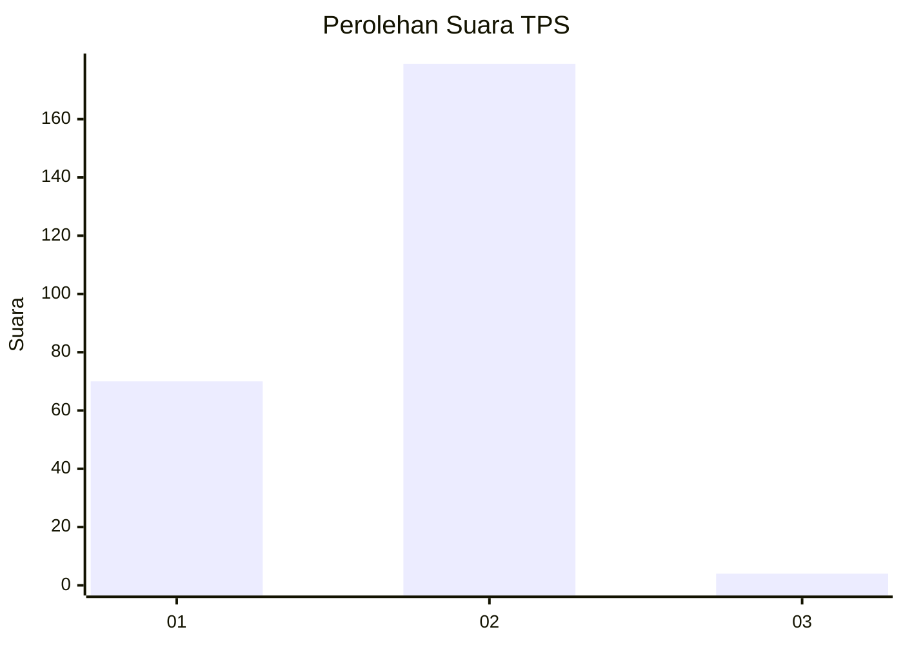
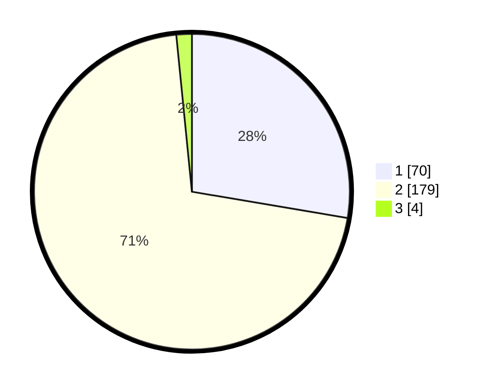

# Hasil

## Grafik

## Tabel

| No. | Nama Paslon    | Suara | Suara (raw) | Persentase |
|:--- |:-------------- | -----:| -----------:| ----------:|
| 1   | ANIES MUHAIMIN | 70    | [70][p-1]   | 27,67      |
| 2   | PRABOWO GIBRAN | 179   | [179][p-2]  | 70,75      |
| 3   | GANJAR MAHFUD  | 4     | [4][p-3]    | 1,58       |

[p-1]: https://github.com/gigit-pemilu/pemilu-2024-75-gorontalo/blob/main/pilpres/hitung-suara/sub/75-gorontalo/sub/02-boalemo/sub/05-mananggu/sub/2004-bendungan/sub/001-tps/sub/paslon-1.txt
[p-2]: https://github.com/gigit-pemilu/pemilu-2024-75-gorontalo/blob/main/pilpres/hitung-suara/sub/75-gorontalo/sub/02-boalemo/sub/05-mananggu/sub/2004-bendungan/sub/001-tps/sub/paslon-2.txt
[p-3]: https://github.com/gigit-pemilu/pemilu-2024-75-gorontalo/blob/main/pilpres/hitung-suara/sub/75-gorontalo/sub/02-boalemo/sub/05-mananggu/sub/2004-bendungan/sub/001-tps/sub/paslon-3.txt

## Foto C Plano

https://sirekap-obj-formc.kpu.go.id/9ca0/pemilu/ppwp/75/02/05/20/04/7502052004001-20240215-173223--bacfa00c-adfb-4e78-a911-113cda5a4c4a.jpg

https://sirekap-obj-formc.kpu.go.id/9ca0/pemilu/ppwp/75/02/05/20/04/7502052004001-20240215-165903--75636392-5f2e-48a6-bbe3-7cd81efa6188.jpg

https://sirekap-obj-formc.kpu.go.id/9ca0/pemilu/ppwp/75/02/05/20/04/7502052004001-20240215-170038--944af438-c351-46b1-b2ab-2b45aac007a3.jpg

## Metadata

| Key        | Value               |
| ---------- | ------------------- |
| Time Stamp | 2024-02-24 22:31:28 |

