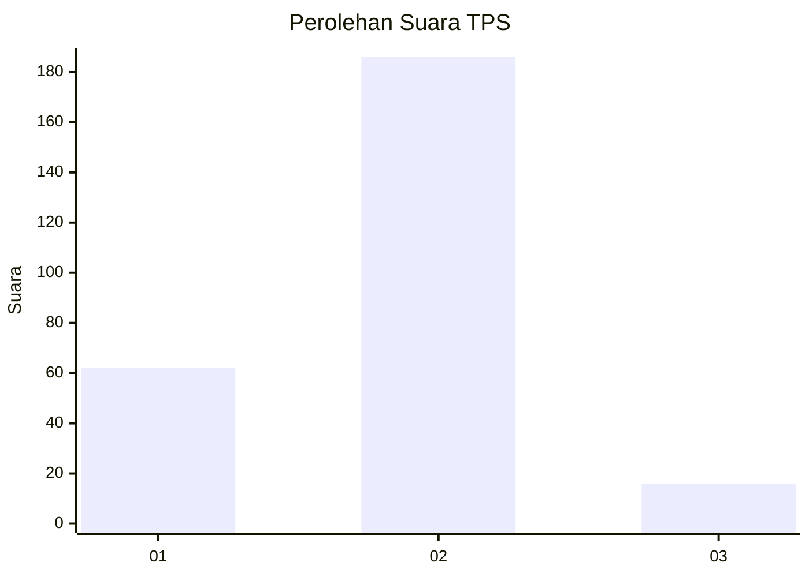

# Hasil

## Grafik

## Tabel

| No. | Nama Paslon    | Suara | Suara (raw) | Persentase |
|:--- |:-------------- | -----:| -----------:| ----------:|
| 1   | ANIES MUHAIMIN | 62    | [62][p-1]   | 23,48      |
| 2   | PRABOWO GIBRAN | 186   | [186][p-2]  | 70,45      |
| 3   | GANJAR MAHFUD  | 16    | [16][p-3]   | 6,06       |

[p-1]: https://github.com/gigit-pemilu/pemilu-2024-75-gorontalo/blob/main/pilpres/hitung-suara/sub/75-gorontalo/sub/02-boalemo/sub/06-botumoito/sub/2003-patoameme/sub/005-tps/sub/paslon-1.txt
[p-2]: https://github.com/gigit-pemilu/pemilu-2024-75-gorontalo/blob/main/pilpres/hitung-suara/sub/75-gorontalo/sub/02-boalemo/sub/06-botumoito/sub/2003-patoameme/sub/005-tps/sub/paslon-2.txt
[p-3]: https://github.com/gigit-pemilu/pemilu-2024-75-gorontalo/blob/main/pilpres/hitung-suara/sub/75-gorontalo/sub/02-boalemo/sub/06-botumoito/sub/2003-patoameme/sub/005-tps/sub/paslon-3.txt

## Foto C Plano

https://sirekap-obj-formc.kpu.go.id/c216/pemilu/ppwp/75/02/06/20/03/7502062003005-20240215-220229--3abe9b07-e35f-4eed-bec5-5f20fdf4b088.jpg

https://sirekap-obj-formc.kpu.go.id/c216/pemilu/ppwp/75/02/06/20/03/7502062003005-20240215-154530--8ed4eb98-ee55-4b67-b064-31596b11f52a.jpg

https://sirekap-obj-formc.kpu.go.id/c216/pemilu/ppwp/75/02/06/20/03/7502062003005-20240215-220200--5129456a-0b30-4cea-9614-d93ee2e8c46b.jpg

## Metadata

| Key        | Value               |
| ---------- | ------------------- |
| Time Stamp | 2024-02-16 01:30:27 |

