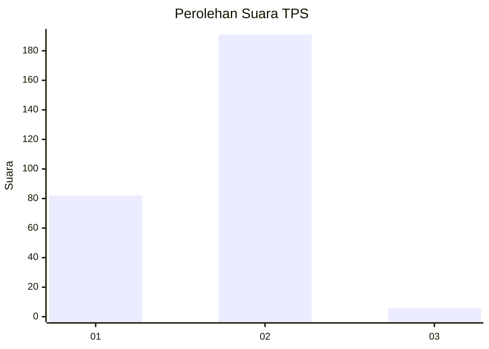
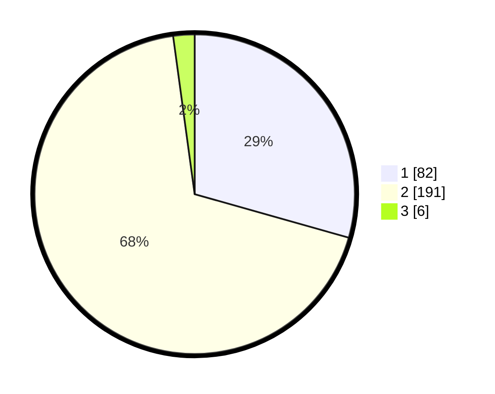

# Hasil

## Grafik

## Tabel

| No. | Nama Paslon    | Suara | Suara (raw) | Persentase |
|:--- |:-------------- | -----:| -----------:| ----------:|
| 1   | ANIES MUHAIMIN | 82    | [82][p-1]   | 29,39      |
| 2   | PRABOWO GIBRAN | 191   | [191][p-2]  | 68,46      |
| 3   | GANJAR MAHFUD  | 6     | [6][p-3]    | 2,15       |

[p-1]: https://github.com/gigit-pemilu/pemilu-2024-75-gorontalo/blob/main/pilpres/hitung-suara/sub/75-gorontalo/sub/02-boalemo/sub/06-botumoito/sub/2006-botumoito/sub/004-tps/sub/paslon-1.txt
[p-2]: https://github.com/gigit-pemilu/pemilu-2024-75-gorontalo/blob/main/pilpres/hitung-suara/sub/75-gorontalo/sub/02-boalemo/sub/06-botumoito/sub/2006-botumoito/sub/004-tps/sub/paslon-2.txt
[p-3]: https://github.com/gigit-pemilu/pemilu-2024-75-gorontalo/blob/main/pilpres/hitung-suara/sub/75-gorontalo/sub/02-boalemo/sub/06-botumoito/sub/2006-botumoito/sub/004-tps/sub/paslon-3.txt

## Foto C Plano

https://sirekap-obj-formc.kpu.go.id/f138/pemilu/ppwp/75/02/06/20/06/7502062006004-20240215-013928--b1f5fedd-6250-4fdd-b1c2-4e64f7d363c1.jpg

https://sirekap-obj-formc.kpu.go.id/f138/pemilu/ppwp/75/02/06/20/06/7502062006004-20240215-014659--1ef443e5-1b0f-43c4-9008-f2a2b6412c62.jpg

https://sirekap-obj-formc.kpu.go.id/f138/pemilu/ppwp/75/02/06/20/06/7502062006004-20240215-021714--9213535f-40d3-4e4c-8862-3a5882f26d8c.jpg

## Metadata

| Key        | Value               |
| ---------- | ------------------- |
| Time Stamp | 2024-02-16 13:00:29 |

