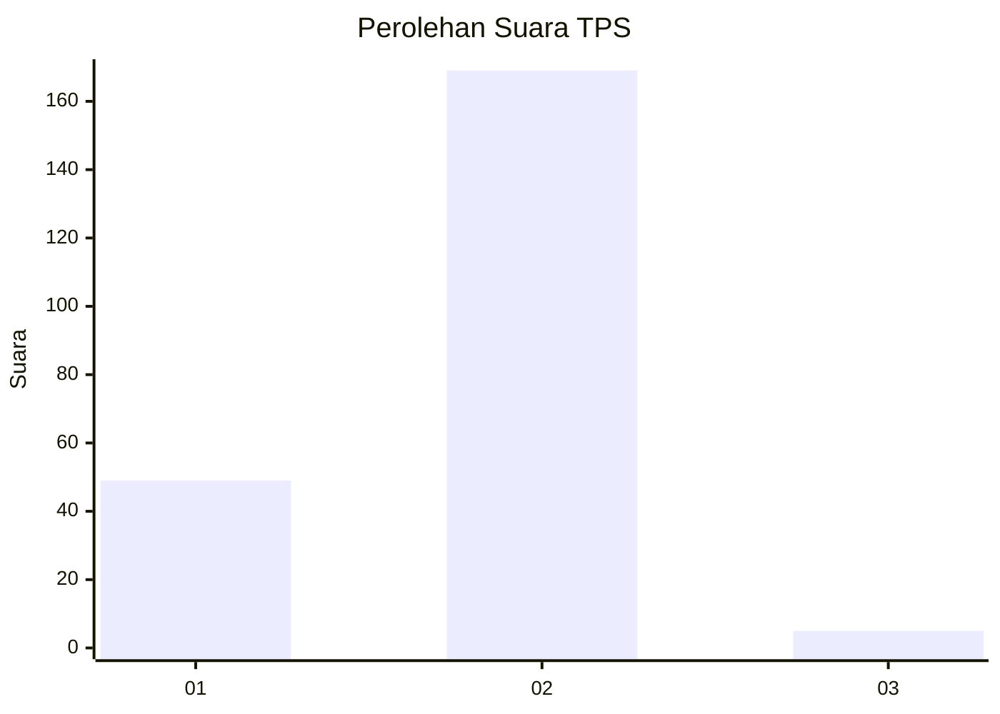
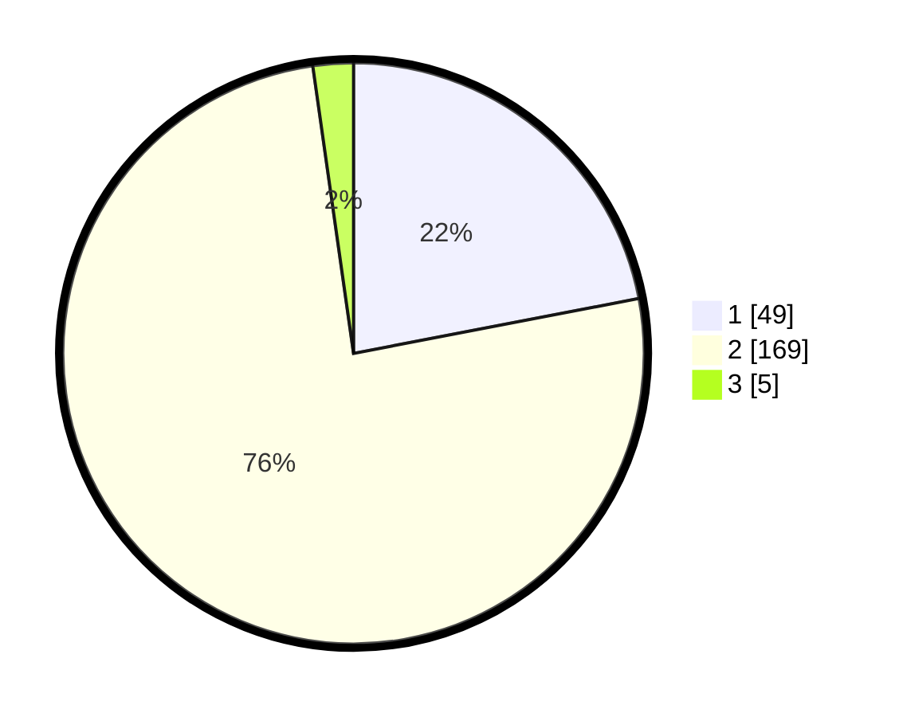

# Hasil

## Grafik

## Tabel

| No. | Nama Paslon    | Suara | Suara (raw) | Persentase |
|:--- |:-------------- | -----:| -----------:| ----------:|
| 1   | ANIES MUHAIMIN | 49    | [49][p-1]   | 21,97      |
| 2   | PRABOWO GIBRAN | 169   | [169][p-2]  | 75,78      |
| 3   | GANJAR MAHFUD  | 5     | [5][p-3]    | 2,24       |

[p-1]: https://github.com/gigit-pemilu/pemilu-2024-75-gorontalo/blob/main/pilpres/hitung-suara/sub/75-gorontalo/sub/02-boalemo/sub/07-paguyaman-pantai/sub/2003-limbatihu/sub/001-tps/sub/paslon-1.txt
[p-2]: https://github.com/gigit-pemilu/pemilu-2024-75-gorontalo/blob/main/pilpres/hitung-suara/sub/75-gorontalo/sub/02-boalemo/sub/07-paguyaman-pantai/sub/2003-limbatihu/sub/001-tps/sub/paslon-2.txt
[p-3]: https://github.com/gigit-pemilu/pemilu-2024-75-gorontalo/blob/main/pilpres/hitung-suara/sub/75-gorontalo/sub/02-boalemo/sub/07-paguyaman-pantai/sub/2003-limbatihu/sub/001-tps/sub/paslon-3.txt

## Foto C Plano

https://sirekap-obj-formc.kpu.go.id/758f/pemilu/ppwp/75/02/07/20/03/7502072003001-20240215-085059--24fb5550-45c3-4ec2-87fc-2448bc0dbd2a.jpg

https://sirekap-obj-formc.kpu.go.id/758f/pemilu/ppwp/75/02/07/20/03/7502072003001-20240215-085237--1a48cfbd-c65d-4a35-8d2b-07fefa865403.jpg

https://sirekap-obj-formc.kpu.go.id/758f/pemilu/ppwp/75/02/07/20/03/7502072003001-20240215-085323--41af3196-2d49-4860-94cc-71124d25e9b8.jpg

## Metadata

| Key        | Value               |
| ---------- | ------------------- |
| Time Stamp | 2024-02-24 22:31:28 |

