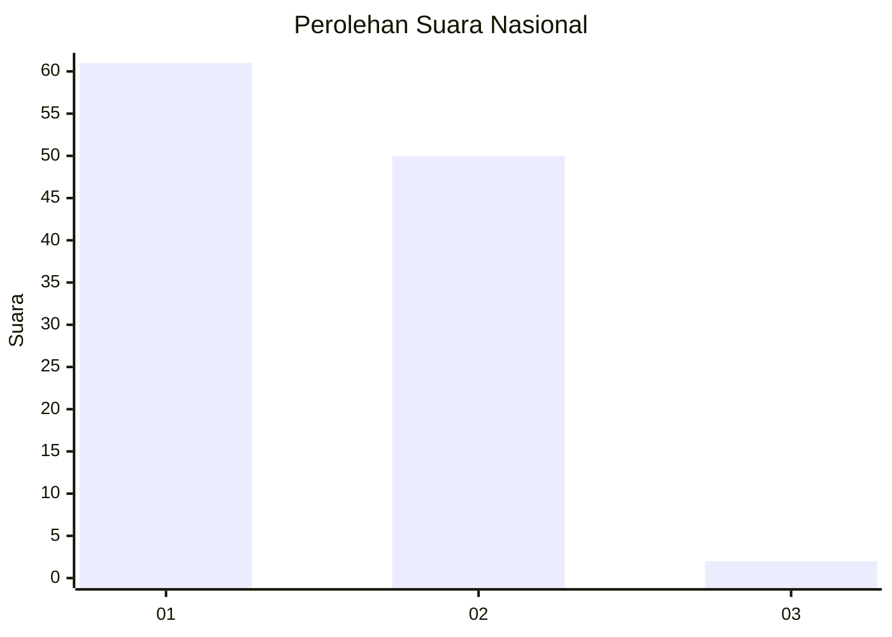
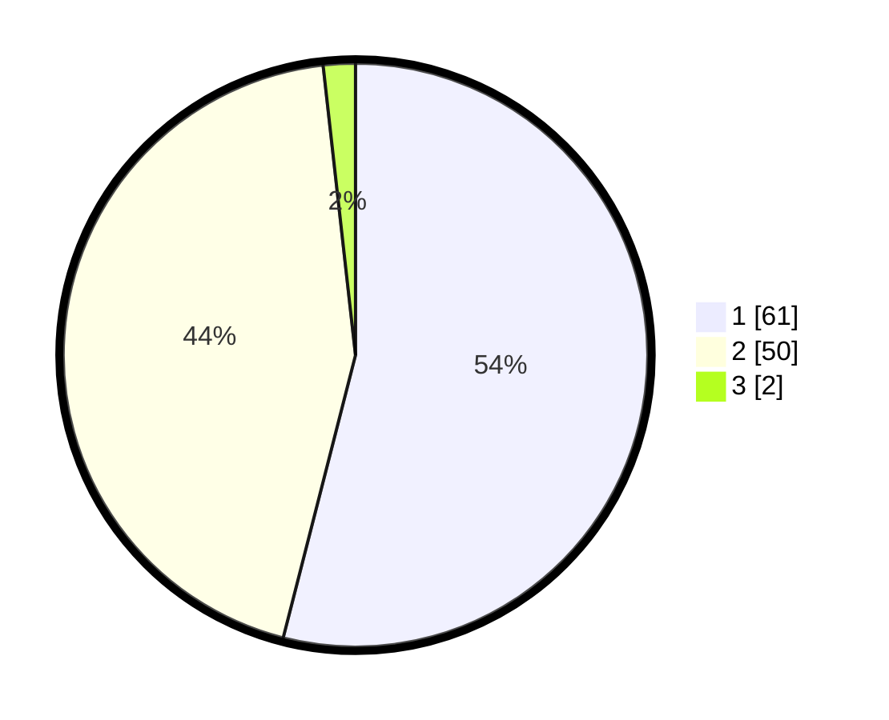

# Hasil

## Grafik

## Tabel

| No. | Nama Paslon    | Suara | Suara (raw) | Persentase |
|:--- |:-------------- | -----:| -----------:| ----------:|
| 1   | ANIES MUHAIMIN | 61    | [61][p-1]   | 53,98      |
| 2   | PRABOWO GIBRAN | 50    | [50][p-2]   | 44,25      |
| 3   | GANJAR MAHFUD  | 2     | [2][p-3]    | 1,77       |

[p-1]: https://github.com/gigit-pemilu/pemilu-2024/blob/main/pilpres/hitung-suara/sub/75-gorontalo/sub/02-boalemo/sub/07-paguyaman-pantai/sub/2006-bangga/sub/001-tps/sub/paslon-1.txt
[p-2]: https://github.com/gigit-pemilu/pemilu-2024/blob/main/pilpres/hitung-suara/sub/75-gorontalo/sub/02-boalemo/sub/07-paguyaman-pantai/sub/2006-bangga/sub/001-tps/sub/paslon-2.txt
[p-3]: https://github.com/gigit-pemilu/pemilu-2024/blob/main/pilpres/hitung-suara/sub/75-gorontalo/sub/02-boalemo/sub/07-paguyaman-pantai/sub/2006-bangga/sub/001-tps/sub/paslon-3.txt

## Foto C Plano

https://sirekap-obj-formc.kpu.go.id/5927/pemilu/ppwp/75/02/07/20/06/7502072006001-20240214-202236--cc3a63e3-3353-46bb-a1e3-99b0c9172e4a.jpg

https://sirekap-obj-formc.kpu.go.id/5927/pemilu/ppwp/75/02/07/20/06/7502072006001-20240214-141034--b0ace9fb-3a91-405b-b01c-c8dc4f58c2d2.jpg

https://sirekap-obj-formc.kpu.go.id/5927/pemilu/ppwp/75/02/07/20/06/7502072006001-20240214-204722--e85b42df-ea1f-4df7-b239-0354e26a6779.jpg

## Metadata

| Key        | Value               |
| ---------- | ------------------- |
| Time Stamp | 2024-02-15 20:30:46 |

