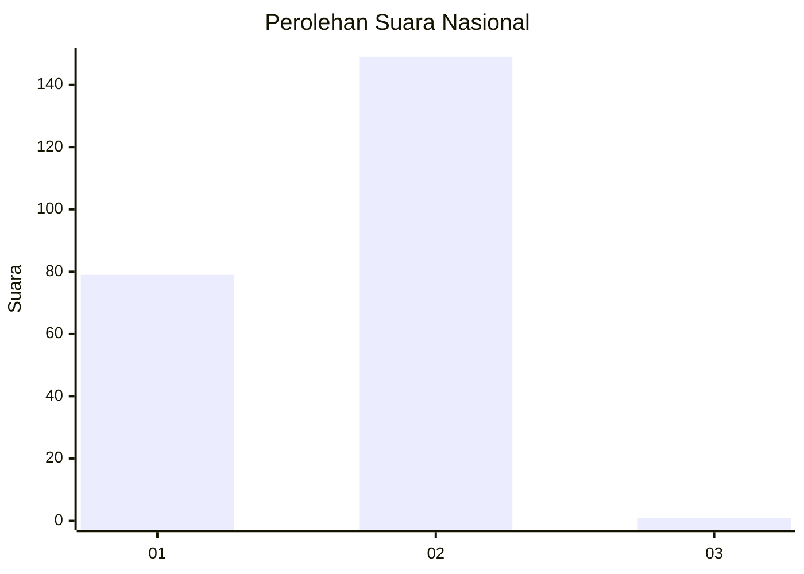
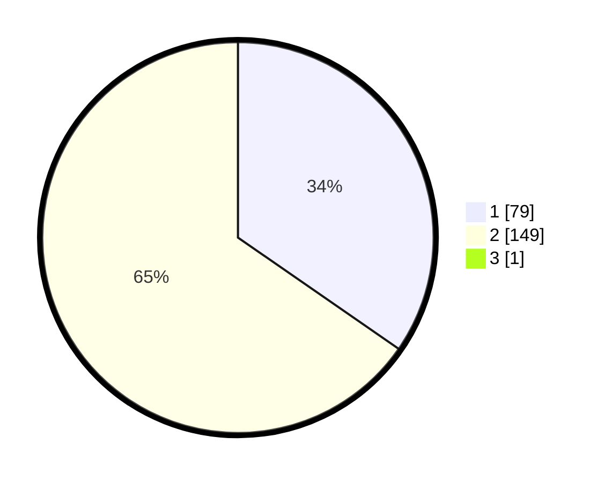

# Hasil

## Grafik

## Tabel

| No. | Nama Paslon    | Suara | Suara (raw) | Persentase |
|:--- |:-------------- | -----:| -----------:| ----------:|
| 1   | ANIES MUHAIMIN | 79    | [79][p-1]   | 34,50      |
| 2   | PRABOWO GIBRAN | 149   | [149][p-2]  | 65,07      |
| 3   | GANJAR MAHFUD  | 1     | [1][p-3]    | 0,44       |

[p-1]: https://github.com/gigit-pemilu/pemilu-2024/blob/main/pilpres/hitung-suara/sub/75-gorontalo/sub/03-bone-bolango/sub/04-bonepantai/sub/2004-bilungala/sub/002-tps/sub/paslon-1.txt
[p-2]: https://github.com/gigit-pemilu/pemilu-2024/blob/main/pilpres/hitung-suara/sub/75-gorontalo/sub/03-bone-bolango/sub/04-bonepantai/sub/2004-bilungala/sub/002-tps/sub/paslon-2.txt
[p-3]: https://github.com/gigit-pemilu/pemilu-2024/blob/main/pilpres/hitung-suara/sub/75-gorontalo/sub/03-bone-bolango/sub/04-bonepantai/sub/2004-bilungala/sub/002-tps/sub/paslon-3.txt

## Foto C Plano

https://sirekap-obj-formc.kpu.go.id/dcd2/pemilu/ppwp/75/03/04/20/04/7503042004002-20240215-095200--32324da7-7460-4b6a-b0ff-67391c1c41a1.jpg

https://sirekap-obj-formc.kpu.go.id/dcd2/pemilu/ppwp/75/03/04/20/04/7503042004002-20240218-191517--2ad0e6e0-6df2-4b19-9643-9c821a0885bd.jpg

https://sirekap-obj-formc.kpu.go.id/dcd2/pemilu/ppwp/75/03/04/20/04/7503042004002-20240215-095408--153547d3-5ae1-4d9a-816e-afa971971339.jpg

## Metadata

| Key        | Value               |
| ---------- | ------------------- |
| Time Stamp | 2024-02-19 06:16:00 |

