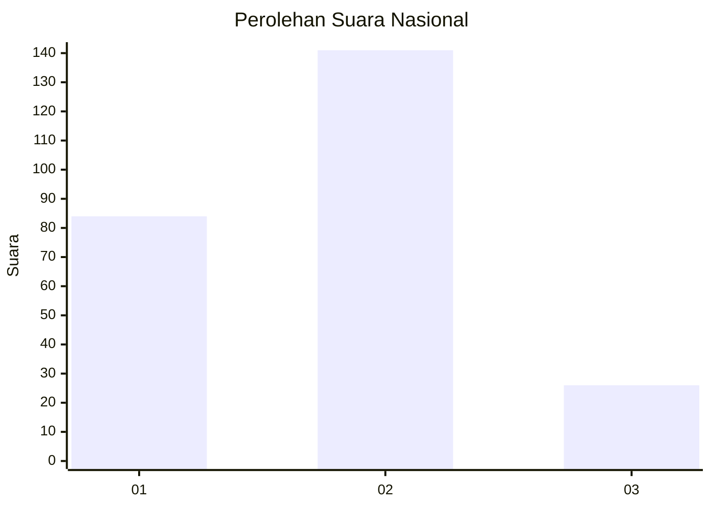
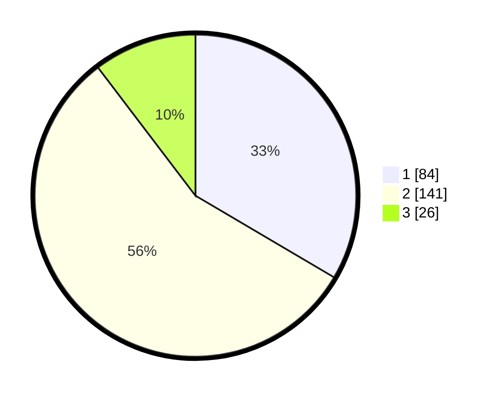

# Hasil

## Grafik

## Tabel

| No. | Nama Paslon    | Suara | Suara (raw) | Persentase |
|:--- |:-------------- | -----:| -----------:| ----------:|
| 1   | ANIES MUHAIMIN | 84    | [84][p-1]   | 33,47      |
| 2   | PRABOWO GIBRAN | 141   | [141][p-2]  | 56,18      |
| 3   | GANJAR MAHFUD  | 26    | [26][p-3]   | 10,36      |

[p-1]: https://github.com/gigit-pemilu/pemilu-2024/blob/main/pilpres/hitung-suara/sub/75-gorontalo/sub/03-bone-bolango/sub/06-tilongkabila/sub/2003-toto-utara/sub/006-tps/sub/paslon-1.txt
[p-2]: https://github.com/gigit-pemilu/pemilu-2024/blob/main/pilpres/hitung-suara/sub/75-gorontalo/sub/03-bone-bolango/sub/06-tilongkabila/sub/2003-toto-utara/sub/006-tps/sub/paslon-2.txt
[p-3]: https://github.com/gigit-pemilu/pemilu-2024/blob/main/pilpres/hitung-suara/sub/75-gorontalo/sub/03-bone-bolango/sub/06-tilongkabila/sub/2003-toto-utara/sub/006-tps/sub/paslon-3.txt

## Foto C Plano

https://sirekap-obj-formc.kpu.go.id/7ef8/pemilu/ppwp/75/03/06/20/03/7503062003006-20240215-004220--f965fec5-39da-48f6-8fd2-96b79ebc9151.jpg

https://sirekap-obj-formc.kpu.go.id/7ef8/pemilu/ppwp/75/03/06/20/03/7503062003006-20240215-005253--c4cbb6e7-3e93-47fa-a1f1-9c794411f679.jpg

https://sirekap-obj-formc.kpu.go.id/7ef8/pemilu/ppwp/75/03/06/20/03/7503062003006-20240215-005300--9e061c9e-99f3-43c1-927c-3d70d27a542d.jpg

## Metadata

| Key        | Value               |
| ---------- | ------------------- |
| Time Stamp | 2024-02-15 15:30:25 |

