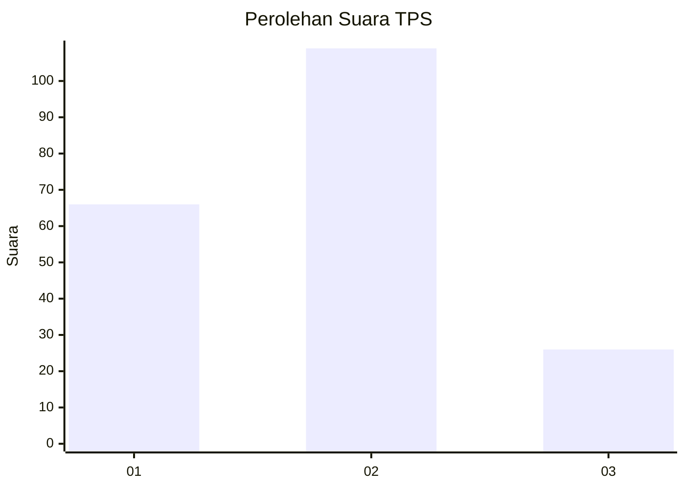
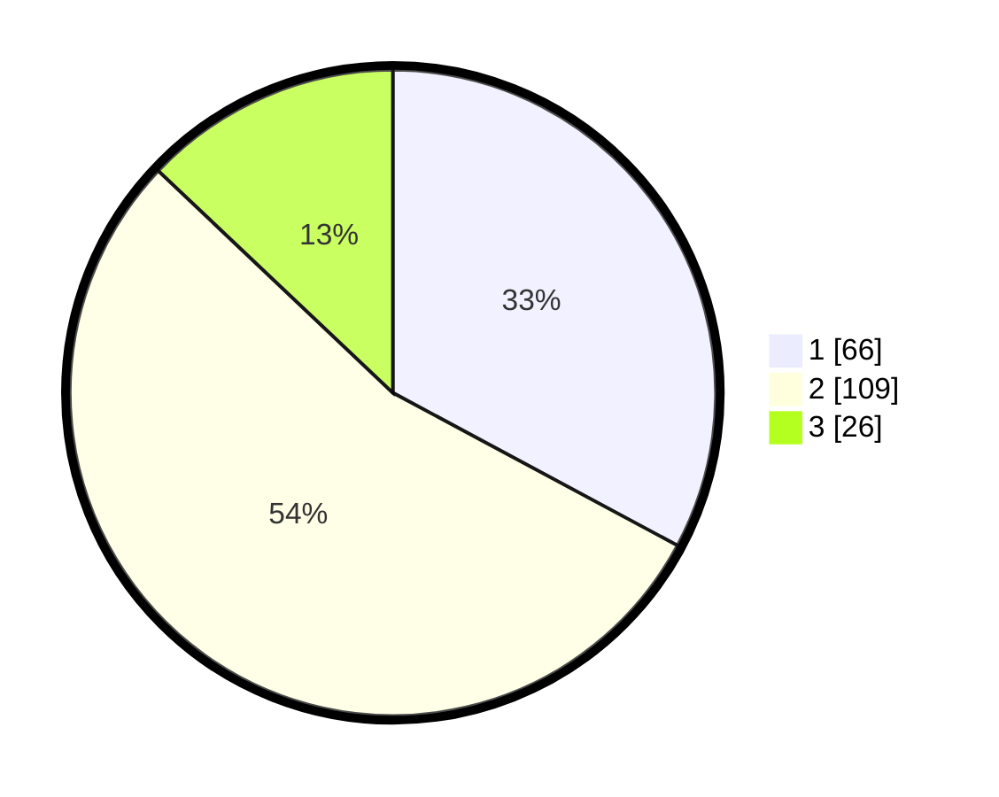

# Hasil

## Grafik

## Tabel

| No. | Nama Paslon    | Suara | Suara (raw) | Persentase |
|:--- |:-------------- | -----:| -----------:| ----------:|
| 1   | ANIES MUHAIMIN | 66    | [66][p-1]   | 32,84      |
| 2   | PRABOWO GIBRAN | 109   | [109][p-2]  | 54,23      |
| 3   | GANJAR MAHFUD  | 26    | [26][p-3]   | 12,94      |

[p-1]: https://github.com/gigit-pemilu/pemilu-2024-75-gorontalo/blob/main/pilpres/hitung-suara/sub/75-gorontalo/sub/03-bone-bolango/sub/07-botupingge/sub/2002-panggulo/sub/002-tps/sub/paslon-1.txt
[p-2]: https://github.com/gigit-pemilu/pemilu-2024-75-gorontalo/blob/main/pilpres/hitung-suara/sub/75-gorontalo/sub/03-bone-bolango/sub/07-botupingge/sub/2002-panggulo/sub/002-tps/sub/paslon-2.txt
[p-3]: https://github.com/gigit-pemilu/pemilu-2024-75-gorontalo/blob/main/pilpres/hitung-suara/sub/75-gorontalo/sub/03-bone-bolango/sub/07-botupingge/sub/2002-panggulo/sub/002-tps/sub/paslon-3.txt

## Foto C Plano

https://sirekap-obj-formc.kpu.go.id/ef19/pemilu/ppwp/75/03/07/20/02/7503072002002-20240229-140112--10cc30da-71a0-4d35-beb8-a23893f145a0.jpg

https://sirekap-obj-formc.kpu.go.id/ef19/pemilu/ppwp/75/03/07/20/02/7503072002002-20240215-082635--1332328a-7f2c-4a38-a6db-c54ab91e6187.jpg

https://sirekap-obj-formc.kpu.go.id/ef19/pemilu/ppwp/75/03/07/20/02/7503072002002-20240216-175641--579c0983-0918-4824-9b14-b94d382f51b0.jpg

## Metadata

| Key        | Value               |
| ---------- | ------------------- |
| Time Stamp | 2024-02-29 15:00:00 |

