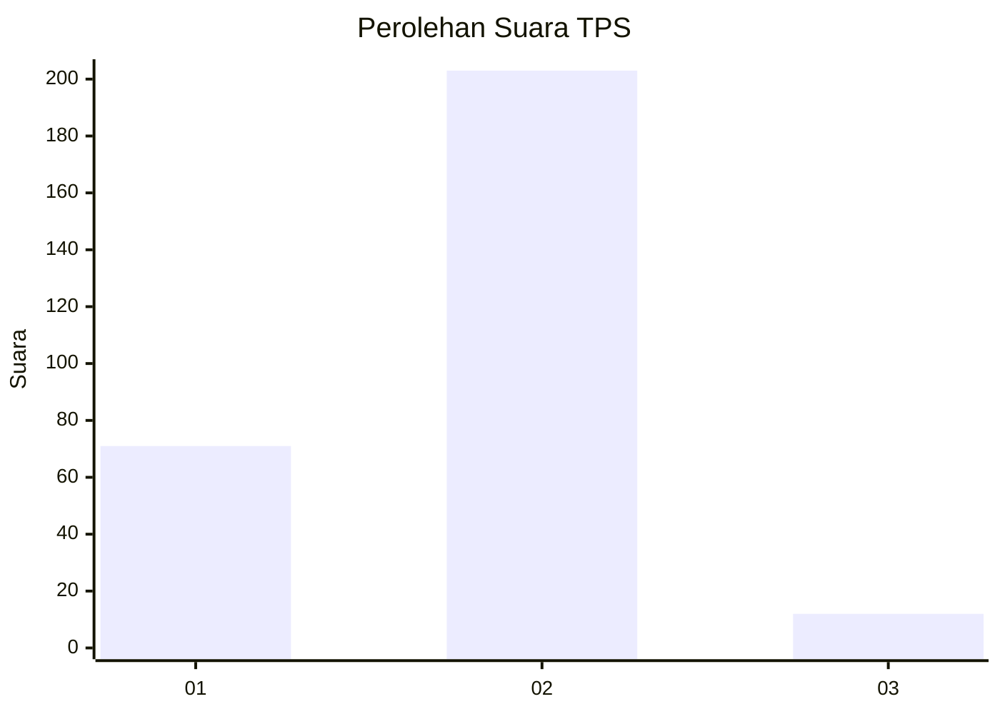
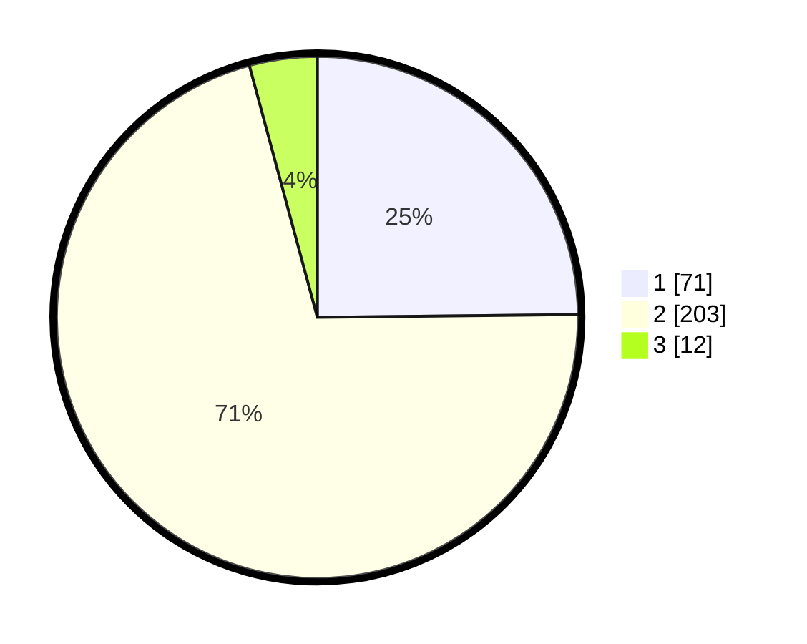

# Hasil

## Grafik

## Tabel

| No. | Nama Paslon    | Suara | Suara (raw) | Persentase |
|:--- |:-------------- | -----:| -----------:| ----------:|
| 1   | ANIES MUHAIMIN | 71    | [71][p-1]   | 24,83      |
| 2   | PRABOWO GIBRAN | 203   | [203][p-2]  | 70,98      |
| 3   | GANJAR MAHFUD  | 12    | [12][p-3]   | 4,20       |

[p-1]: https://github.com/gigit-pemilu/pemilu-2024-75-gorontalo/blob/main/pilpres/hitung-suara/sub/75-gorontalo/sub/03-bone-bolango/sub/07-botupingge/sub/2005-timbuolo-timur/sub/002-tps/sub/paslon-1.txt
[p-2]: https://github.com/gigit-pemilu/pemilu-2024-75-gorontalo/blob/main/pilpres/hitung-suara/sub/75-gorontalo/sub/03-bone-bolango/sub/07-botupingge/sub/2005-timbuolo-timur/sub/002-tps/sub/paslon-2.txt
[p-3]: https://github.com/gigit-pemilu/pemilu-2024-75-gorontalo/blob/main/pilpres/hitung-suara/sub/75-gorontalo/sub/03-bone-bolango/sub/07-botupingge/sub/2005-timbuolo-timur/sub/002-tps/sub/paslon-3.txt

## Foto C Plano

https://sirekap-obj-formc.kpu.go.id/c2d1/pemilu/ppwp/75/03/07/20/05/7503072005002-20240215-135848--e155411a-0b73-4d31-90ca-5fc252cd5e49.jpg

https://sirekap-obj-formc.kpu.go.id/c2d1/pemilu/ppwp/75/03/07/20/05/7503072005002-20240215-105049--19e4e291-36f4-44df-935d-e8452f45a3c2.jpg

https://sirekap-obj-formc.kpu.go.id/c2d1/pemilu/ppwp/75/03/07/20/05/7503072005002-20240215-105202--5792d270-c42c-43d2-af5a-401d0857c8f9.jpg

## Metadata

| Key        | Value               |
| ---------- | ------------------- |
| Time Stamp | 2024-02-15 17:00:25 |

