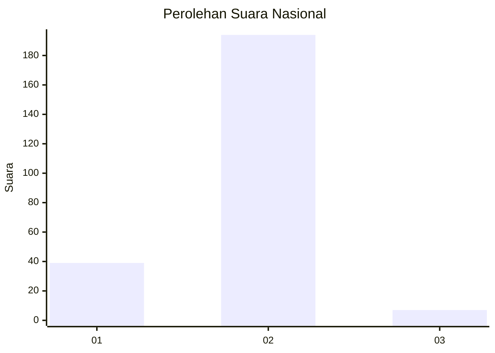
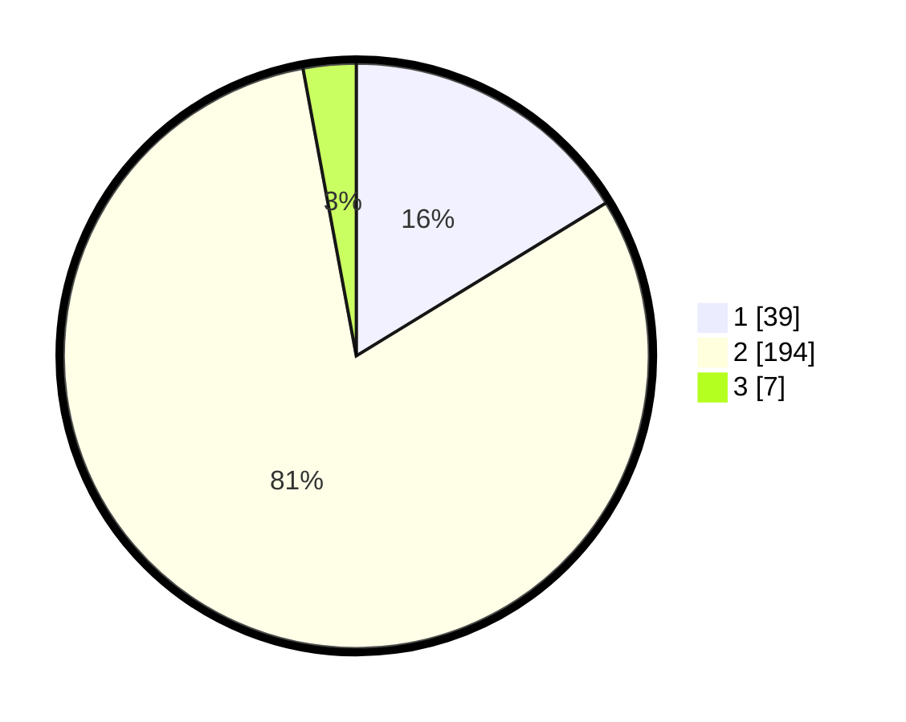

# Hasil

## Grafik

## Tabel

| No. | Nama Paslon    | Suara | Suara (raw) | Persentase |
|:--- |:-------------- | -----:| -----------:| ----------:|
| 1   | ANIES MUHAIMIN | 39    | [39][p-1]   | 16,25      |
| 2   | PRABOWO GIBRAN | 194   | [194][p-2]  | 80,83      |
| 3   | GANJAR MAHFUD  | 7     | [7][p-3]    | 2,92       |

[p-1]: https://github.com/gigit-pemilu/pemilu-2024/blob/main/pilpres/hitung-suara/sub/75-gorontalo/sub/03-bone-bolango/sub/08-kabila-bone/sub/2001-huangobotu/sub/005-tps/sub/paslon-1.txt
[p-2]: https://github.com/gigit-pemilu/pemilu-2024/blob/main/pilpres/hitung-suara/sub/75-gorontalo/sub/03-bone-bolango/sub/08-kabila-bone/sub/2001-huangobotu/sub/005-tps/sub/paslon-2.txt
[p-3]: https://github.com/gigit-pemilu/pemilu-2024/blob/main/pilpres/hitung-suara/sub/75-gorontalo/sub/03-bone-bolango/sub/08-kabila-bone/sub/2001-huangobotu/sub/005-tps/sub/paslon-3.txt

## Foto C Plano

https://sirekap-obj-formc.kpu.go.id/9ff1/pemilu/ppwp/75/03/08/20/01/7503082001005-20240214-221936--4b3c22a6-47e2-46f5-949c-172c56992bfc.jpg

https://sirekap-obj-formc.kpu.go.id/9ff1/pemilu/ppwp/75/03/08/20/01/7503082001005-20240215-034959--a4496132-77ed-4bfe-a669-afcfb41f96e0.jpg

https://sirekap-obj-formc.kpu.go.id/9ff1/pemilu/ppwp/75/03/08/20/01/7503082001005-20240214-222147--789d15bd-d220-4933-84d3-212a7c8c2fcf.jpg

## Metadata

| Key        | Value               |
| ---------- | ------------------- |
| Time Stamp | 2024-02-15 17:30:25 |

