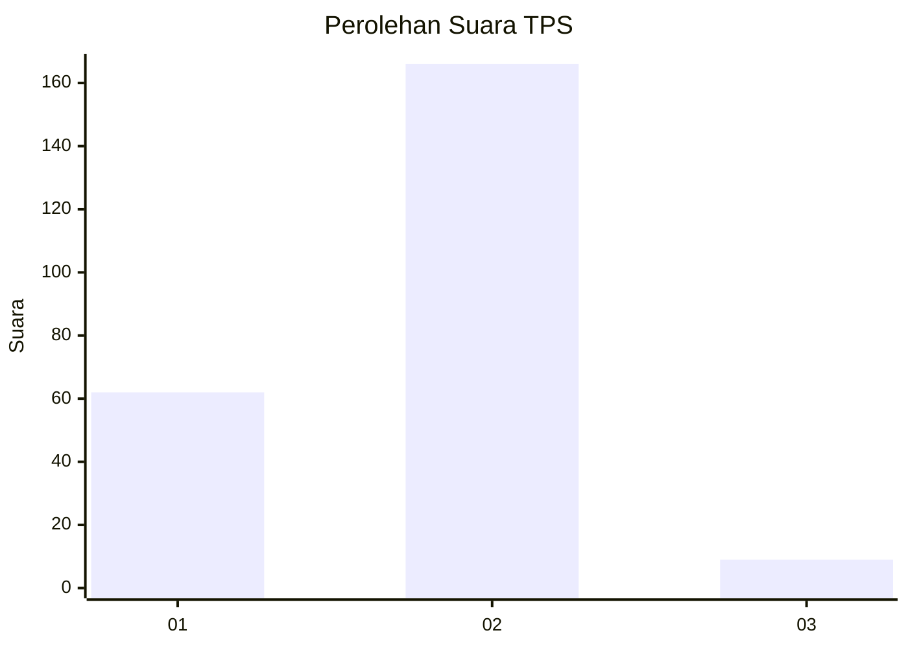
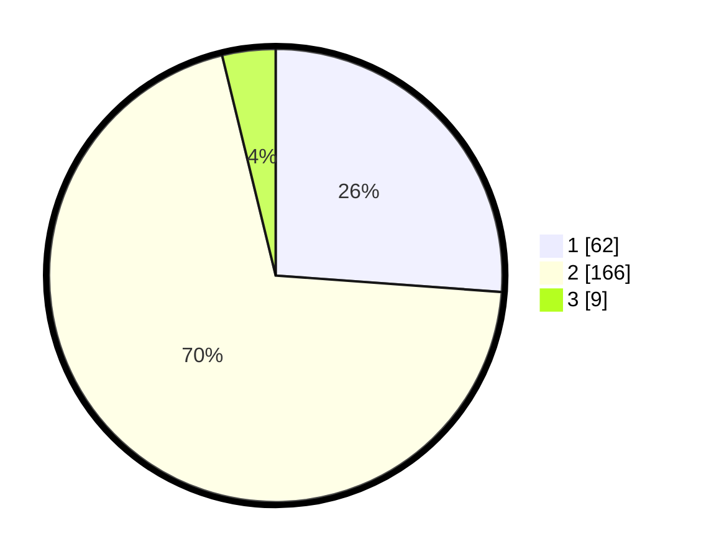

# Hasil

## Grafik

## Tabel

| No. | Nama Paslon    | Suara | Suara (raw) | Persentase |
|:--- |:-------------- | -----:| -----------:| ----------:|
| 1   | ANIES MUHAIMIN | 62    | [62][p-1]   | 26,16      |
| 2   | PRABOWO GIBRAN | 166   | [166][p-2]  | 70,04      |
| 3   | GANJAR MAHFUD  | 9     | [9][p-3]    | 3,80       |

[p-1]: https://github.com/gigit-pemilu/pemilu-2024-75-gorontalo/blob/main/pilpres/hitung-suara/sub/75-gorontalo/sub/03-bone-bolango/sub/09-bone/sub/2001-taludaa/sub/002-tps/sub/paslon-1.txt
[p-2]: https://github.com/gigit-pemilu/pemilu-2024-75-gorontalo/blob/main/pilpres/hitung-suara/sub/75-gorontalo/sub/03-bone-bolango/sub/09-bone/sub/2001-taludaa/sub/002-tps/sub/paslon-2.txt
[p-3]: https://github.com/gigit-pemilu/pemilu-2024-75-gorontalo/blob/main/pilpres/hitung-suara/sub/75-gorontalo/sub/03-bone-bolango/sub/09-bone/sub/2001-taludaa/sub/002-tps/sub/paslon-3.txt

## Foto C Plano

https://sirekap-obj-formc.kpu.go.id/56fa/pemilu/ppwp/75/03/09/20/01/7503092001002-20240214-214105--99e9c479-7d31-4da3-90e6-ac02b82fe822.jpg

https://sirekap-obj-formc.kpu.go.id/56fa/pemilu/ppwp/75/03/09/20/01/7503092001002-20240214-200834--aa4bc98e-541c-4592-9ea5-074c6633db1d.jpg

https://sirekap-obj-formc.kpu.go.id/56fa/pemilu/ppwp/75/03/09/20/01/7503092001002-20240214-201412--5a9804b2-1ab4-493e-8864-5955e723235b.jpg

## Metadata

| Key        | Value               |
| ---------- | ------------------- |
| Time Stamp | 2024-02-15 20:30:46 |

