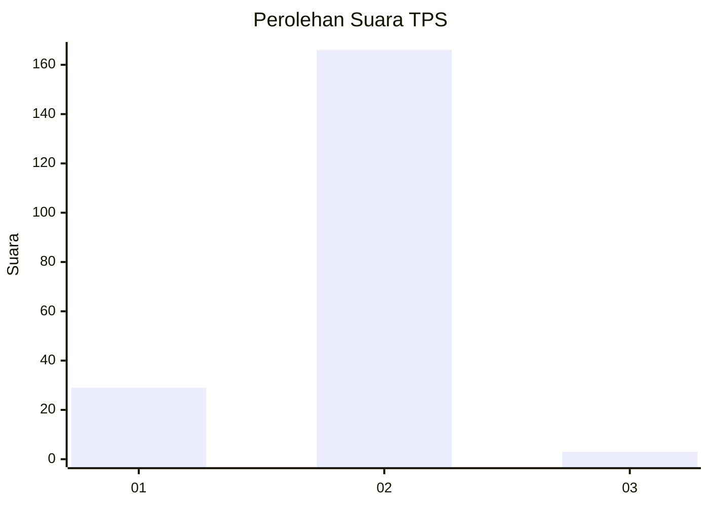
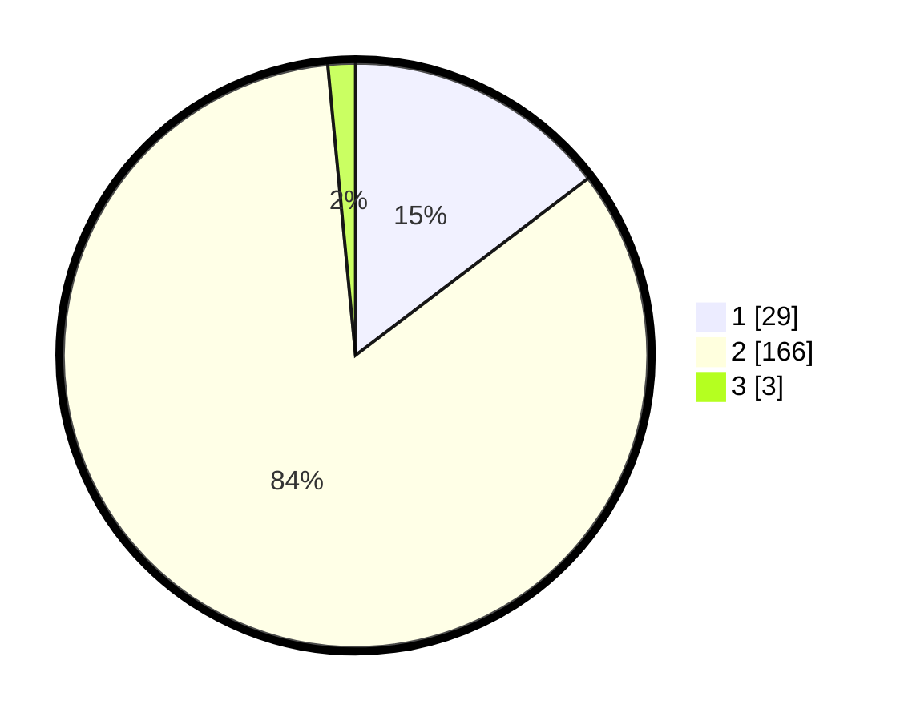

# Hasil

## Grafik

## Tabel

| No. | Nama Paslon    | Suara | Suara (raw) | Persentase |
|:--- |:-------------- | -----:| -----------:| ----------:|
| 1   | ANIES MUHAIMIN | 29    | [29][p-1]   | 14,65      |
| 2   | PRABOWO GIBRAN | 166   | [166][p-2]  | 83,84      |
| 3   | GANJAR MAHFUD  | 3     | [3][p-3]    | 1,52       |

[p-1]: https://github.com/gigit-pemilu/pemilu-2024-75-gorontalo/blob/main/pilpres/hitung-suara/sub/75-gorontalo/sub/03-bone-bolango/sub/09-bone/sub/2002-sogitia/sub/003-tps/sub/paslon-1.txt
[p-2]: https://github.com/gigit-pemilu/pemilu-2024-75-gorontalo/blob/main/pilpres/hitung-suara/sub/75-gorontalo/sub/03-bone-bolango/sub/09-bone/sub/2002-sogitia/sub/003-tps/sub/paslon-2.txt
[p-3]: https://github.com/gigit-pemilu/pemilu-2024-75-gorontalo/blob/main/pilpres/hitung-suara/sub/75-gorontalo/sub/03-bone-bolango/sub/09-bone/sub/2002-sogitia/sub/003-tps/sub/paslon-3.txt

## Foto C Plano

https://sirekap-obj-formc.kpu.go.id/8396/pemilu/ppwp/75/03/09/20/02/7503092002003-20240215-012722--657b96be-b56e-4645-8b00-bb0a92015fee.jpg

https://sirekap-obj-formc.kpu.go.id/8396/pemilu/ppwp/75/03/09/20/02/7503092002003-20240215-033325--12755bb7-41bf-4fb1-bb85-7b7c685d5013.jpg

https://sirekap-obj-formc.kpu.go.id/8396/pemilu/ppwp/75/03/09/20/02/7503092002003-20240215-013254--f8f64c1c-0771-4cd7-b753-749d08a54815.jpg

## Metadata

| Key        | Value               |
| ---------- | ------------------- |
| Time Stamp | 2024-02-15 20:30:46 |

