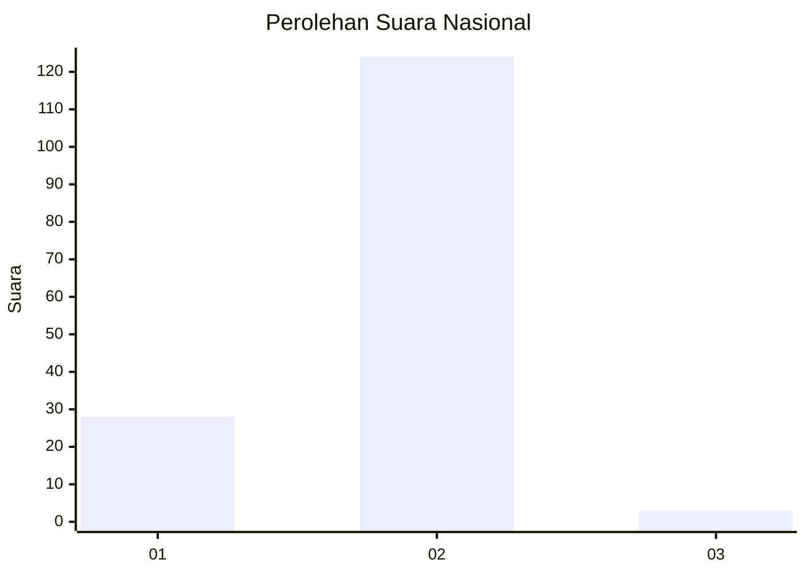
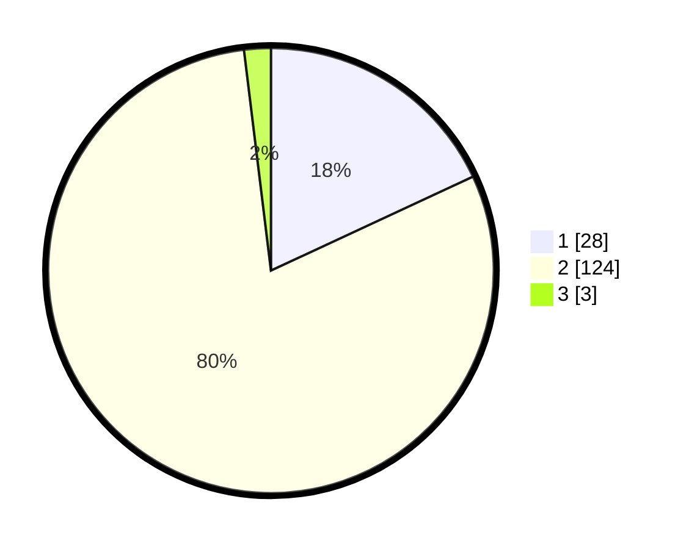

# Hasil

## Grafik

## Tabel

| No. | Nama Paslon    | Suara | Suara (raw) | Persentase |
|:--- |:-------------- | -----:| -----------:| ----------:|
| 1   | ANIES MUHAIMIN | 28    | [28][p-1]   | 18,06      |
| 2   | PRABOWO GIBRAN | 124   | [124][p-2]  | 80,00      |
| 3   | GANJAR MAHFUD  | 3     | [3][p-3]    | 1,94       |

[p-1]: https://github.com/gigit-pemilu/pemilu-2024/blob/main/pilpres/hitung-suara/sub/75-gorontalo/sub/03-bone-bolango/sub/09-bone/sub/2007-tumbuh-mekar/sub/002-tps/sub/paslon-1.txt
[p-2]: https://github.com/gigit-pemilu/pemilu-2024/blob/main/pilpres/hitung-suara/sub/75-gorontalo/sub/03-bone-bolango/sub/09-bone/sub/2007-tumbuh-mekar/sub/002-tps/sub/paslon-2.txt
[p-3]: https://github.com/gigit-pemilu/pemilu-2024/blob/main/pilpres/hitung-suara/sub/75-gorontalo/sub/03-bone-bolango/sub/09-bone/sub/2007-tumbuh-mekar/sub/002-tps/sub/paslon-3.txt

## Foto C Plano

https://sirekap-obj-formc.kpu.go.id/5a87/pemilu/ppwp/75/03/09/20/07/7503092007002-20240215-041655--68f9e69b-f937-4d61-9b14-0d4be31ef639.jpg

https://sirekap-obj-formc.kpu.go.id/5a87/pemilu/ppwp/75/03/09/20/07/7503092007002-20240215-084951--01c59d1f-35d0-4f6f-99f3-435d6af0cc8c.jpg

https://sirekap-obj-formc.kpu.go.id/5a87/pemilu/ppwp/75/03/09/20/07/7503092007002-20240215-085040--db6a3576-d855-4adf-8f9f-4b5bd48fdd50.jpg

## Metadata

| Key        | Value               |
| ---------- | ------------------- |
| Time Stamp | 2024-02-15 21:30:27 |

