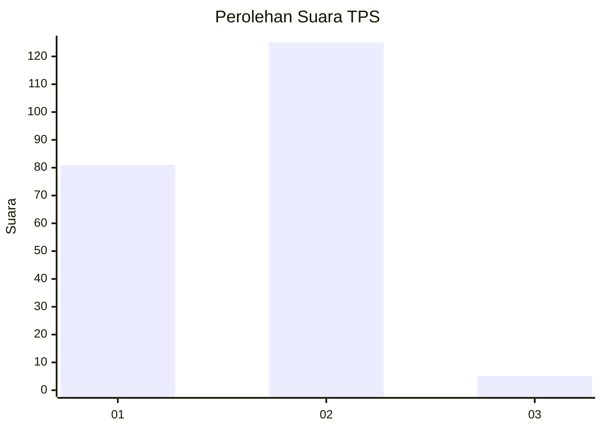
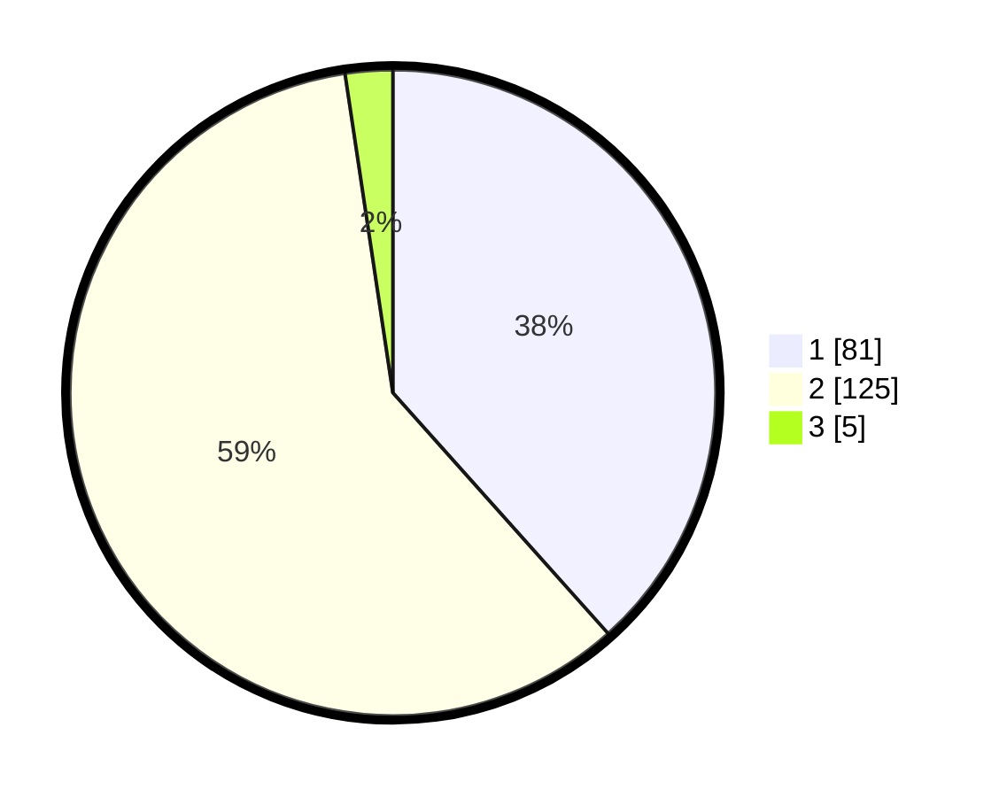

# Hasil

## Grafik

## Tabel

| No. | Nama Paslon    | Suara | Suara (raw) | Persentase |
|:--- |:-------------- | -----:| -----------:| ----------:|
| 1   | ANIES MUHAIMIN | 81    | [81][p-1]   | 38,39      |
| 2   | PRABOWO GIBRAN | 125   | [125][p-2]  | 59,24      |
| 3   | GANJAR MAHFUD  | 5     | [5][p-3]    | 2,37       |

[p-1]: https://github.com/gigit-pemilu/pemilu-2024-75-gorontalo/blob/main/pilpres/hitung-suara/sub/75-gorontalo/sub/03-bone-bolango/sub/10-bone-raya/sub/2001-inomata/sub/001-tps/sub/paslon-1.txt
[p-2]: https://github.com/gigit-pemilu/pemilu-2024-75-gorontalo/blob/main/pilpres/hitung-suara/sub/75-gorontalo/sub/03-bone-bolango/sub/10-bone-raya/sub/2001-inomata/sub/001-tps/sub/paslon-2.txt
[p-3]: https://github.com/gigit-pemilu/pemilu-2024-75-gorontalo/blob/main/pilpres/hitung-suara/sub/75-gorontalo/sub/03-bone-bolango/sub/10-bone-raya/sub/2001-inomata/sub/001-tps/sub/paslon-3.txt

## Foto C Plano

https://sirekap-obj-formc.kpu.go.id/4c03/pemilu/ppwp/75/03/10/20/01/7503102001001-20240215-085819--fd16f178-86bf-48e8-96ac-22b236b05826.jpg

https://sirekap-obj-formc.kpu.go.id/4c03/pemilu/ppwp/75/03/10/20/01/7503102001001-20240215-085846--81fd6671-26c7-4419-9a33-d098154857d8.jpg

https://sirekap-obj-formc.kpu.go.id/4c03/pemilu/ppwp/75/03/10/20/01/7503102001001-20240215-085918--7b1de7ea-62c3-42e8-bb23-ff8f571c21d5.jpg

## Metadata

| Key        | Value               |
| ---------- | ------------------- |
| Time Stamp | 2024-02-15 22:30:27 |

