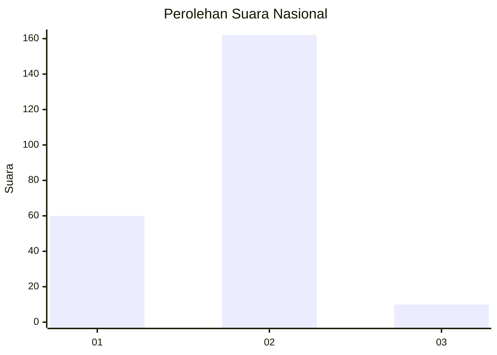
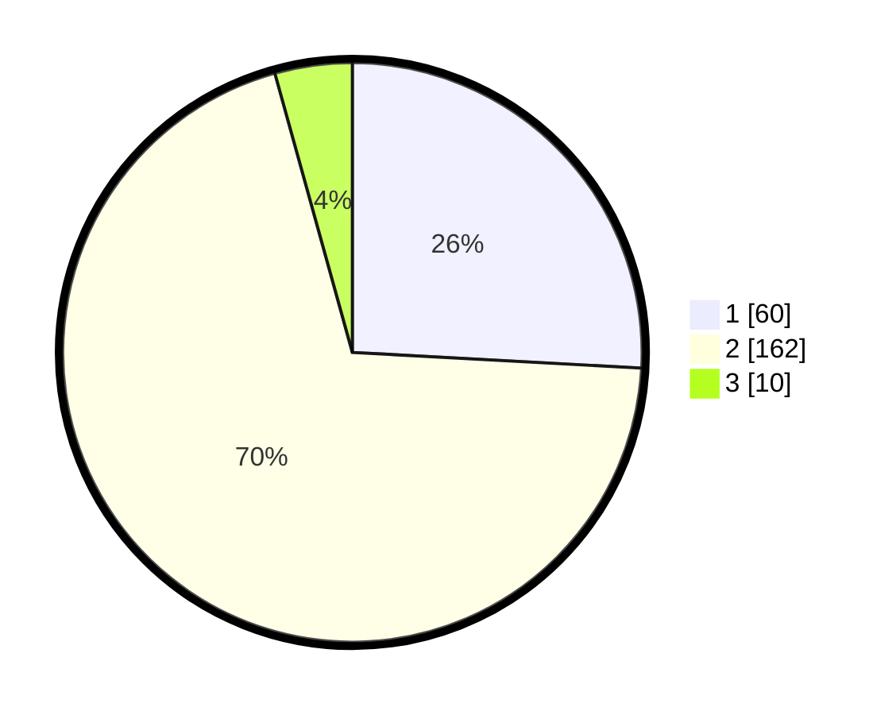

# Hasil

## Grafik

## Tabel

| No. | Nama Paslon    | Suara | Suara (raw) | Persentase |
|:--- |:-------------- | -----:| -----------:| ----------:|
| 1   | ANIES MUHAIMIN | 60    | [60][p-1]   | 25,86      |
| 2   | PRABOWO GIBRAN | 162   | [162][p-2]  | 69,83      |
| 3   | GANJAR MAHFUD  | 10    | [10][p-3]   | 4,31       |

[p-1]: https://github.com/gigit-pemilu/pemilu-2024/blob/main/pilpres/hitung-suara/sub/75-gorontalo/sub/03-bone-bolango/sub/11-suwawa-timur/sub/2001-tulabolo/sub/001-tps/sub/paslon-1.txt
[p-2]: https://github.com/gigit-pemilu/pemilu-2024/blob/main/pilpres/hitung-suara/sub/75-gorontalo/sub/03-bone-bolango/sub/11-suwawa-timur/sub/2001-tulabolo/sub/001-tps/sub/paslon-2.txt
[p-3]: https://github.com/gigit-pemilu/pemilu-2024/blob/main/pilpres/hitung-suara/sub/75-gorontalo/sub/03-bone-bolango/sub/11-suwawa-timur/sub/2001-tulabolo/sub/001-tps/sub/paslon-3.txt

## Foto C Plano

https://sirekap-obj-formc.kpu.go.id/0635/pemilu/ppwp/75/03/11/20/01/7503112001001-20240215-132247--cbafc75a-6af5-437f-8138-437a88e856ec.jpg

https://sirekap-obj-formc.kpu.go.id/0635/pemilu/ppwp/75/03/11/20/01/7503112001001-20240215-132447--b22b2206-c402-4978-9f80-a247e5374ec8.jpg

https://sirekap-obj-formc.kpu.go.id/0635/pemilu/ppwp/75/03/11/20/01/7503112001001-20240215-132720--d011affc-1811-47b3-8c53-1d1dc2884b3e.jpg

## Metadata

| Key        | Value               |
| ---------- | ------------------- |
| Time Stamp | 2024-02-15 22:30:27 |

