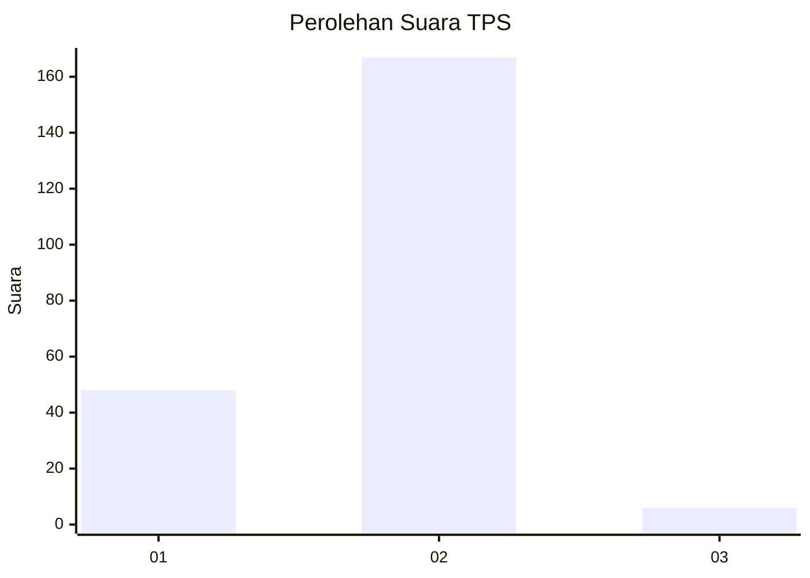

# Hasil

## Grafik

## Tabel

| No. | Nama Paslon    | Suara | Suara (raw) | Persentase |
|:--- |:-------------- | -----:| -----------:| ----------:|
| 1   | ANIES MUHAIMIN | 48    | [48][p-1]   | 21,72      |
| 2   | PRABOWO GIBRAN | 167   | [167][p-2]  | 75,57      |
| 3   | GANJAR MAHFUD  | 6     | [6][p-3]    | 2,71       |

[p-1]: https://github.com/gigit-pemilu/pemilu-2024-75-gorontalo/blob/main/pilpres/hitung-suara/sub/75-gorontalo/sub/03-bone-bolango/sub/11-suwawa-timur/sub/2001-tulabolo/sub/002-tps/sub/paslon-1.txt
[p-2]: https://github.com/gigit-pemilu/pemilu-2024-75-gorontalo/blob/main/pilpres/hitung-suara/sub/75-gorontalo/sub/03-bone-bolango/sub/11-suwawa-timur/sub/2001-tulabolo/sub/002-tps/sub/paslon-2.txt
[p-3]: https://github.com/gigit-pemilu/pemilu-2024-75-gorontalo/blob/main/pilpres/hitung-suara/sub/75-gorontalo/sub/03-bone-bolango/sub/11-suwawa-timur/sub/2001-tulabolo/sub/002-tps/sub/paslon-3.txt

## Foto C Plano

https://sirekap-obj-formc.kpu.go.id/a4ee/pemilu/ppwp/75/03/11/20/01/7503112001002-20240223-161727--fcdba734-2245-4812-900a-fb882f6c61d2.jpg

https://sirekap-obj-formc.kpu.go.id/a4ee/pemilu/ppwp/75/03/11/20/01/7503112001002-20240223-161739--5cd19384-1784-40dd-a689-af3998ad9010.jpg

https://sirekap-obj-formc.kpu.go.id/a4ee/pemilu/ppwp/75/03/11/20/01/7503112001002-20240223-161753--da0488e5-9716-4bc9-8fcf-4e2312e93ef0.jpg

## Metadata

| Key        | Value               |
| ---------- | ------------------- |
| Time Stamp | 2024-02-24 22:31:28 |

