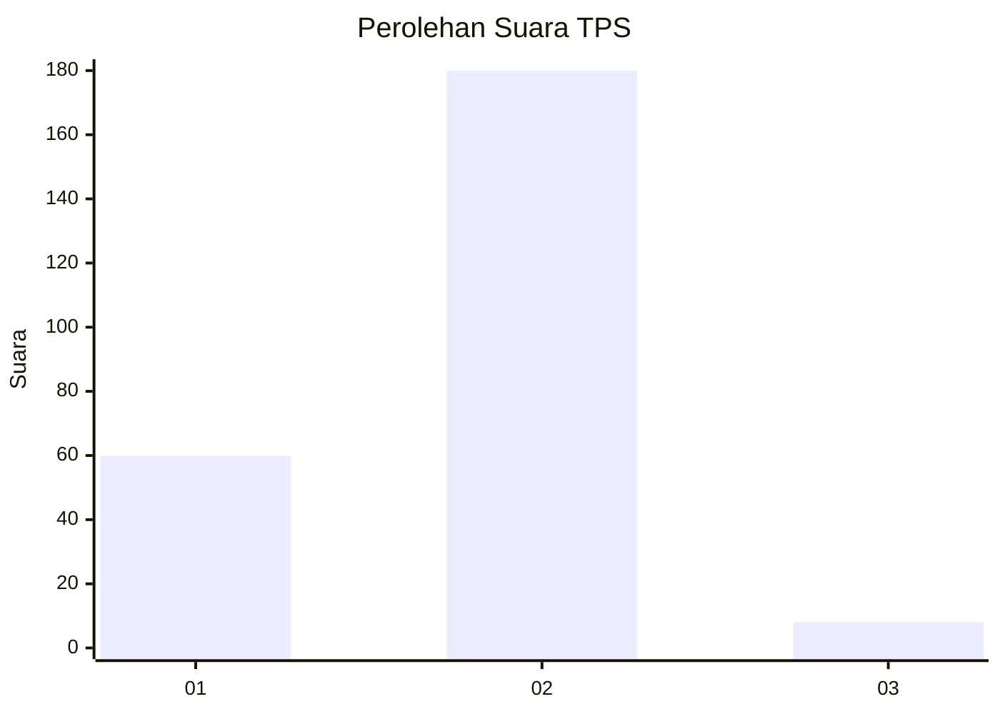
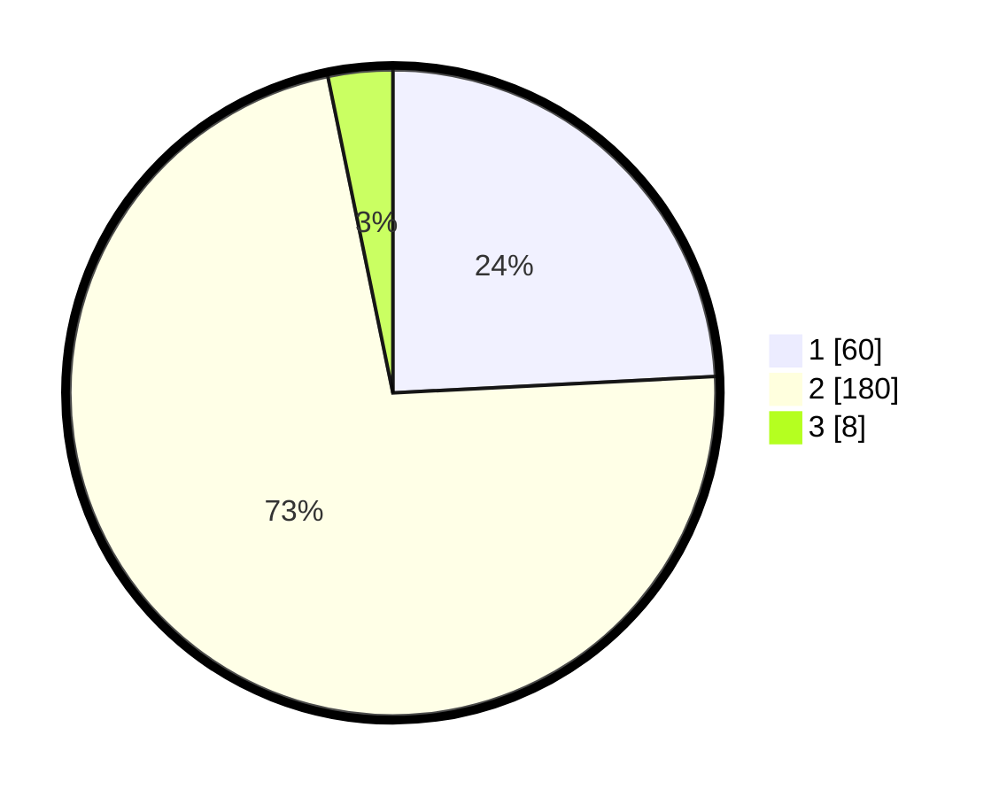

# Hasil

## Grafik

## Tabel

| No. | Nama Paslon    | Suara | Suara (raw) | Persentase |
|:--- |:-------------- | -----:| -----------:| ----------:|
| 1   | ANIES MUHAIMIN | 60    | [60][p-1]   | 24,19      |
| 2   | PRABOWO GIBRAN | 180   | [180][p-2]  | 72,58      |
| 3   | GANJAR MAHFUD  | 8     | [8][p-3]    | 3,23       |

[p-1]: https://github.com/gigit-pemilu/pemilu-2024-75-gorontalo/blob/main/pilpres/hitung-suara/sub/75-gorontalo/sub/03-bone-bolango/sub/11-suwawa-timur/sub/2003-dumbaya-bulan/sub/002-tps/sub/paslon-1.txt
[p-2]: https://github.com/gigit-pemilu/pemilu-2024-75-gorontalo/blob/main/pilpres/hitung-suara/sub/75-gorontalo/sub/03-bone-bolango/sub/11-suwawa-timur/sub/2003-dumbaya-bulan/sub/002-tps/sub/paslon-2.txt
[p-3]: https://github.com/gigit-pemilu/pemilu-2024-75-gorontalo/blob/main/pilpres/hitung-suara/sub/75-gorontalo/sub/03-bone-bolango/sub/11-suwawa-timur/sub/2003-dumbaya-bulan/sub/002-tps/sub/paslon-3.txt

## Foto C Plano

https://sirekap-obj-formc.kpu.go.id/5a90/pemilu/ppwp/75/03/11/20/03/7503112003002-20240214-203545--7a1ce596-6b9f-4c18-8ca7-4c412028d2b7.jpg

https://sirekap-obj-formc.kpu.go.id/5a90/pemilu/ppwp/75/03/11/20/03/7503112003002-20240214-210130--3eb7f2c2-8a27-4fca-a164-8feaa6e0a52c.jpg

https://sirekap-obj-formc.kpu.go.id/5a90/pemilu/ppwp/75/03/11/20/03/7503112003002-20240214-205651--41365be0-a2e7-4e61-810f-8af25157b942.jpg

## Metadata

| Key        | Value               |
| ---------- | ------------------- |
| Time Stamp | 2024-02-15 18:30:25 |

