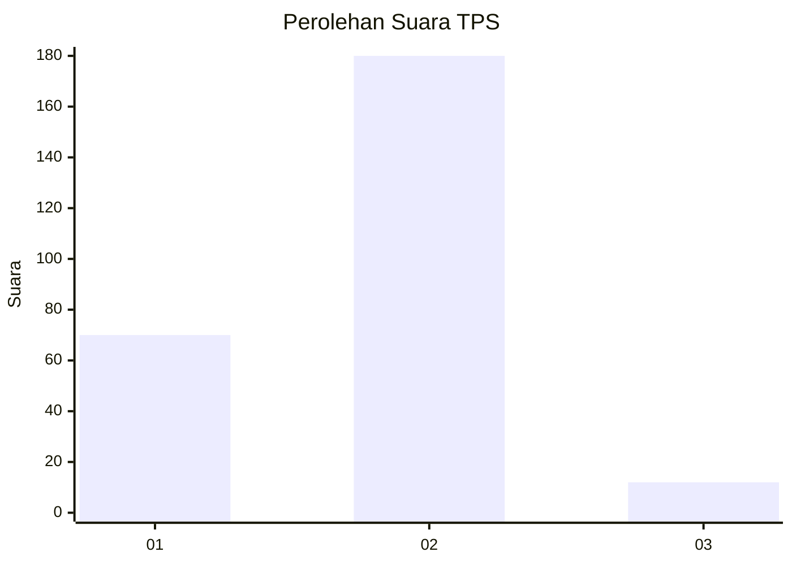
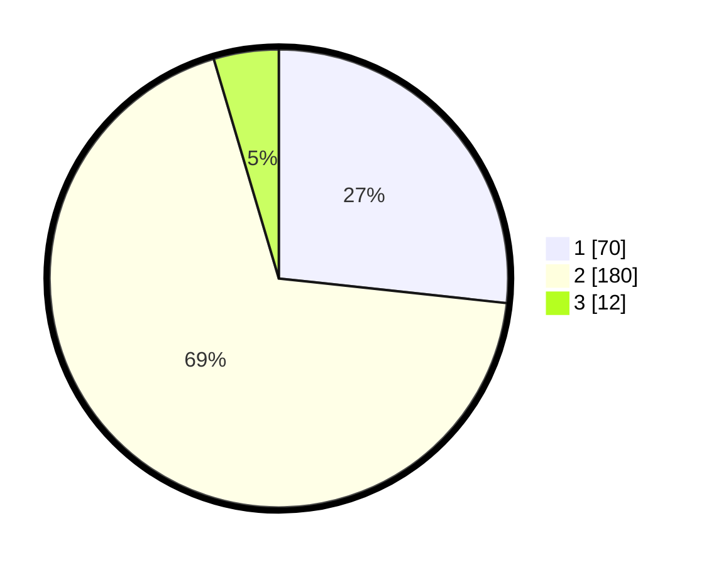

# Hasil

## Grafik

## Tabel

| No. | Nama Paslon    | Suara | Suara (raw) | Persentase |
|:--- |:-------------- | -----:| -----------:| ----------:|
| 1   | ANIES MUHAIMIN | 70    | [70][p-1]   | 26,72      |
| 2   | PRABOWO GIBRAN | 180   | [180][p-2]  | 68,70      |
| 3   | GANJAR MAHFUD  | 12    | [12][p-3]   | 4,58       |

[p-1]: https://github.com/gigit-pemilu/pemilu-2024-75-gorontalo/blob/main/pilpres/hitung-suara/sub/75-gorontalo/sub/03-bone-bolango/sub/11-suwawa-timur/sub/2003-dumbaya-bulan/sub/003-tps/sub/paslon-1.txt
[p-2]: https://github.com/gigit-pemilu/pemilu-2024-75-gorontalo/blob/main/pilpres/hitung-suara/sub/75-gorontalo/sub/03-bone-bolango/sub/11-suwawa-timur/sub/2003-dumbaya-bulan/sub/003-tps/sub/paslon-2.txt
[p-3]: https://github.com/gigit-pemilu/pemilu-2024-75-gorontalo/blob/main/pilpres/hitung-suara/sub/75-gorontalo/sub/03-bone-bolango/sub/11-suwawa-timur/sub/2003-dumbaya-bulan/sub/003-tps/sub/paslon-3.txt

## Foto C Plano

https://sirekap-obj-formc.kpu.go.id/b26d/pemilu/ppwp/75/03/11/20/03/7503112003003-20240215-142414--cd5ae0da-64c3-4b51-9484-f91b88f57503.jpg

https://sirekap-obj-formc.kpu.go.id/b26d/pemilu/ppwp/75/03/11/20/03/7503112003003-20240215-142527--16d7c39c-6066-4be7-a3c6-d7e809610346.jpg

https://sirekap-obj-formc.kpu.go.id/b26d/pemilu/ppwp/75/03/11/20/03/7503112003003-20240215-142738--5655184a-8563-4ead-becc-3b3f96f7b62b.jpg

## Metadata

| Key        | Value               |
| ---------- | ------------------- |
| Time Stamp | 2024-02-15 20:30:46 |

