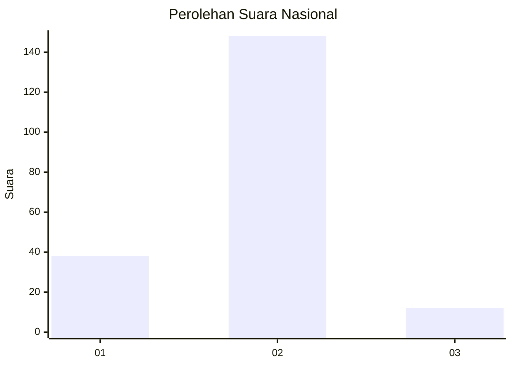
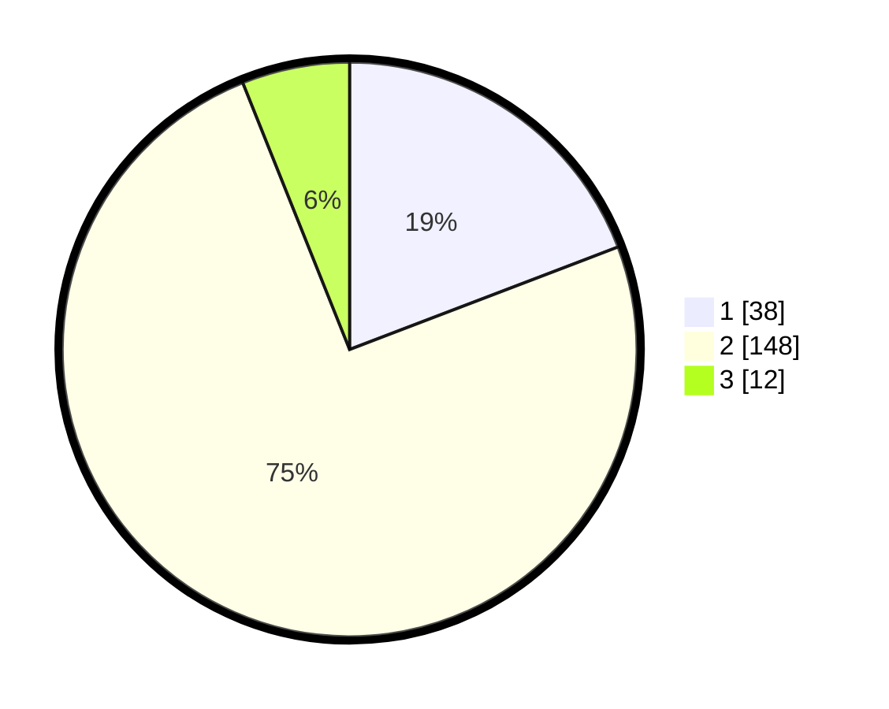

# Hasil

## Grafik

## Tabel

| No. | Nama Paslon    | Suara | Suara (raw) | Persentase |
|:--- |:-------------- | -----:| -----------:| ----------:|
| 1   | ANIES MUHAIMIN | 38    | [38][p-1]   | 19,19      |
| 2   | PRABOWO GIBRAN | 148   | [148][p-2]  | 74,75      |
| 3   | GANJAR MAHFUD  | 12    | [12][p-3]   | 6,06       |

[p-1]: https://github.com/gigit-pemilu/pemilu-2024/blob/main/pilpres/hitung-suara/sub/75-gorontalo/sub/03-bone-bolango/sub/13-suwawa-tengah/sub/2001-lompotoo/sub/002-tps/sub/paslon-1.txt
[p-2]: https://github.com/gigit-pemilu/pemilu-2024/blob/main/pilpres/hitung-suara/sub/75-gorontalo/sub/03-bone-bolango/sub/13-suwawa-tengah/sub/2001-lompotoo/sub/002-tps/sub/paslon-2.txt
[p-3]: https://github.com/gigit-pemilu/pemilu-2024/blob/main/pilpres/hitung-suara/sub/75-gorontalo/sub/03-bone-bolango/sub/13-suwawa-tengah/sub/2001-lompotoo/sub/002-tps/sub/paslon-3.txt

## Foto C Plano

https://sirekap-obj-formc.kpu.go.id/aa55/pemilu/ppwp/75/03/13/20/01/7503132001002-20240219-132348--8890e172-18af-476b-81a9-13bf187a8e9d.jpg

https://sirekap-obj-formc.kpu.go.id/aa55/pemilu/ppwp/75/03/13/20/01/7503132001002-20240215-141208--1e6550b3-d072-4ac0-8aa4-d71f5748c509.jpg

https://sirekap-obj-formc.kpu.go.id/aa55/pemilu/ppwp/75/03/13/20/01/7503132001002-20240215-190221--c396e4e6-ffe9-41e1-92e5-418dc85713d1.jpg

## Metadata

| Key        | Value               |
| ---------- | ------------------- |
| Time Stamp | 2024-02-19 14:00:00 |

