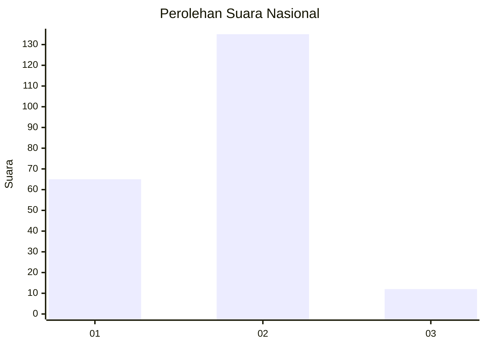
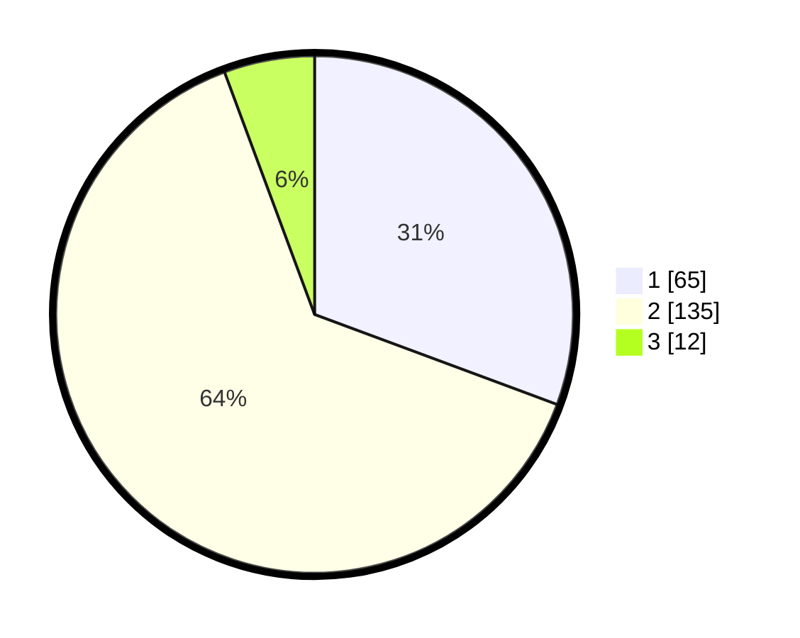

# Hasil

## Grafik

## Tabel

| No. | Nama Paslon    | Suara | Suara (raw) | Persentase |
|:--- |:-------------- | -----:| -----------:| ----------:|
| 1   | ANIES MUHAIMIN | 65    | [65][p-1]   | 30,66      |
| 2   | PRABOWO GIBRAN | 135   | [135][p-2]  | 63,68      |
| 3   | GANJAR MAHFUD  | 12    | [12][p-3]   | 5,66       |

[p-1]: https://github.com/gigit-pemilu/pemilu-2024/blob/main/pilpres/hitung-suara/sub/75-gorontalo/sub/03-bone-bolango/sub/16-bulango-timur/sub/2001-bulotalangi/sub/003-tps/sub/paslon-1.txt
[p-2]: https://github.com/gigit-pemilu/pemilu-2024/blob/main/pilpres/hitung-suara/sub/75-gorontalo/sub/03-bone-bolango/sub/16-bulango-timur/sub/2001-bulotalangi/sub/003-tps/sub/paslon-2.txt
[p-3]: https://github.com/gigit-pemilu/pemilu-2024/blob/main/pilpres/hitung-suara/sub/75-gorontalo/sub/03-bone-bolango/sub/16-bulango-timur/sub/2001-bulotalangi/sub/003-tps/sub/paslon-3.txt

## Foto C Plano

https://sirekap-obj-formc.kpu.go.id/ab91/pemilu/ppwp/75/03/16/20/01/7503162001003-20240223-160332--706273a3-8888-4f80-815c-4014465785bd.jpg

https://sirekap-obj-formc.kpu.go.id/ab91/pemilu/ppwp/75/03/16/20/01/7503162001003-20240223-160841--6fdee996-7f18-466b-a0b2-be89cb91a328.jpg

https://sirekap-obj-formc.kpu.go.id/ab91/pemilu/ppwp/75/03/16/20/01/7503162001003-20240223-160900--e0a2ef72-b51b-416d-a3c5-1213e9a4e6d7.jpg

## Metadata

| Key        | Value               |
| ---------- | ------------------- |
| Time Stamp | 2024-02-24 22:31:28 |

