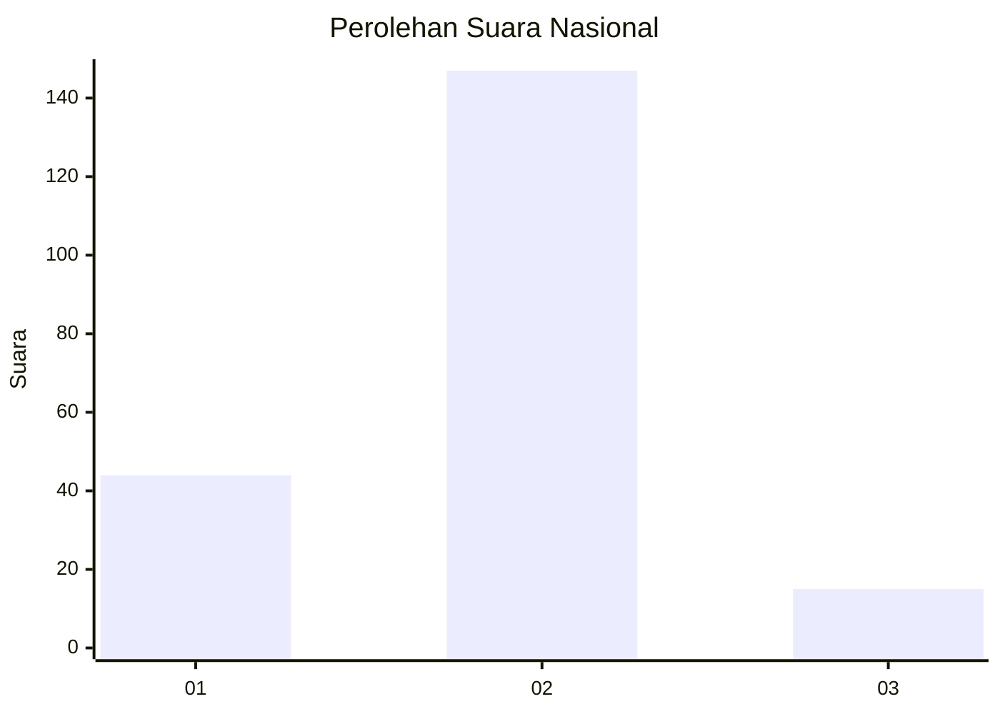
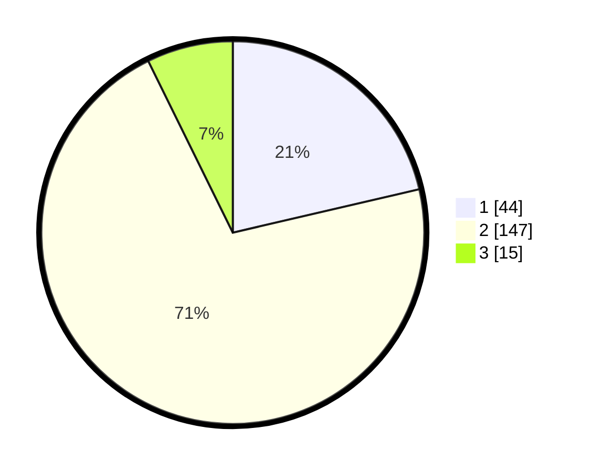

# Hasil

## Grafik

## Tabel

| No. | Nama Paslon    | Suara | Suara (raw) | Persentase |
|:--- |:-------------- | -----:| -----------:| ----------:|
| 1   | ANIES MUHAIMIN | 44    | [44][p-1]   | 21,36      |
| 2   | PRABOWO GIBRAN | 147   | [147][p-2]  | 71,36      |
| 3   | GANJAR MAHFUD  | 15    | [15][p-3]   | 7,28       |

[p-1]: https://github.com/gigit-pemilu/pemilu-2024/blob/main/pilpres/hitung-suara/sub/75-gorontalo/sub/03-bone-bolango/sub/16-bulango-timur/sub/2001-bulotalangi/sub/004-tps/sub/paslon-1.txt
[p-2]: https://github.com/gigit-pemilu/pemilu-2024/blob/main/pilpres/hitung-suara/sub/75-gorontalo/sub/03-bone-bolango/sub/16-bulango-timur/sub/2001-bulotalangi/sub/004-tps/sub/paslon-2.txt
[p-3]: https://github.com/gigit-pemilu/pemilu-2024/blob/main/pilpres/hitung-suara/sub/75-gorontalo/sub/03-bone-bolango/sub/16-bulango-timur/sub/2001-bulotalangi/sub/004-tps/sub/paslon-3.txt

## Foto C Plano

https://sirekap-obj-formc.kpu.go.id/7c33/pemilu/ppwp/75/03/16/20/01/7503162001004-20240223-182842--3b14659e-89a4-4e13-9d92-90d6b55d3fb7.jpg

https://sirekap-obj-formc.kpu.go.id/7c33/pemilu/ppwp/75/03/16/20/01/7503162001004-20240223-183049--460281b4-2aa9-4a8b-93b9-d1e0f6975315.jpg

https://sirekap-obj-formc.kpu.go.id/7c33/pemilu/ppwp/75/03/16/20/01/7503162001004-20240223-183111--db34b4aa-7417-4ae3-84fc-9126e928a7ac.jpg

## Metadata

| Key        | Value               |
| ---------- | ------------------- |
| Time Stamp | 2024-02-24 22:31:28 |

