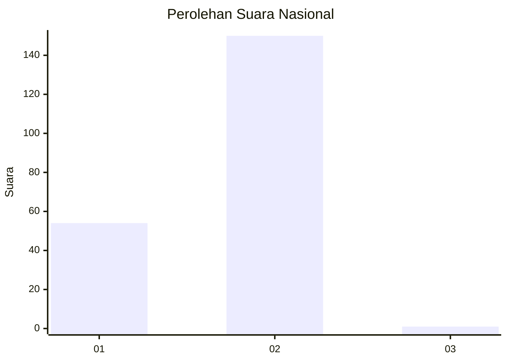
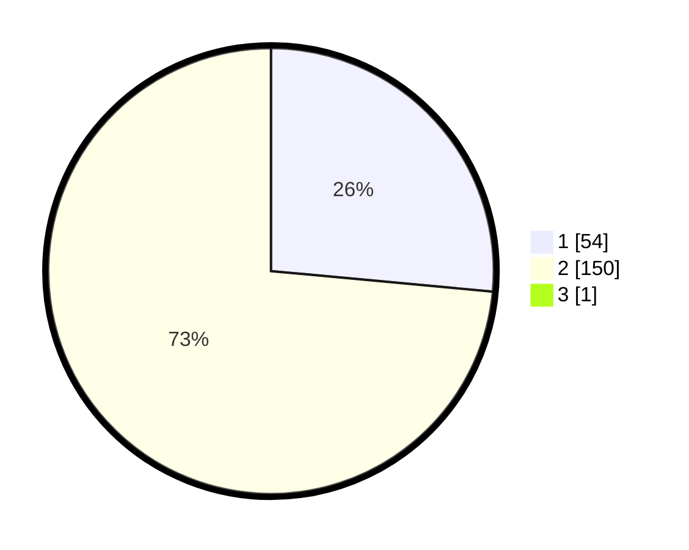

# Hasil

## Grafik

## Tabel

| No. | Nama Paslon    | Suara | Suara (raw) | Persentase |
|:--- |:-------------- | -----:| -----------:| ----------:|
| 1   | ANIES MUHAIMIN | 54    | [54][p-1]   | 26,34      |
| 2   | PRABOWO GIBRAN | 150   | [150][p-2]  | 73,17      |
| 3   | GANJAR MAHFUD  | 1     | [1][p-3]    | 0,49       |

[p-1]: https://github.com/gigit-pemilu/pemilu-2024/blob/main/pilpres/hitung-suara/sub/75-gorontalo/sub/03-bone-bolango/sub/16-bulango-timur/sub/2002-toluwaya/sub/001-tps/sub/paslon-1.txt
[p-2]: https://github.com/gigit-pemilu/pemilu-2024/blob/main/pilpres/hitung-suara/sub/75-gorontalo/sub/03-bone-bolango/sub/16-bulango-timur/sub/2002-toluwaya/sub/001-tps/sub/paslon-2.txt
[p-3]: https://github.com/gigit-pemilu/pemilu-2024/blob/main/pilpres/hitung-suara/sub/75-gorontalo/sub/03-bone-bolango/sub/16-bulango-timur/sub/2002-toluwaya/sub/001-tps/sub/paslon-3.txt

## Foto C Plano

https://sirekap-obj-formc.kpu.go.id/07fe/pemilu/ppwp/75/03/16/20/02/7503162002001-20240214-200332--13748195-357f-442c-b7b9-ac672db217df.jpg

https://sirekap-obj-formc.kpu.go.id/07fe/pemilu/ppwp/75/03/16/20/02/7503162002001-20240223-180305--4870583c-e146-4fce-b48c-eac095bfafd8.jpg

https://sirekap-obj-formc.kpu.go.id/07fe/pemilu/ppwp/75/03/16/20/02/7503162002001-20240223-180404--dc0bb268-f591-41fe-afe9-b991cd9a41aa.jpg

## Metadata

| Key        | Value               |
| ---------- | ------------------- |
| Time Stamp | 2024-02-24 22:31:28 |

