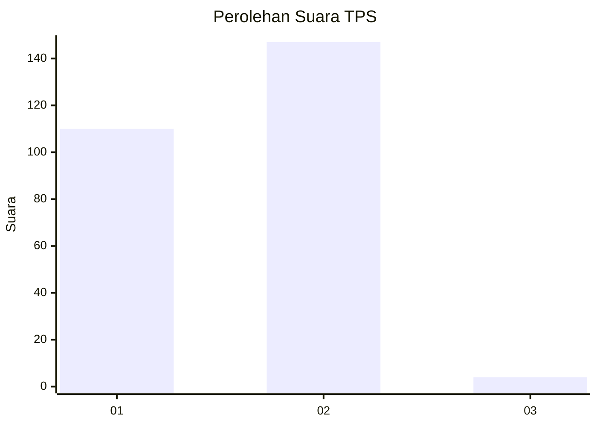
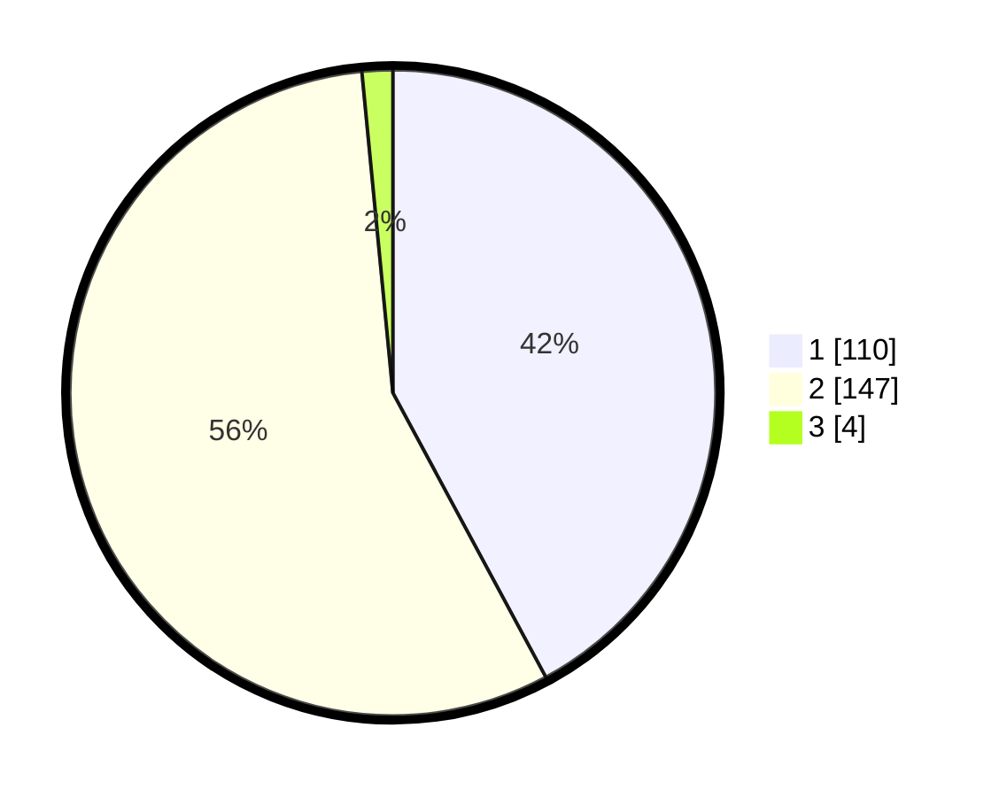

# Hasil

## Grafik

## Tabel

| No. | Nama Paslon    | Suara | Suara (raw) | Persentase |
|:--- |:-------------- | -----:| -----------:| ----------:|
| 1   | ANIES MUHAIMIN | 110   | [110][p-1]  | 42,15      |
| 2   | PRABOWO GIBRAN | 147   | [147][p-2]  | 56,32      |
| 3   | GANJAR MAHFUD  | 4     | [4][p-3]    | 1,53       |

[p-1]: https://github.com/gigit-pemilu/pemilu-2024-75-gorontalo/blob/main/pilpres/hitung-suara/sub/75-gorontalo/sub/03-bone-bolango/sub/16-bulango-timur/sub/2003-popodu/sub/001-tps/sub/paslon-1.txt
[p-2]: https://github.com/gigit-pemilu/pemilu-2024-75-gorontalo/blob/main/pilpres/hitung-suara/sub/75-gorontalo/sub/03-bone-bolango/sub/16-bulango-timur/sub/2003-popodu/sub/001-tps/sub/paslon-2.txt
[p-3]: https://github.com/gigit-pemilu/pemilu-2024-75-gorontalo/blob/main/pilpres/hitung-suara/sub/75-gorontalo/sub/03-bone-bolango/sub/16-bulango-timur/sub/2003-popodu/sub/001-tps/sub/paslon-3.txt

## Foto C Plano

https://sirekap-obj-formc.kpu.go.id/e2de/pemilu/ppwp/75/03/16/20/03/7503162003001-20240215-010249--a0240da3-d091-4b81-9485-1d16d2be8a69.jpg

https://sirekap-obj-formc.kpu.go.id/e2de/pemilu/ppwp/75/03/16/20/03/7503162003001-20240215-010630--dd1ce411-b57c-4f16-82c8-c5770dd7c29d.jpg

https://sirekap-obj-formc.kpu.go.id/e2de/pemilu/ppwp/75/03/16/20/03/7503162003001-20240215-010551--f4d597e4-5b83-4d22-85c9-7aee59ede703.jpg

## Metadata

| Key        | Value               |
| ---------- | ------------------- |
| Time Stamp | 2024-02-15 15:00:29 |

