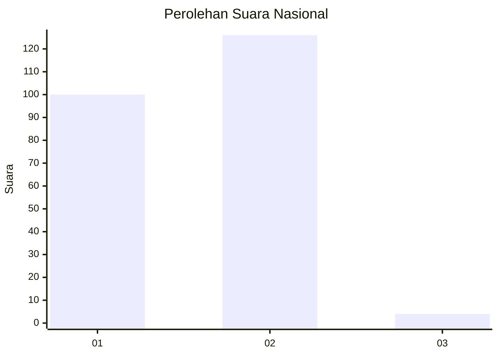
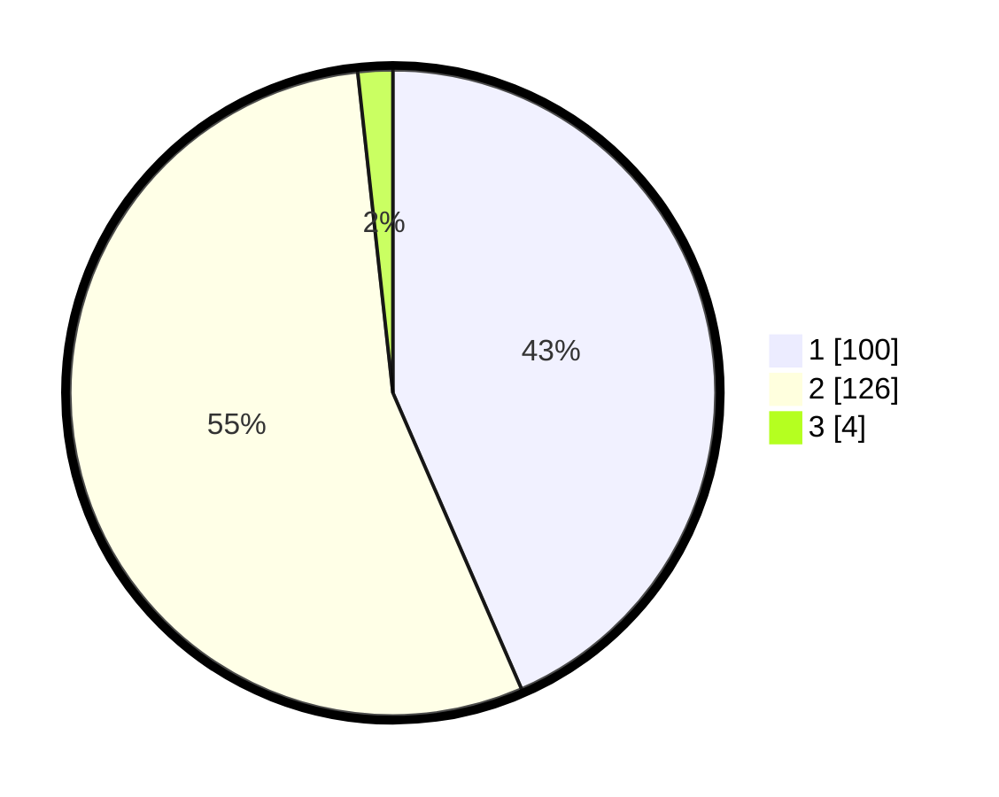

# Hasil

## Grafik

## Tabel

| No. | Nama Paslon    | Suara | Suara (raw) | Persentase |
|:--- |:-------------- | -----:| -----------:| ----------:|
| 1   | ANIES MUHAIMIN | 100   | [100][p-1]  | 43,48      |
| 2   | PRABOWO GIBRAN | 126   | [126][p-2]  | 54,78      |
| 3   | GANJAR MAHFUD  | 4     | [4][p-3]    | 1,74       |

[p-1]: https://github.com/gigit-pemilu/pemilu-2024/blob/main/pilpres/hitung-suara/sub/75-gorontalo/sub/03-bone-bolango/sub/16-bulango-timur/sub/2005-bulotalangi-barat/sub/002-tps/sub/paslon-1.txt
[p-2]: https://github.com/gigit-pemilu/pemilu-2024/blob/main/pilpres/hitung-suara/sub/75-gorontalo/sub/03-bone-bolango/sub/16-bulango-timur/sub/2005-bulotalangi-barat/sub/002-tps/sub/paslon-2.txt
[p-3]: https://github.com/gigit-pemilu/pemilu-2024/blob/main/pilpres/hitung-suara/sub/75-gorontalo/sub/03-bone-bolango/sub/16-bulango-timur/sub/2005-bulotalangi-barat/sub/002-tps/sub/paslon-3.txt

## Foto C Plano

https://sirekap-obj-formc.kpu.go.id/5edd/pemilu/ppwp/75/03/16/20/05/7503162005002-20240215-063323--92489728-a842-4e06-8d00-eb1b744cdc17.jpg

https://sirekap-obj-formc.kpu.go.id/5edd/pemilu/ppwp/75/03/16/20/05/7503162005002-20240215-063538--d07ddf01-5c7c-46f8-9801-fc0b4ed1f9d8.jpg

https://sirekap-obj-formc.kpu.go.id/5edd/pemilu/ppwp/75/03/16/20/05/7503162005002-20240215-063620--9d1aefc4-2e80-4e53-9d47-4013ed9258cb.jpg

## Metadata

| Key        | Value               |
| ---------- | ------------------- |
| Time Stamp | 2024-02-15 15:00:29 |

