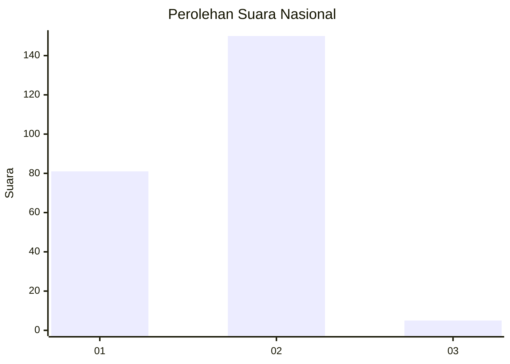
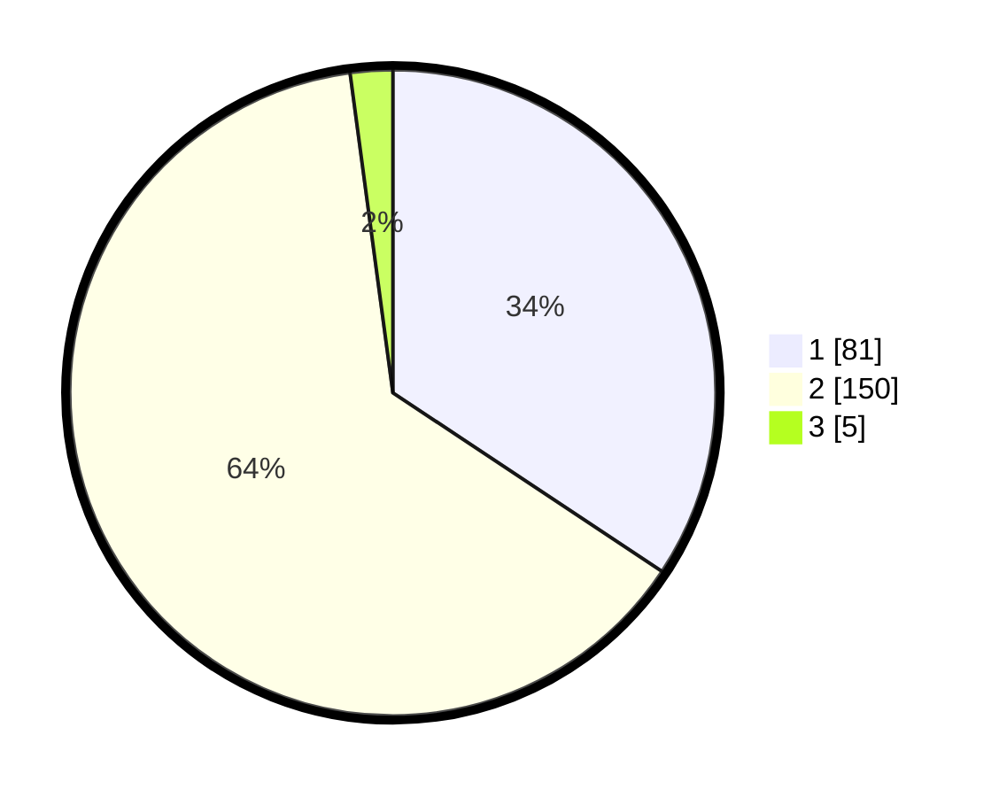

# Hasil

## Grafik

## Tabel

| No. | Nama Paslon    | Suara | Suara (raw) | Persentase |
|:--- |:-------------- | -----:| -----------:| ----------:|
| 1   | ANIES MUHAIMIN | 81    | [81][p-1]   | 34,32      |
| 2   | PRABOWO GIBRAN | 150   | [150][p-2]  | 63,56      |
| 3   | GANJAR MAHFUD  | 5     | [5][p-3]    | 2,12       |

[p-1]: https://github.com/gigit-pemilu/pemilu-2024/blob/main/pilpres/hitung-suara/sub/75-gorontalo/sub/03-bone-bolango/sub/16-bulango-timur/sub/2005-bulotalangi-barat/sub/004-tps/sub/paslon-1.txt
[p-2]: https://github.com/gigit-pemilu/pemilu-2024/blob/main/pilpres/hitung-suara/sub/75-gorontalo/sub/03-bone-bolango/sub/16-bulango-timur/sub/2005-bulotalangi-barat/sub/004-tps/sub/paslon-2.txt
[p-3]: https://github.com/gigit-pemilu/pemilu-2024/blob/main/pilpres/hitung-suara/sub/75-gorontalo/sub/03-bone-bolango/sub/16-bulango-timur/sub/2005-bulotalangi-barat/sub/004-tps/sub/paslon-3.txt

## Foto C Plano

https://sirekap-obj-formc.kpu.go.id/1df3/pemilu/ppwp/75/03/16/20/05/7503162005004-20240215-103428--2e2c9c3a-f603-4908-b989-3f01403dd748.jpg

https://sirekap-obj-formc.kpu.go.id/1df3/pemilu/ppwp/75/03/16/20/05/7503162005004-20240214-231447--4fb5c26e-20cb-4189-9ca5-edcf23f76de9.jpg

https://sirekap-obj-formc.kpu.go.id/1df3/pemilu/ppwp/75/03/16/20/05/7503162005004-20240214-231931--aedc07ca-1a2b-4b70-aa5f-38323dc8d60e.jpg

## Metadata

| Key        | Value               |
| ---------- | ------------------- |
| Time Stamp | 2024-02-15 15:00:29 |

