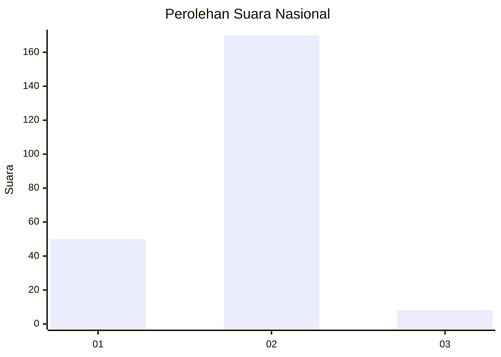

# Hasil

## Grafik

## Tabel

| No. | Nama Paslon    | Suara | Suara (raw) | Persentase |
|:--- |:-------------- | -----:| -----------:| ----------:|
| 1   | ANIES MUHAIMIN | 50    | [50][p-1]   | 21,93      |
| 2   | PRABOWO GIBRAN | 170   | [170][p-2]  | 74,56      |
| 3   | GANJAR MAHFUD  | 8     | [8][p-3]    | 3,51       |

[p-1]: https://github.com/gigit-pemilu/pemilu-2024/blob/main/pilpres/hitung-suara/sub/75-gorontalo/sub/03-bone-bolango/sub/17-bulawa/sub/2006-mamungaa-timur/sub/002-tps/sub/paslon-1.txt
[p-2]: https://github.com/gigit-pemilu/pemilu-2024/blob/main/pilpres/hitung-suara/sub/75-gorontalo/sub/03-bone-bolango/sub/17-bulawa/sub/2006-mamungaa-timur/sub/002-tps/sub/paslon-2.txt
[p-3]: https://github.com/gigit-pemilu/pemilu-2024/blob/main/pilpres/hitung-suara/sub/75-gorontalo/sub/03-bone-bolango/sub/17-bulawa/sub/2006-mamungaa-timur/sub/002-tps/sub/paslon-3.txt

## Foto C Plano

https://sirekap-obj-formc.kpu.go.id/dbe9/pemilu/ppwp/75/03/17/20/06/7503172006002-20240215-072822--7c55ec4d-6c1b-4a80-95c8-67d7e70a4af4.jpg

https://sirekap-obj-formc.kpu.go.id/dbe9/pemilu/ppwp/75/03/17/20/06/7503172006002-20240215-073454--52bc8138-11d4-44fe-9a30-c1b5d104d5a4.jpg

https://sirekap-obj-formc.kpu.go.id/dbe9/pemilu/ppwp/75/03/17/20/06/7503172006002-20240215-073243--0be32573-75a7-4407-8ead-86bea0b656ca.jpg

## Metadata

| Key        | Value               |
| ---------- | ------------------- |
| Time Stamp | 2024-02-15 15:00:29 |

