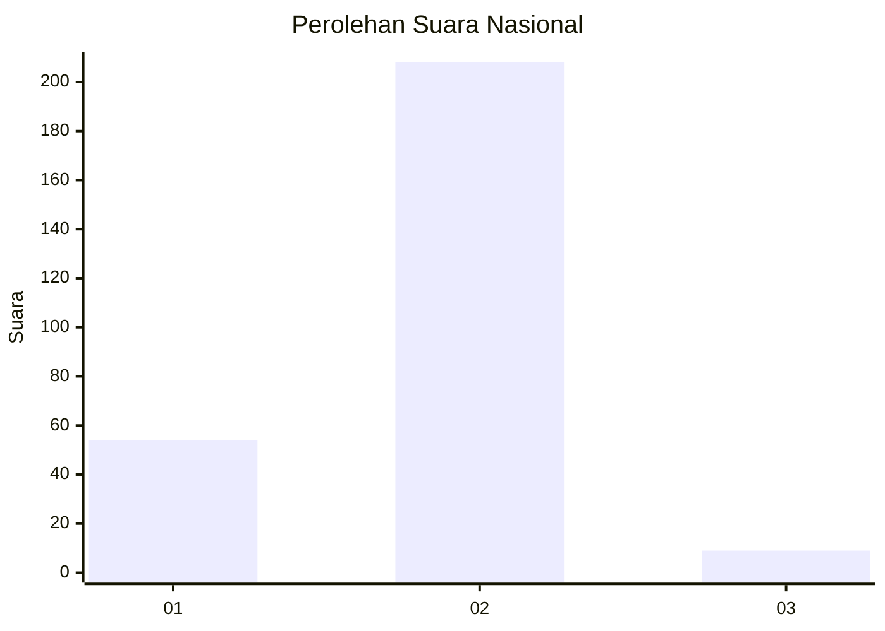
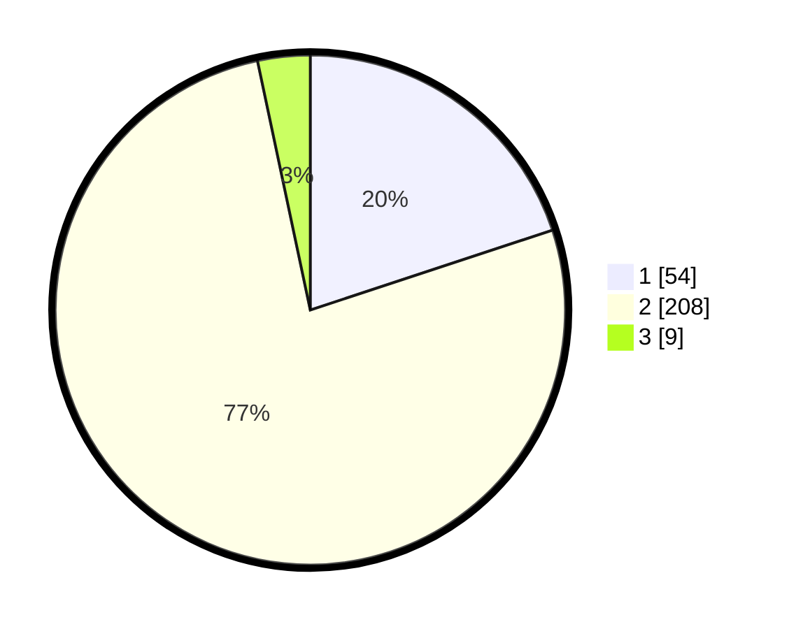

# Hasil

## Grafik

## Tabel

| No. | Nama Paslon    | Suara | Suara (raw) | Persentase |
|:--- |:-------------- | -----:| -----------:| ----------:|
| 1   | ANIES MUHAIMIN | 54    | [54][p-1]   | 19,93      |
| 2   | PRABOWO GIBRAN | 208   | [208][p-2]  | 76,75      |
| 3   | GANJAR MAHFUD  | 9     | [9][p-3]    | 3,32       |

[p-1]: https://github.com/gigit-pemilu/pemilu-2024/blob/main/pilpres/hitung-suara/sub/75-gorontalo/sub/03-bone-bolango/sub/17-bulawa/sub/2009-patoa/sub/001-tps/sub/paslon-1.txt
[p-2]: https://github.com/gigit-pemilu/pemilu-2024/blob/main/pilpres/hitung-suara/sub/75-gorontalo/sub/03-bone-bolango/sub/17-bulawa/sub/2009-patoa/sub/001-tps/sub/paslon-2.txt
[p-3]: https://github.com/gigit-pemilu/pemilu-2024/blob/main/pilpres/hitung-suara/sub/75-gorontalo/sub/03-bone-bolango/sub/17-bulawa/sub/2009-patoa/sub/001-tps/sub/paslon-3.txt

## Foto C Plano

https://sirekap-obj-formc.kpu.go.id/aa55/pemilu/ppwp/75/03/17/20/09/7503172009001-20240214-184643--329efe38-a7bf-4f79-a2f8-7ad005dc5428.jpg

https://sirekap-obj-formc.kpu.go.id/aa55/pemilu/ppwp/75/03/17/20/09/7503172009001-20240214-184926--722fbb3c-085b-4cec-a550-49348f97e1c5.jpg

https://sirekap-obj-formc.kpu.go.id/aa55/pemilu/ppwp/75/03/17/20/09/7503172009001-20240214-184830--908da00f-5e4b-4e5e-95dc-0eed9545fe34.jpg

## Metadata

| Key        | Value               |
| ---------- | ------------------- |
| Time Stamp | 2024-02-15 22:00:27 |

