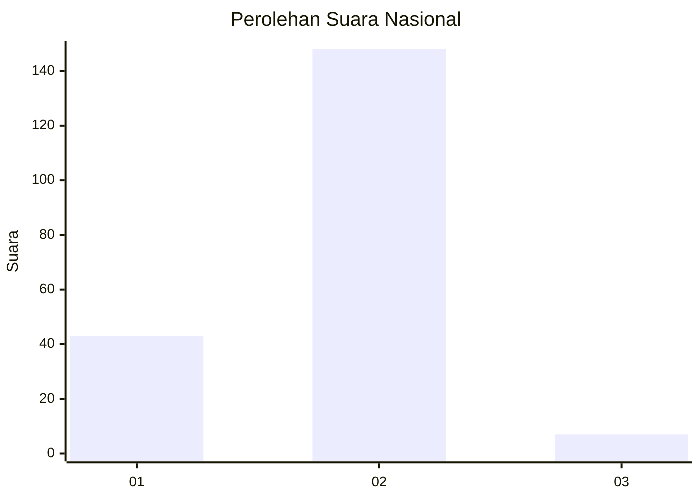

# Hasil

## Grafik

## Tabel

| No. | Nama Paslon    | Suara | Suara (raw) | Persentase |
|:--- |:-------------- | -----:| -----------:| ----------:|
| 1   | ANIES MUHAIMIN | 43    | [43][p-1]   | 21,72      |
| 2   | PRABOWO GIBRAN | 148   | [148][p-2]  | 74,75      |
| 3   | GANJAR MAHFUD  | 7     | [7][p-3]    | 3,54       |

[p-1]: https://github.com/gigit-pemilu/pemilu-2024/blob/main/pilpres/hitung-suara/sub/75-gorontalo/sub/04-pohuwato/sub/01-popayato/sub/2017-trikora/sub/002-tps/sub/paslon-1.txt
[p-2]: https://github.com/gigit-pemilu/pemilu-2024/blob/main/pilpres/hitung-suara/sub/75-gorontalo/sub/04-pohuwato/sub/01-popayato/sub/2017-trikora/sub/002-tps/sub/paslon-2.txt
[p-3]: https://github.com/gigit-pemilu/pemilu-2024/blob/main/pilpres/hitung-suara/sub/75-gorontalo/sub/04-pohuwato/sub/01-popayato/sub/2017-trikora/sub/002-tps/sub/paslon-3.txt

## Foto C Plano

https://sirekap-obj-formc.kpu.go.id/d6d9/pemilu/ppwp/75/04/01/20/17/7504012017002-20240214-235700--0019f6fc-afbf-402a-b0a3-c8e1ab2f8b63.jpg

https://sirekap-obj-formc.kpu.go.id/d6d9/pemilu/ppwp/75/04/01/20/17/7504012017002-20240215-000915--e179d2a5-3122-49b8-930f-3013e6ed3b6b.jpg

https://sirekap-obj-formc.kpu.go.id/d6d9/pemilu/ppwp/75/04/01/20/17/7504012017002-20240215-001006--9f16996b-0442-4a53-b3e9-605ac8b0c2f3.jpg

## Metadata

| Key        | Value               |
| ---------- | ------------------- |
| Time Stamp | 2024-02-15 18:00:26 |

