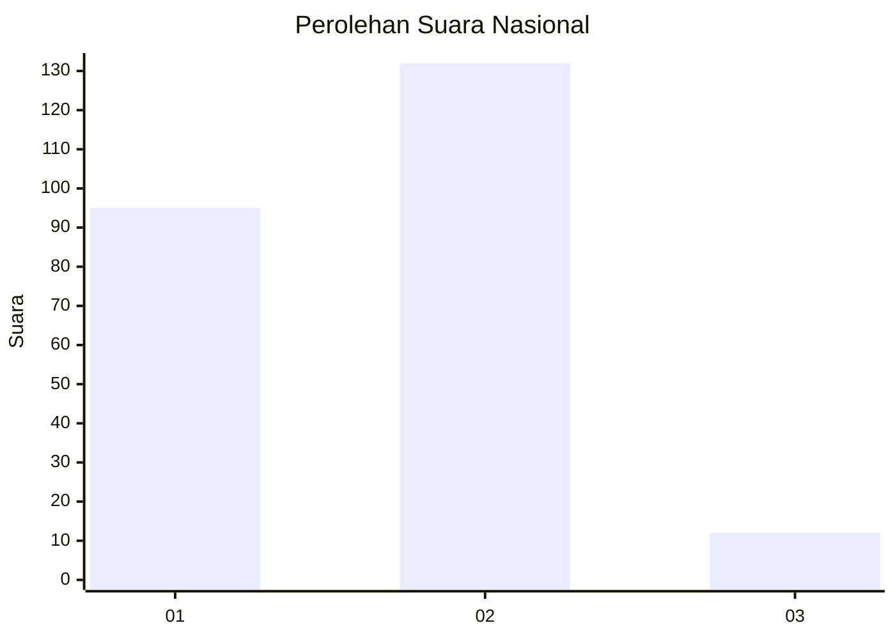
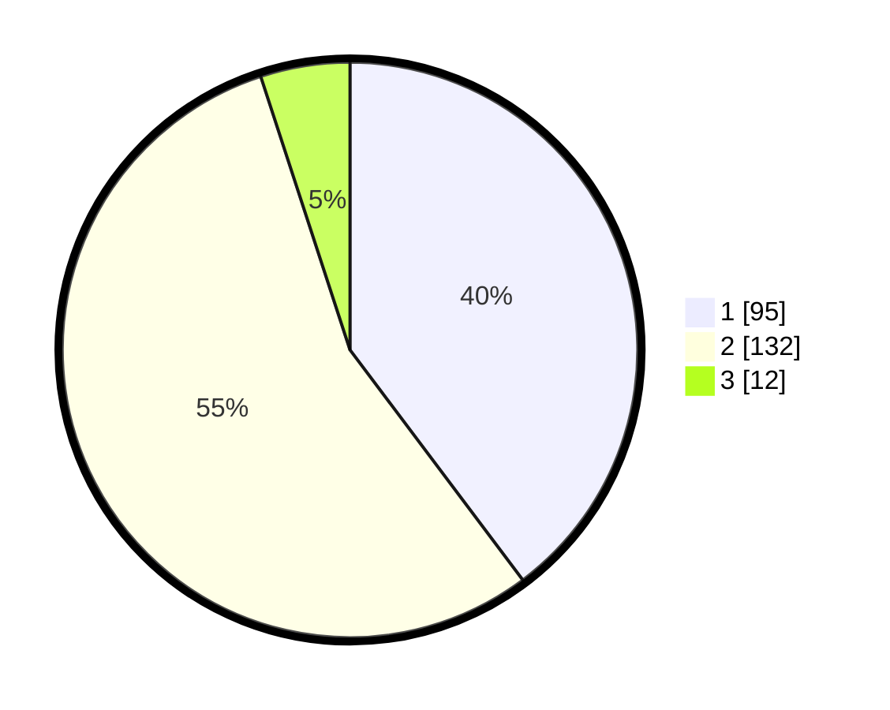

# Hasil

## Grafik

## Tabel

| No. | Nama Paslon    | Suara | Suara (raw) | Persentase |
|:--- |:-------------- | -----:| -----------:| ----------:|
| 1   | ANIES MUHAIMIN | 95    | [95][p-1]   | 39,75      |
| 2   | PRABOWO GIBRAN | 132   | [132][p-2]  | 55,23      |
| 3   | GANJAR MAHFUD  | 12    | [12][p-3]   | 5,02       |

[p-1]: https://github.com/gigit-pemilu/pemilu-2024/blob/main/pilpres/hitung-suara/sub/75-gorontalo/sub/04-pohuwato/sub/02-lemito/sub/2001-lemito/sub/001-tps/sub/paslon-1.txt
[p-2]: https://github.com/gigit-pemilu/pemilu-2024/blob/main/pilpres/hitung-suara/sub/75-gorontalo/sub/04-pohuwato/sub/02-lemito/sub/2001-lemito/sub/001-tps/sub/paslon-2.txt
[p-3]: https://github.com/gigit-pemilu/pemilu-2024/blob/main/pilpres/hitung-suara/sub/75-gorontalo/sub/04-pohuwato/sub/02-lemito/sub/2001-lemito/sub/001-tps/sub/paslon-3.txt

## Foto C Plano

https://sirekap-obj-formc.kpu.go.id/f59a/pemilu/ppwp/75/04/02/20/01/7504022001001-20240217-164239--3f91e1c7-b08d-49f3-a800-6eabdd19bb0b.jpg

https://sirekap-obj-formc.kpu.go.id/f59a/pemilu/ppwp/75/04/02/20/01/7504022001001-20240215-080229--cb3ff0a1-ff53-4c86-bc38-af0b0e534817.jpg

https://sirekap-obj-formc.kpu.go.id/f59a/pemilu/ppwp/75/04/02/20/01/7504022001001-20240215-080613--521f9e73-7d18-4bd6-bbeb-a294a26fd08d.jpg

## Metadata

| Key        | Value               |
| ---------- | ------------------- |
| Time Stamp | 2024-02-17 16:52:47 |

