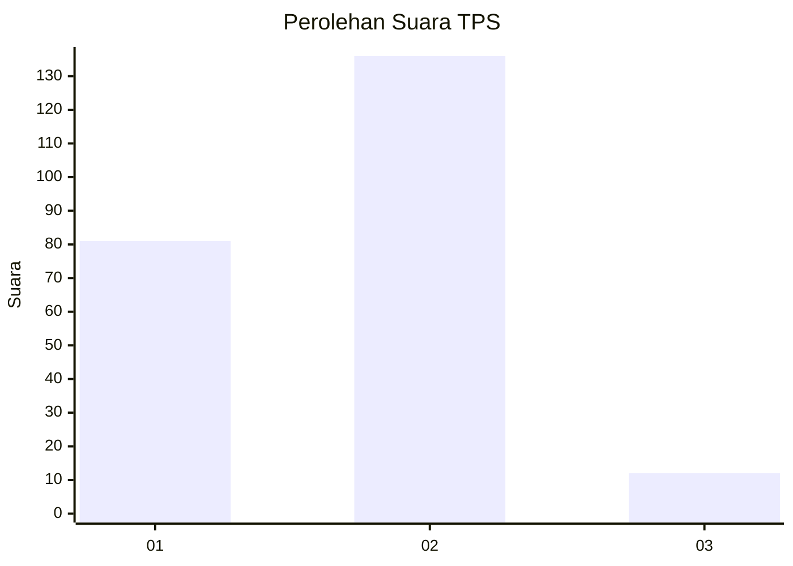
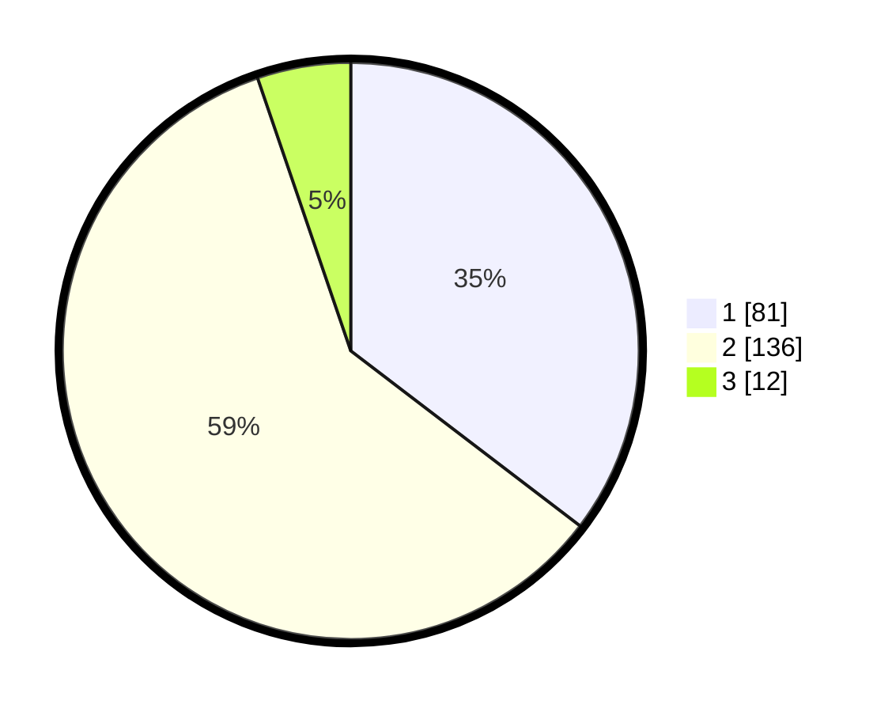

# Hasil

## Grafik

## Tabel

| No. | Nama Paslon    | Suara | Suara (raw) | Persentase |
|:--- |:-------------- | -----:| -----------:| ----------:|
| 1   | ANIES MUHAIMIN | 81    | [81][p-1]   | 35,37      |
| 2   | PRABOWO GIBRAN | 136   | [136][p-2]  | 59,39      |
| 3   | GANJAR MAHFUD  | 12    | [12][p-3]   | 5,24       |

[p-1]: https://github.com/gigit-pemilu/pemilu-2024-75-gorontalo/blob/main/pilpres/hitung-suara/sub/75-gorontalo/sub/04-pohuwato/sub/02-lemito/sub/2001-lemito/sub/003-tps/sub/paslon-1.txt
[p-2]: https://github.com/gigit-pemilu/pemilu-2024-75-gorontalo/blob/main/pilpres/hitung-suara/sub/75-gorontalo/sub/04-pohuwato/sub/02-lemito/sub/2001-lemito/sub/003-tps/sub/paslon-2.txt
[p-3]: https://github.com/gigit-pemilu/pemilu-2024-75-gorontalo/blob/main/pilpres/hitung-suara/sub/75-gorontalo/sub/04-pohuwato/sub/02-lemito/sub/2001-lemito/sub/003-tps/sub/paslon-3.txt

## Foto C Plano

https://sirekap-obj-formc.kpu.go.id/f0e2/pemilu/ppwp/75/04/02/20/01/7504022001003-20240215-052128--1597f431-c791-4bc0-ae16-10e2f1fc0f9a.jpg

https://sirekap-obj-formc.kpu.go.id/f0e2/pemilu/ppwp/75/04/02/20/01/7504022001003-20240214-195301--53002768-40f5-42c6-b645-6ead7c68f143.jpg

https://sirekap-obj-formc.kpu.go.id/f0e2/pemilu/ppwp/75/04/02/20/01/7504022001003-20240214-195439--f18c00b4-f308-422e-8ea6-7493e0a57f07.jpg

## Metadata

| Key        | Value               |
| ---------- | ------------------- |
| Time Stamp | 2024-02-24 22:31:28 |

