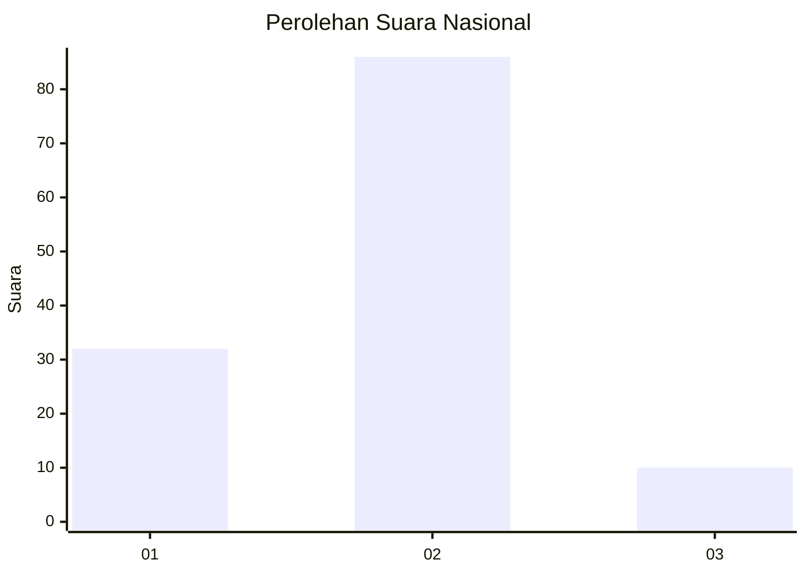
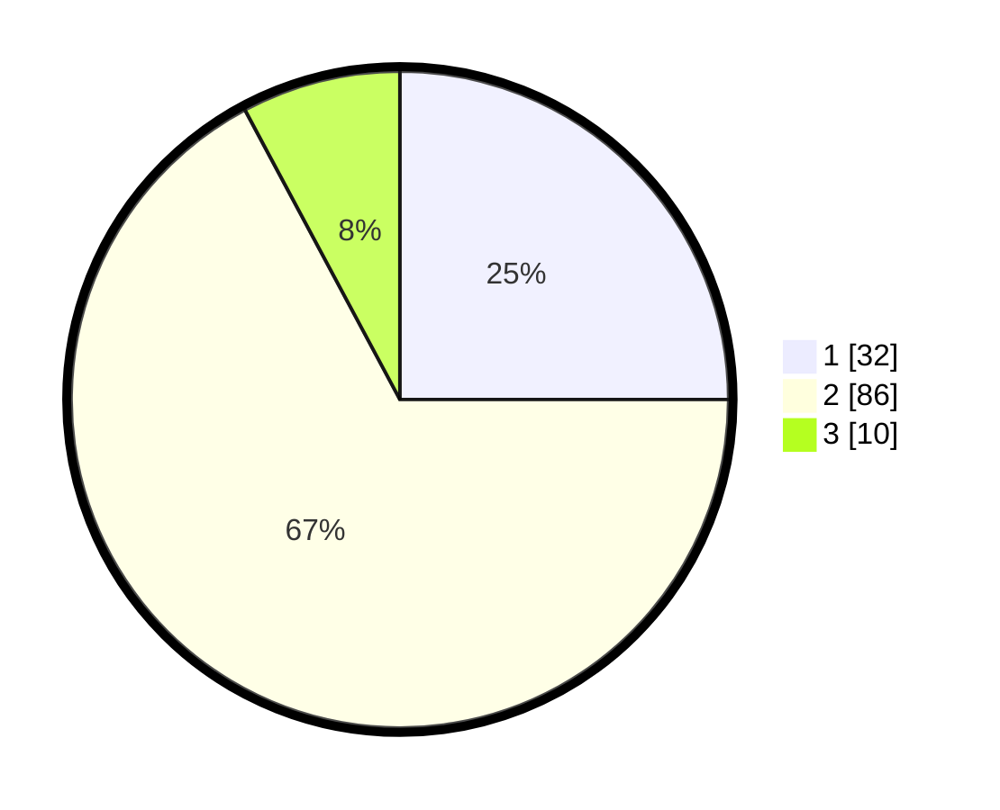

# Hasil

## Grafik

## Tabel

| No. | Nama Paslon    | Suara | Suara (raw) | Persentase |
|:--- |:-------------- | -----:| -----------:| ----------:|
| 1   | ANIES MUHAIMIN | 32    | [32][p-1]   | 25,00      |
| 2   | PRABOWO GIBRAN | 86    | [86][p-2]   | 67,19      |
| 3   | GANJAR MAHFUD  | 10    | [10][p-3]   | 7,81       |

[p-1]: https://github.com/gigit-pemilu/pemilu-2024/blob/main/pilpres/hitung-suara/sub/75-gorontalo/sub/04-pohuwato/sub/03-randangan/sub/2002-imbodu/sub/004-tps/sub/paslon-1.txt
[p-2]: https://github.com/gigit-pemilu/pemilu-2024/blob/main/pilpres/hitung-suara/sub/75-gorontalo/sub/04-pohuwato/sub/03-randangan/sub/2002-imbodu/sub/004-tps/sub/paslon-2.txt
[p-3]: https://github.com/gigit-pemilu/pemilu-2024/blob/main/pilpres/hitung-suara/sub/75-gorontalo/sub/04-pohuwato/sub/03-randangan/sub/2002-imbodu/sub/004-tps/sub/paslon-3.txt

## Foto C Plano

https://sirekap-obj-formc.kpu.go.id/2603/pemilu/ppwp/75/04/03/20/02/7504032002004-20240219-084001--19f6649f-96a8-4bf8-9083-61ce9f8fa519.jpg

https://sirekap-obj-formc.kpu.go.id/2603/pemilu/ppwp/75/04/03/20/02/7504032002004-20240215-003836--fe8adc85-b9d3-4906-b899-1b5d20eea000.jpg

https://sirekap-obj-formc.kpu.go.id/2603/pemilu/ppwp/75/04/03/20/02/7504032002004-20240215-031036--aa70cebc-12d7-4a25-96f0-adb748d8a17c.jpg

## Metadata

| Key        | Value               |
| ---------- | ------------------- |
| Time Stamp | 2024-02-24 22:31:28 |

