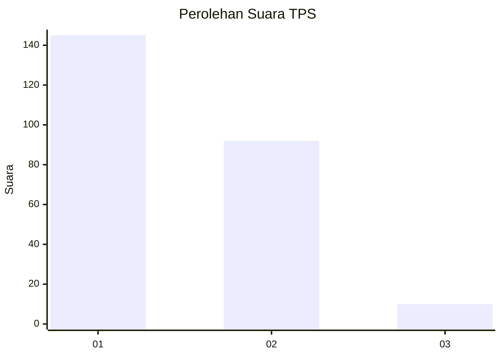
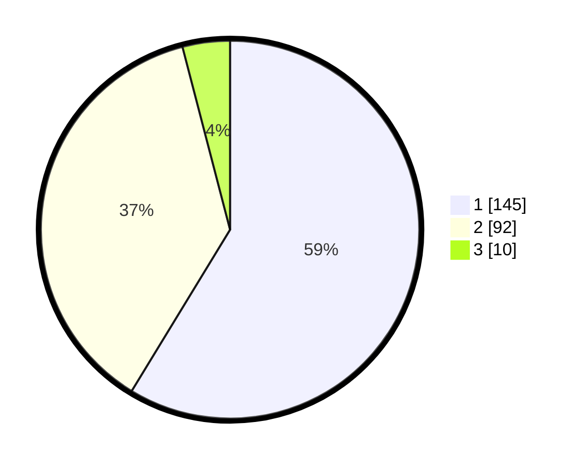

# Hasil

## Grafik

## Tabel

| No. | Nama Paslon    | Suara | Suara (raw) | Persentase |
|:--- |:-------------- | -----:| -----------:| ----------:|
| 1   | ANIES MUHAIMIN | 145   | [145][p-1]  | 58,70      |
| 2   | PRABOWO GIBRAN | 92    | [92][p-2]   | 37,25      |
| 3   | GANJAR MAHFUD  | 10    | [10][p-3]   | 4,05       |

[p-1]: https://github.com/gigit-pemilu/pemilu-2024-75-gorontalo/blob/main/pilpres/hitung-suara/sub/75-gorontalo/sub/04-pohuwato/sub/03-randangan/sub/2009-huyula/sub/002-tps/sub/paslon-1.txt
[p-2]: https://github.com/gigit-pemilu/pemilu-2024-75-gorontalo/blob/main/pilpres/hitung-suara/sub/75-gorontalo/sub/04-pohuwato/sub/03-randangan/sub/2009-huyula/sub/002-tps/sub/paslon-2.txt
[p-3]: https://github.com/gigit-pemilu/pemilu-2024-75-gorontalo/blob/main/pilpres/hitung-suara/sub/75-gorontalo/sub/04-pohuwato/sub/03-randangan/sub/2009-huyula/sub/002-tps/sub/paslon-3.txt

## Foto C Plano

https://sirekap-obj-formc.kpu.go.id/ec46/pemilu/ppwp/75/04/03/20/09/7504032009002-20240215-025518--84dcb17e-804c-4971-9a6f-e4e58c838ab1.jpg

https://sirekap-obj-formc.kpu.go.id/ec46/pemilu/ppwp/75/04/03/20/09/7504032009002-20240215-100222--e2dc75ac-60ed-46a7-bc83-670cd0ac55f0.jpg

https://sirekap-obj-formc.kpu.go.id/ec46/pemilu/ppwp/75/04/03/20/09/7504032009002-20240215-064711--c21ac5f2-13d5-4a1d-b52d-3ab99b79de46.jpg

## Metadata

| Key        | Value               |
| ---------- | ------------------- |
| Time Stamp | 2024-02-24 22:31:28 |

