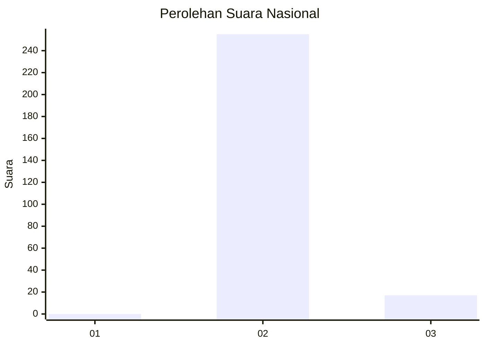
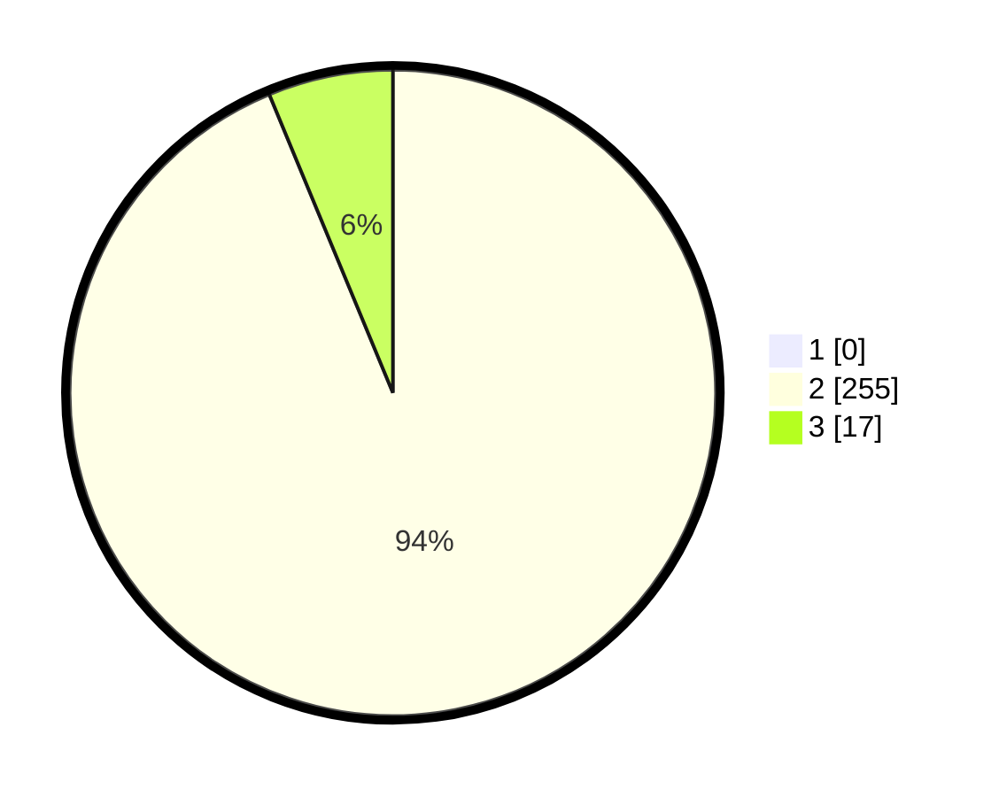

# Hasil

## Grafik

## Tabel

| No. | Nama Paslon    | Suara | Suara (raw) | Persentase |
|:--- |:-------------- | -----:| -----------:| ----------:|
| 1   | ANIES MUHAIMIN | 0     | [0][p-1]    | 0,00       |
| 2   | PRABOWO GIBRAN | 255   | [255][p-2]  | 93,75      |
| 3   | GANJAR MAHFUD  | 17    | [17][p-3]   | 6,25       |

[p-1]: https://github.com/gigit-pemilu/pemilu-2024/blob/main/pilpres/hitung-suara/sub/75-gorontalo/sub/04-pohuwato/sub/03-randangan/sub/2015-banuroja/sub/001-tps/sub/paslon-1.txt
[p-2]: https://github.com/gigit-pemilu/pemilu-2024/blob/main/pilpres/hitung-suara/sub/75-gorontalo/sub/04-pohuwato/sub/03-randangan/sub/2015-banuroja/sub/001-tps/sub/paslon-2.txt
[p-3]: https://github.com/gigit-pemilu/pemilu-2024/blob/main/pilpres/hitung-suara/sub/75-gorontalo/sub/04-pohuwato/sub/03-randangan/sub/2015-banuroja/sub/001-tps/sub/paslon-3.txt

## Foto C Plano

https://sirekap-obj-formc.kpu.go.id/de71/pemilu/ppwp/75/04/03/20/15/7504032015001-20240215-101358--1f5fba93-b22f-4d70-9516-a0eee72e01c9.jpg

https://sirekap-obj-formc.kpu.go.id/de71/pemilu/ppwp/75/04/03/20/15/7504032015001-20240215-101610--a126229c-7bd3-44cf-8618-80607fc72798.jpg

https://sirekap-obj-formc.kpu.go.id/de71/pemilu/ppwp/75/04/03/20/15/7504032015001-20240215-101721--19c4269c-57d4-488d-980d-90df3683435b.jpg

## Metadata

| Key        | Value               |
| ---------- | ------------------- |
| Time Stamp | 2024-02-25 15:00:00 |

