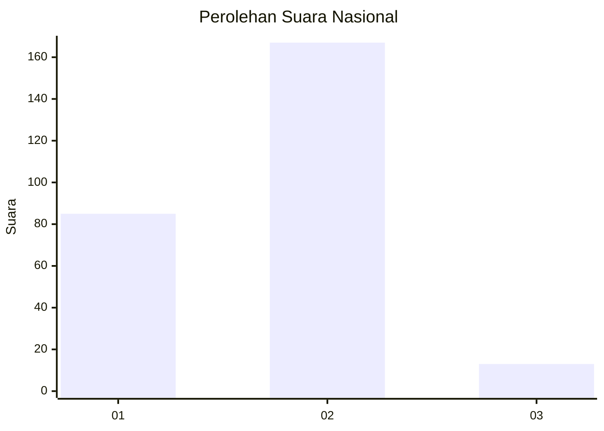
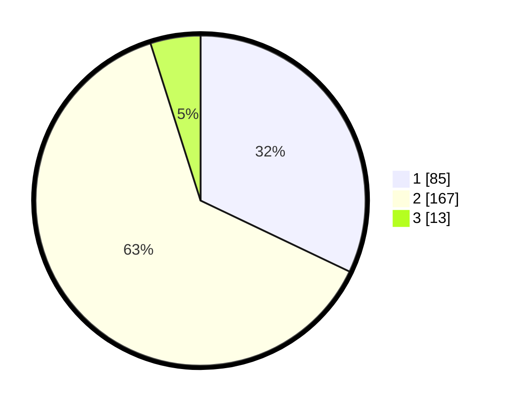

# Hasil

## Grafik

## Tabel

| No. | Nama Paslon    | Suara | Suara (raw) | Persentase |
|:--- |:-------------- | -----:| -----------:| ----------:|
| 1   | ANIES MUHAIMIN | 85    | [85][p-1]   | 32,08      |
| 2   | PRABOWO GIBRAN | 167   | [167][p-2]  | 63,02      |
| 3   | GANJAR MAHFUD  | 13    | [13][p-3]   | 4,91       |

[p-1]: https://github.com/gigit-pemilu/pemilu-2024/blob/main/pilpres/hitung-suara/sub/75-gorontalo/sub/04-pohuwato/sub/03-randangan/sub/2016-pelambane/sub/002-tps/sub/paslon-1.txt
[p-2]: https://github.com/gigit-pemilu/pemilu-2024/blob/main/pilpres/hitung-suara/sub/75-gorontalo/sub/04-pohuwato/sub/03-randangan/sub/2016-pelambane/sub/002-tps/sub/paslon-2.txt
[p-3]: https://github.com/gigit-pemilu/pemilu-2024/blob/main/pilpres/hitung-suara/sub/75-gorontalo/sub/04-pohuwato/sub/03-randangan/sub/2016-pelambane/sub/002-tps/sub/paslon-3.txt

## Foto C Plano

https://sirekap-obj-formc.kpu.go.id/a4c1/pemilu/ppwp/75/04/03/20/16/7504032016002-20240219-105123--5dd6f5d6-459b-498a-b741-e7eadbc7b7dd.jpg

https://sirekap-obj-formc.kpu.go.id/a4c1/pemilu/ppwp/75/04/03/20/16/7504032016002-20240219-105158--694db163-ce78-4b80-9716-0756521c0e98.jpg

https://sirekap-obj-formc.kpu.go.id/a4c1/pemilu/ppwp/75/04/03/20/16/7504032016002-20240219-105233--ad718974-fcd5-4e5c-a288-a5c931b5cc9c.jpg

## Metadata

| Key        | Value               |
| ---------- | ------------------- |
| Time Stamp | 2024-02-25 16:00:00 |

