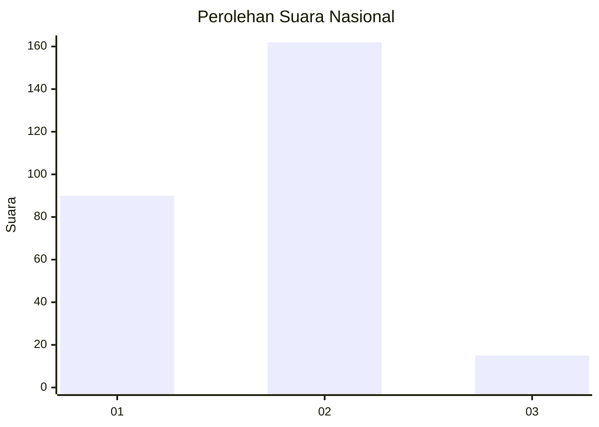
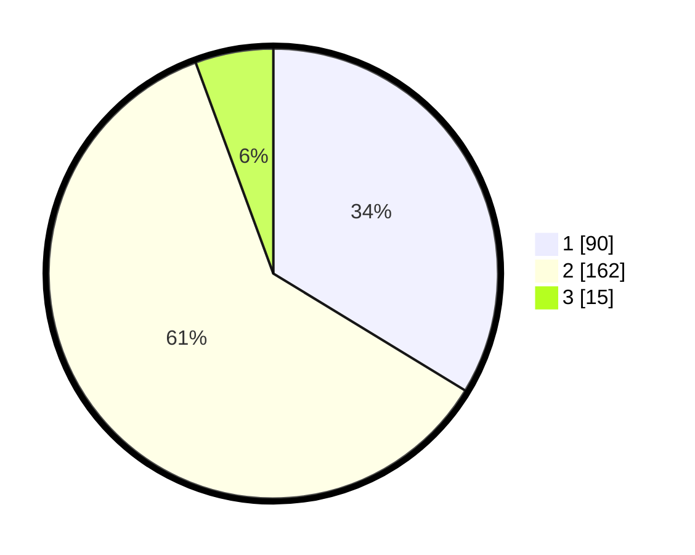

# Hasil

## Grafik

## Tabel

| No. | Nama Paslon    | Suara | Suara (raw) | Persentase |
|:--- |:-------------- | -----:| -----------:| ----------:|
| 1   | ANIES MUHAIMIN | 90    | [90][p-1]   | 33,71      |
| 2   | PRABOWO GIBRAN | 162   | [162][p-2]  | 60,67      |
| 3   | GANJAR MAHFUD  | 15    | [15][p-3]   | 5,62       |

[p-1]: https://github.com/gigit-pemilu/pemilu-2024/blob/main/pilpres/hitung-suara/sub/75-gorontalo/sub/04-pohuwato/sub/06-patilanggio/sub/2003-suka-makmur/sub/002-tps/sub/paslon-1.txt
[p-2]: https://github.com/gigit-pemilu/pemilu-2024/blob/main/pilpres/hitung-suara/sub/75-gorontalo/sub/04-pohuwato/sub/06-patilanggio/sub/2003-suka-makmur/sub/002-tps/sub/paslon-2.txt
[p-3]: https://github.com/gigit-pemilu/pemilu-2024/blob/main/pilpres/hitung-suara/sub/75-gorontalo/sub/04-pohuwato/sub/06-patilanggio/sub/2003-suka-makmur/sub/002-tps/sub/paslon-3.txt

## Foto C Plano

https://sirekap-obj-formc.kpu.go.id/145e/pemilu/ppwp/75/04/06/20/03/7504062003002-20240219-125943--9bf66402-a7bf-44a3-858f-21532d1d10f5.jpg

https://sirekap-obj-formc.kpu.go.id/145e/pemilu/ppwp/75/04/06/20/03/7504062003002-20240219-130233--92b0d14f-8d10-4d7f-bf36-b7013e0b049e.jpg

https://sirekap-obj-formc.kpu.go.id/145e/pemilu/ppwp/75/04/06/20/03/7504062003002-20240219-130338--4ed17a4d-90a9-440f-928f-fdd361db7564.jpg

## Metadata

| Key        | Value               |
| ---------- | ------------------- |
| Time Stamp | 2024-02-20 18:00:00 |

