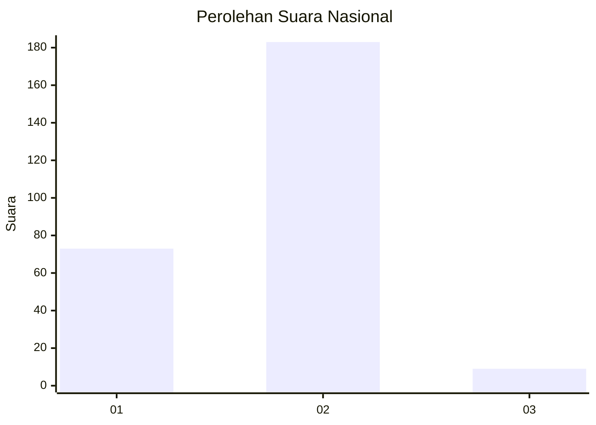
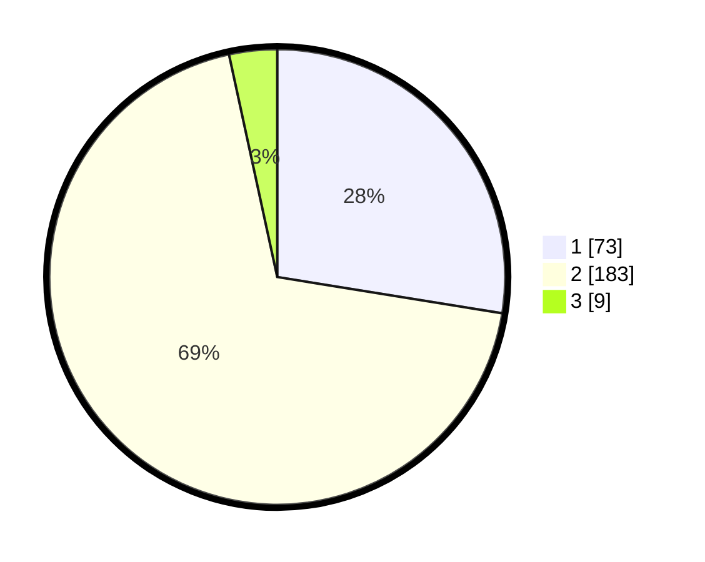

# Hasil

## Grafik

## Tabel

| No. | Nama Paslon    | Suara | Suara (raw) | Persentase |
|:--- |:-------------- | -----:| -----------:| ----------:|
| 1   | ANIES MUHAIMIN | 73    | [73][p-1]   | 27,55      |
| 2   | PRABOWO GIBRAN | 183   | [183][p-2]  | 69,06      |
| 3   | GANJAR MAHFUD  | 9     | [9][p-3]    | 3,40       |

[p-1]: https://github.com/gigit-pemilu/pemilu-2024/blob/main/pilpres/hitung-suara/sub/75-gorontalo/sub/04-pohuwato/sub/06-patilanggio/sub/2003-suka-makmur/sub/004-tps/sub/paslon-1.txt
[p-2]: https://github.com/gigit-pemilu/pemilu-2024/blob/main/pilpres/hitung-suara/sub/75-gorontalo/sub/04-pohuwato/sub/06-patilanggio/sub/2003-suka-makmur/sub/004-tps/sub/paslon-2.txt
[p-3]: https://github.com/gigit-pemilu/pemilu-2024/blob/main/pilpres/hitung-suara/sub/75-gorontalo/sub/04-pohuwato/sub/06-patilanggio/sub/2003-suka-makmur/sub/004-tps/sub/paslon-3.txt

## Foto C Plano

https://sirekap-obj-formc.kpu.go.id/99c5/pemilu/ppwp/75/04/06/20/03/7504062003004-20240219-142234--bdd6d91f-4716-40f1-8fa1-d508faff60f4.jpg

https://sirekap-obj-formc.kpu.go.id/99c5/pemilu/ppwp/75/04/06/20/03/7504062003004-20240219-142325--30e5e590-34fd-457d-b441-fc9fb1873a2d.jpg

https://sirekap-obj-formc.kpu.go.id/99c5/pemilu/ppwp/75/04/06/20/03/7504062003004-20240219-142420--6b5ef1a6-5592-4147-b268-af1707edc35a.jpg

## Metadata

| Key        | Value               |
| ---------- | ------------------- |
| Time Stamp | 2024-02-20 18:00:00 |

