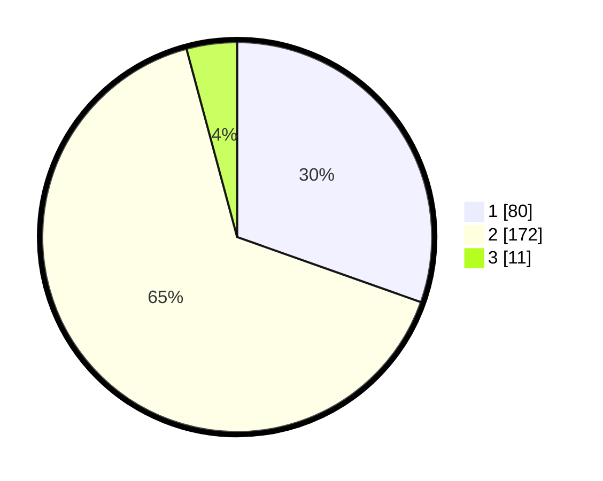

# Hasil

## Grafik

## Tabel

| No. | Nama Paslon    | Suara | Suara (raw) | Persentase |
|:--- |:-------------- | -----:| -----------:| ----------:|
| 1   | ANIES MUHAIMIN | 80    | [80][p-1]   | 30,42      |
| 2   | PRABOWO GIBRAN | 172   | [172][p-2]  | 65,40      |
| 3   | GANJAR MAHFUD  | 11    | [11][p-3]   | 4,18       |

[p-1]: https://github.com/gigit-pemilu/pemilu-2024-75-gorontalo/blob/main/pilpres/hitung-suara/sub/75-gorontalo/sub/04-pohuwato/sub/06-patilanggio/sub/2004-manawa/sub/003-tps/sub/paslon-1.txt
[p-2]: https://github.com/gigit-pemilu/pemilu-2024-75-gorontalo/blob/main/pilpres/hitung-suara/sub/75-gorontalo/sub/04-pohuwato/sub/06-patilanggio/sub/2004-manawa/sub/003-tps/sub/paslon-2.txt
[p-3]: https://github.com/gigit-pemilu/pemilu-2024-75-gorontalo/blob/main/pilpres/hitung-suara/sub/75-gorontalo/sub/04-pohuwato/sub/06-patilanggio/sub/2004-manawa/sub/003-tps/sub/paslon-3.txt

## Foto C Plano

https://sirekap-obj-formc.kpu.go.id/430f/pemilu/ppwp/75/04/06/20/04/7504062004003-20240219-190507--d92c18a3-39ba-4ce4-856c-94dade86c0dc.jpg

https://sirekap-obj-formc.kpu.go.id/430f/pemilu/ppwp/75/04/06/20/04/7504062004003-20240219-190616--66bc581d-8b07-4336-a93e-eca2501c0dbb.jpg

https://sirekap-obj-formc.kpu.go.id/430f/pemilu/ppwp/75/04/06/20/04/7504062004003-20240219-190717--d16d1489-5e98-4976-af6c-5ddc9f09e3f5.jpg

## Metadata

| Key        | Value               |
| ---------- | ------------------- |
| Time Stamp | 2024-02-20 18:00:00 |

