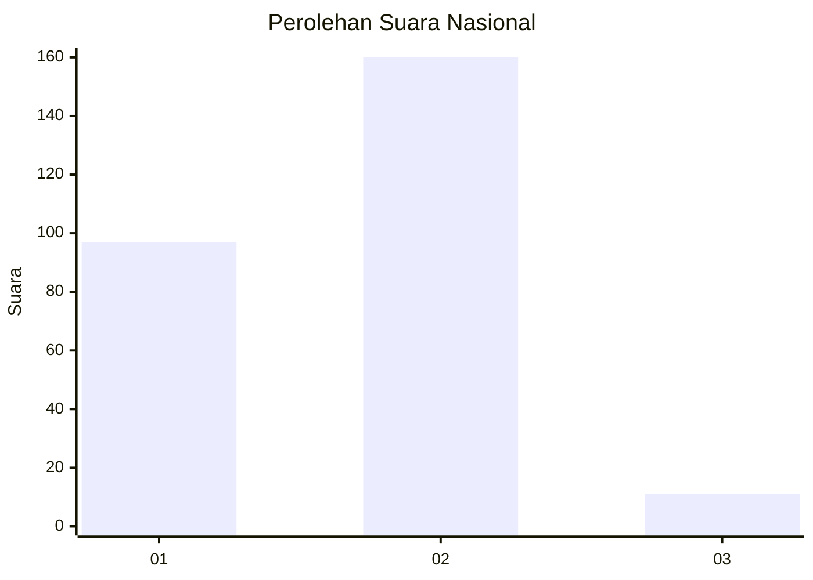
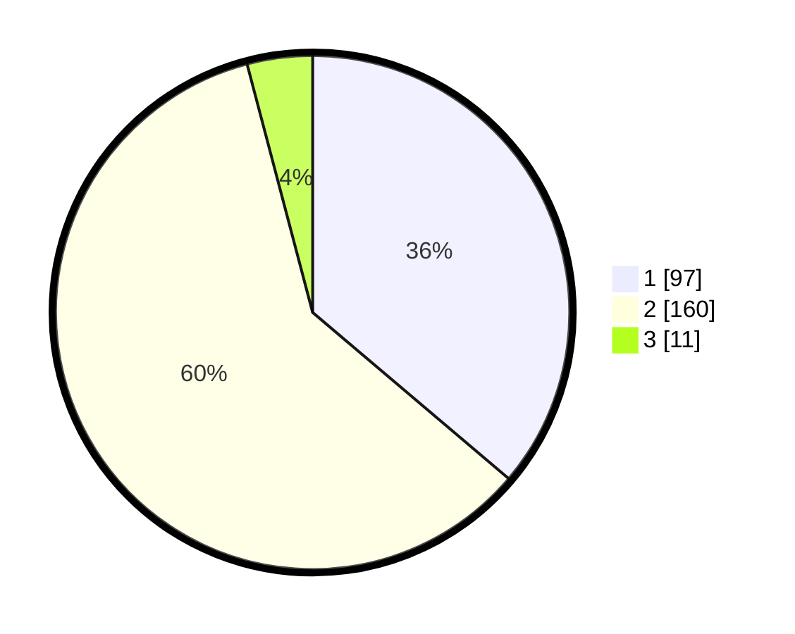

# Hasil

## Grafik

## Tabel

| No. | Nama Paslon    | Suara | Suara (raw) | Persentase |
|:--- |:-------------- | -----:| -----------:| ----------:|
| 1   | ANIES MUHAIMIN | 97    | [97][p-1]   | 36,19      |
| 2   | PRABOWO GIBRAN | 160   | [160][p-2]  | 59,70      |
| 3   | GANJAR MAHFUD  | 11    | [11][p-3]   | 4,10       |

[p-1]: https://github.com/gigit-pemilu/pemilu-2024/blob/main/pilpres/hitung-suara/sub/75-gorontalo/sub/04-pohuwato/sub/06-patilanggio/sub/2004-manawa/sub/005-tps/sub/paslon-1.txt
[p-2]: https://github.com/gigit-pemilu/pemilu-2024/blob/main/pilpres/hitung-suara/sub/75-gorontalo/sub/04-pohuwato/sub/06-patilanggio/sub/2004-manawa/sub/005-tps/sub/paslon-2.txt
[p-3]: https://github.com/gigit-pemilu/pemilu-2024/blob/main/pilpres/hitung-suara/sub/75-gorontalo/sub/04-pohuwato/sub/06-patilanggio/sub/2004-manawa/sub/005-tps/sub/paslon-3.txt

## Foto C Plano

https://sirekap-obj-formc.kpu.go.id/4b0c/pemilu/ppwp/75/04/06/20/04/7504062004005-20240219-194307--88e2209f-e137-4336-8aa9-cb1ddd5ade91.jpg

https://sirekap-obj-formc.kpu.go.id/4b0c/pemilu/ppwp/75/04/06/20/04/7504062004005-20240219-194411--a3fb9d61-015e-45fa-8cef-96b4cd686579.jpg

https://sirekap-obj-formc.kpu.go.id/4b0c/pemilu/ppwp/75/04/06/20/04/7504062004005-20240219-194508--4f0b4f73-520f-4b7d-848c-f9de9b1f3f1e.jpg

## Metadata

| Key        | Value               |
| ---------- | ------------------- |
| Time Stamp | 2024-02-20 18:00:00 |

